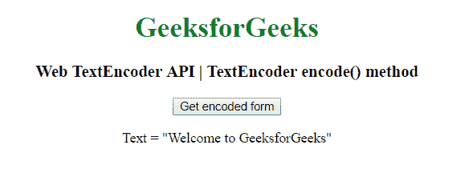
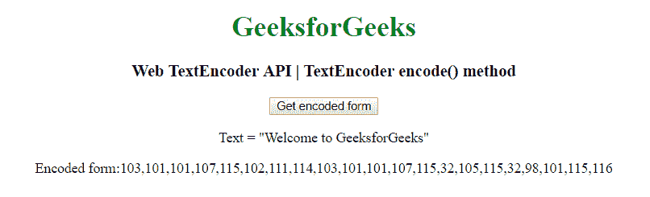

# Web text encoder API | text encoder encode()方法

> 原文:[https://www . geesforgeks . org/web-text encoder-API-text encoder-encode-method/](https://www.geeksforgeeks.org/web-textencoder-api-textencoder-encode-method/)

在 HTML 中有一个 **TextEncoder** 接口，它有一个 **encode()** 方法，返回一个包含编码形式的输入参数的整数数组。

**语法:**

```html
var str = encoder.encode( str );
```

**Return:** 它返回一个 *Uint8array* ，该数组包含用该 TextEncoder 对象的特定方法编码的参数中给出的文本。

**示例:**本示例使用 TextEncoder encode()方法。

```html
<!DOCTYPE html>
<html>

<head>
    <title>
        Web TextEncoder API | TextEncoder
        encode() method
    </title>
</head>

<body style="text-align:center;">

    <h1 style="color:green;"> 
        GeeksforGeeks 
    </h1>

    <h3>Web TextEncoder API | TextEncoder encode() method</h3>

    <button onclick="getTextEncoder ();">
        Get encoded form
    </button>

    <p>Text = "Welcome to GeeksforGeeks"</p>

    <p id='TextEncoder'></p>

    <script type="text/javascript">
        function getTextEncoder() {
            var string = "geeksforgeeks is best";
            var textEncoder = new TextEncoder();
            let encoded = textEncoder.encode(string);
            document.getElementById("TextEncoder").innerHTML
                    = "Encoded form:" + encoded;
        }
    </script>
</body>

</html>
```

**输出:**

*   **点击按钮前:**
    
*   **点击按钮后:**
    

**支持的浏览器:***TextEncoder encode()方法*支持的浏览器如下:

*   谷歌 Chrome 38
*   Firefox 19
*   歌剧 25
*   Safari 10.1