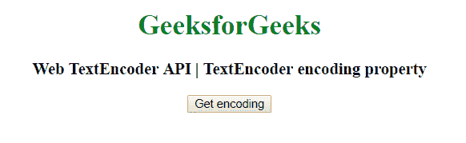
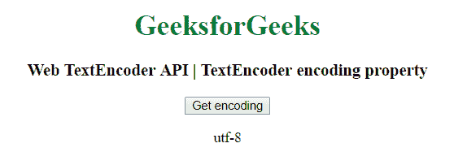

# 网页文本编码器 API |文本编码器编码属性

> 原文:[https://www . geesforgeks . org/web-text encoder-API-text encoder-encoding-property/](https://www.geeksforgeeks.org/web-textencoder-api-textencoder-encoding-property/)

在 HTML 中有一个**文本编码器**接口，它有一个属性**编码**，告诉我们编码器使用的编码算法。它只能有 *utf-8* 的值。

**语法:**

```htmlhtml
var b = encoder.encoding;
```

**返回值:**返回编码算法的名称。

**示例:**

```htmlhtml
<!DOCTYPE html>
<html>

<head>
    <title>
        Web TextEncoder API | TextEncoder
        encoding property
    </title>
</head>

<body style="text-align:center;">

    <h1 style="color:green;"> 
        GeeksforGeeks 
    </h1>

    <h3>Web TextEncoder API | TextEncoder encoding property</h3>

    <button onclick="getTextEncoder ();">
        Get encoding
    </button>

    <p id='TextEncoder'></p>

    <script type="text/javascript">
        function getTextEncoder() {
            const encoder = new TextEncoder()
            var geeks = encoder.encoding;
            document.getElementById("TextEncoder").innerHTML
                        = geeks;
        }
    </script>
</body>

</html>
```

**输出:**

*   **点击按钮前:**
    
*   **点击按钮后:**
    

**支持的浏览器:***文本编码器编码属性*支持的浏览器如下:

*   谷歌 Chrome 38
*   Firefox 19
*   歌剧 25
*   Safari 10.1