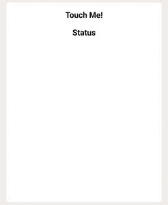

# web touch event API | touch event . changedtouche

> 哎哎哎:# t0]https://www . geeksforgeeks . org/web-touch event-API-touch event-changedtouche/

TouchEvent.changedTouches 只读属性，它是一个触摸列表。代表直接参与此事件的每个接触点的接触列表:
**touchstart:** 在 touchstart 事件中变为活动的接触点列表。
**触摸移动:**在触摸移动事件期间移动的触摸点列表。
**触摸结束:**在触摸结束事件中被停用的触摸点列表。
**触摸输入:**在触摸输入事件期间进入触摸表面的触摸点列表。
**touchleave:** 在 touchleave 事件期间已退出触摸表面的触摸点列表。

**语法:**

```htmlhtml
var touches = touchEvent.targetTouches;
```

**返回值:**
返回一个触摸列表，列出仍然与触摸表面接触的触摸点的所有触摸对象，并且其触摸开始事件发生在与当前目标元素相同的目标元素内。

**例 1:**

```htmlhtml
<!DOCTYPE html> 
<html> 
    <head>    
    <title>
        TouchEvent.changedTouches
    </title>
    </head>
<body>
<center> 
<div class="classdiv" id="divID">
<h3> Touch Me! </h3>
</div>

<h3 id="statusdiv">Status</h3>
</center>

</body>

<script>

window.addEventListener('load', function(){

    var divID = document.getElementById('divID')
    var statusdiv = document.getElementById('statusdiv')
    var startx = 0
    var dist = 0

    divID.addEventListener('touchstart', function(e){
        var touchobj = e.changedTouches[0]
        startx = parseInt(touchobj.clientX) 
        statusdiv.innerHTML = 'Status: touchstart<br> ClientX: ' + startx + 'px'
        e.preventDefault()
    }, false)
}, false)

</script>
</html>                    
```

**输出:**
**前触:**


**触摸后:**


**支持的浏览器:****支持的浏览器如下:**

*   谷歌 Chrome
*   火狐浏览器
*   边缘
*   歌剧