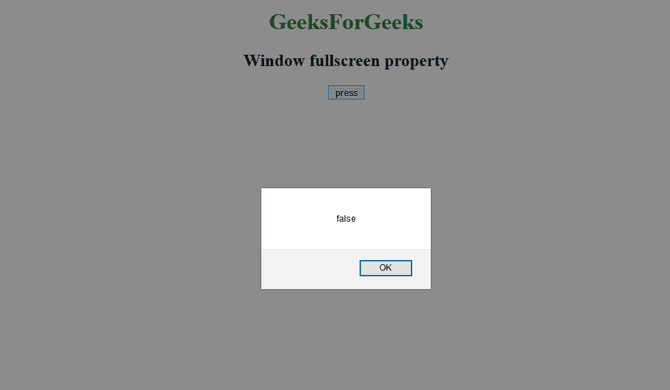
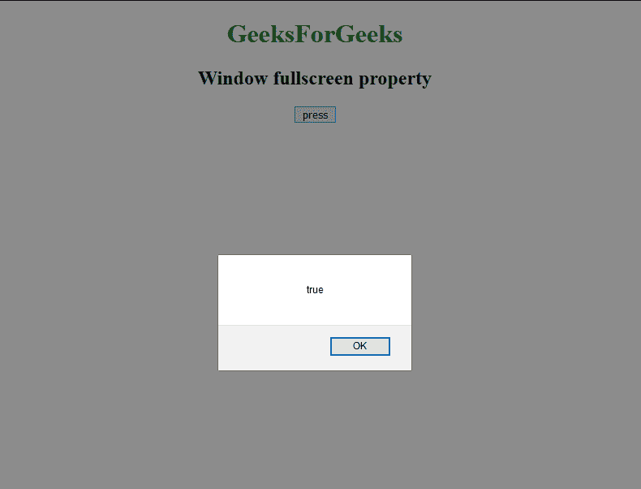

# 网页窗口 API | DOM 窗口全屏属性

> 原文:[https://www . geesforgeks . org/web-window-API-DOM-window-full screen-property/](https://www.geeksforgeeks.org/web-window-api-dom-window-fullscreen-property/)

**窗口界面**有一个*全屏*属性，告知窗口是否以全屏模式显示。

**语法:**

```html
BoolVal = windowReference.fullScreen;
```

**返回值:**

**Boolean**

*   **真:**如果窗口处于全屏模式。
*   **假:**如果窗口不是全屏模式。

**示例:**

```html
<!DOCTYPE html>
<html>

<head>
    <title>
        Window fullscreen property
    </title>
</head>

<body>
    <center>
        <h1 style="color:green;"> 
                GeeksForGeeks 
            </h1>

        <h2>Window fullscreen property</h2>

        <button onclick="GFGfun();">press</button>
        <script>
            function GFGfun() {
                alert(window.fullScreen);
            }
        </script>
    </center>
</body>

</html>
```

**输出:**
窗口未全屏:


全屏窗口:


**浏览器支持:**

*   Firefox 3+