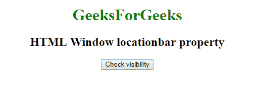
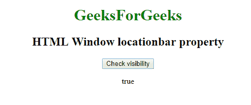

# 网络窗口应用编程接口|窗口定位栏属性

> 原文:[https://www . geesforgeks . org/web-window-API-window-location bar-property/](https://www.geeksforgeeks.org/web-window-api-window-locationbar-property/)

在 Web API**window . location bar**属性返回 *locationbar* 的对象，可以查看*的可见性*。

**语法:**

```html
objectReference = window.locationbar
```

**例:**检查能见度。

```html
<!DOCTYPE html>
<html>

<head>
    <title>
        Window locationbar property
    </title>
    <style>
        a:focus {
            background-color: magenta;
        }
    </style>

    <script type="text/javascript">
        function getvisibility() {
            document.getElementById('visibility').innerHTML = 
              window.locationbar.visible;

        }
    </script>

</head>

<body>
    <center>

        <h1 style="color:green;">  
                GeeksForGeeks  
            </h1>

        <h2>HTML Window locationbar property</h2>
        <button onclick="getvisibility ();"
                id="btn">
          Check visibility
      </button>
        <p id='visibility'></p>
    </center>
</body>

</html>
```

**输出:**
**点击按钮:**


**点击按钮时:**


**支持的浏览器:**

*   谷歌 Chrome
*   边缘 12
*   火狐浏览器
*   旅行队
*   歌剧