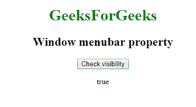

# 网络窗口应用编程接口|窗口菜单栏属性

> 原文:[https://www . geesforgeks . org/web-window-API-window-menubar-property/](https://www.geeksforgeeks.org/web-window-api-window-menubar-property/)

属性返回*菜单栏*的对象，我们可以查看*的可见性*。

**语法:**

```html
objectReference = window.menubar
```

**示例:**本示例使用 Window.menubar 属性检查 menuber 对象的可见性。

```html
<!DOCTYPE html>
<html>

<head>

    <title>
        Window menubar property
    </title>

    <script type="text/javascript">
        function getvisibility() {

            document.getElementById(
                    'visibility').innerHTML =
                window.menubar.visible;

        }
    </script>

</head>

<body>
    <center>

        <h1 style="color:green;">  
                GeeksForGeeks  
            </h1>

        <h2>Window menubar property</h2>
        <button onclick="getvisibility ();"
                id="btn">
            Check visibility
        </button>
        <p id='visibility'></p>
    </center>
</body>

</html>
```

**输出:**
**点击按钮:**


**点击按钮时:**


**支持的浏览器:**window . menubar 属性支持的浏览器如下:

*   谷歌 Chrome
*   边缘 12
*   火狐浏览器
*   旅行队
*   歌剧