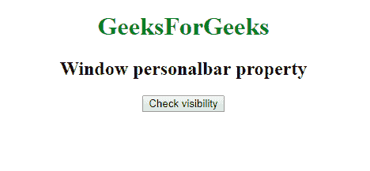
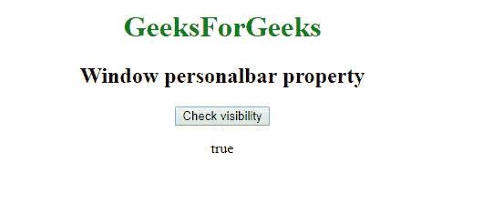

# 网页窗口 API |窗口人物角色属性

> 原文:[https://www . geesforgeks . org/web-window-API-window-personal bar-property/](https://www.geeksforgeeks.org/web-window-api-window-personalbar-property/)

在 Web API**window . personal bar**属性返回 *personalbar* 的对象，可以查看*的可见性*。

**语法:**

```html
objectReference = window.personalbar
```

**示例:**检查能见度

```html
<!DOCTYPE html>
<html>

<head>

    <title>
        Window personalbar property
    </title>

    <script type="text/javascript">
        function getvisibility() {

            document.getElementById('visibility').innerHTML =
              window.personalbar.visible;

        }
    </script>

</head>

<body>
    <center>

        <h1 style="color:green;">  
                GeeksForGeeks  
            </h1>

        <h2>Window personalbar property</h2>
        <button onclick="getvisibility ();" id="btn">
          Check visibility
      </button>
        <p id='visibility'></p>
    </center>
</body>

</html>
```

**输出:**
点击前:


点击后:


**支持的浏览器:**

*   谷歌 Chrome
*   边缘 12
*   火狐浏览器
*   旅行队
*   歌剧