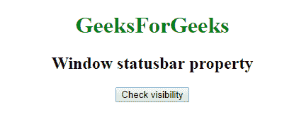
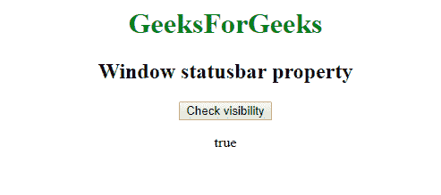

# 网络窗口应用编程接口|窗口状态栏属性

> 原文:[https://www . geesforgeks . org/web-window-API-window-status bar-property/](https://www.geeksforgeeks.org/web-window-api-window-statusbar-property/)

在 Web API **Window.statusbar** 属性返回 *statusbar* 的对象，可以查看*的可见性*。

**语法:**

```
objectReference = window.statusbar
```

**示例:**检查能见度

```
<!DOCTYPE html>
<html>

<head>

    <title>
        Window statusbar property
    </title>

    <script type="text/javascript">
        function getvisibility() {

            document.getElementById(
              'visibility').innerHTML = window.statusbar.visible;

        }
    </script>

</head>

<body>
    <center>

        <h1 style="color:green;">  
                GeeksForGeeks  
            </h1>

        <h2>Window statusbar property</h2>
        <button onclick="getvisibility ();" 
                id="btn">Check visibility</button>
        <p id='visibility'></p>
    </center>
</body>

</html>
```

**输出:**T2:
之前:

后:


**支持的浏览器:**

*   谷歌 Chrome
*   边缘 12
*   火狐浏览器
*   旅行队
*   歌剧