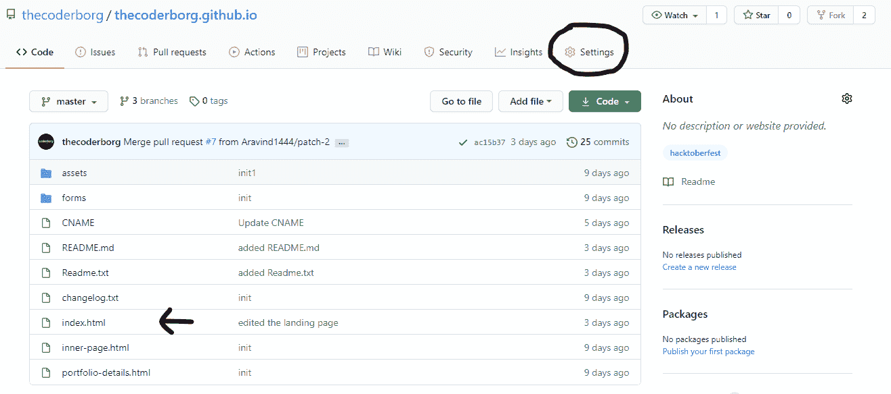
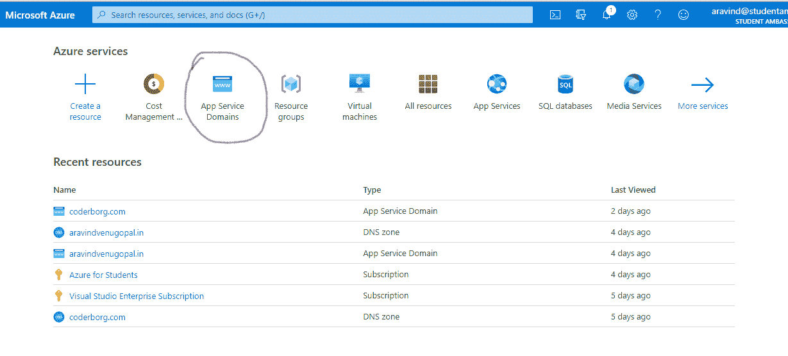
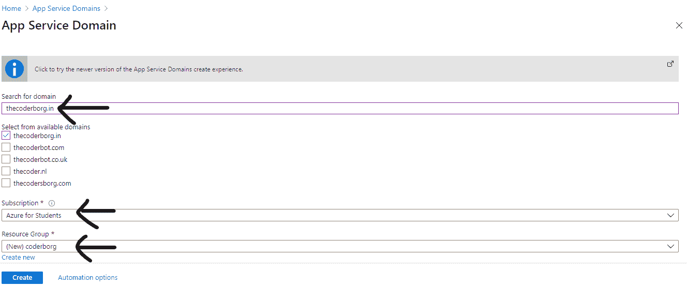
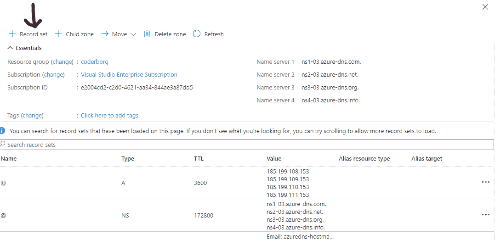
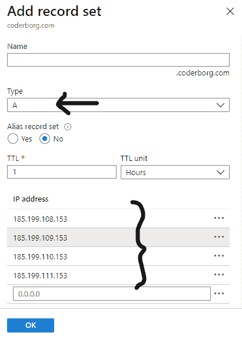
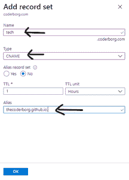
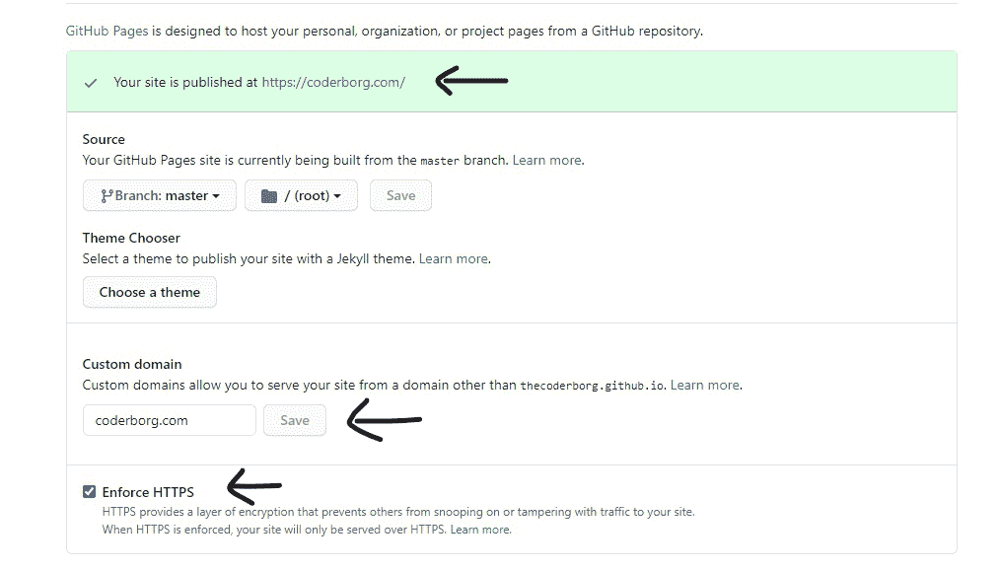

# 免费网站托管和高级域名

> 原文:[https://www . geeksforgeeks . org/网站托管和高级域名免费/](https://www.geeksforgeeks.org/website-hosting-and-premium-domain-for-free/)

让我们看看如何免费托管您的网站，并免费将域名(高级)连接到该网站。在继续下一步之前，确保你有一个网站准备托管，因为它将有助于你一路尝试。你至少需要一个可以托管的 index.html 文件。

文章可以分为两部分。第一部分将向您传达如何托管您的网站，第二部分将帮助您向托管的网站添加优质域名。

### 托管网站

虽然有很多免费的托管平台，如 000Webhost、Firebase 等，但我们将使用 GitHub 来托管网站。在 [GitHub](https://github.com) 上托管一个网站也将允许我们通过 GitHub 页面选项提供我们的网站。你可以关注[这篇 GFG 文章来托管你的](https://www.geeksforgeeks.org/using-github-to-host-a-free-static-website/)网站或者继续这篇文章。

首先，你必须在 [GitHub](https://github.com) 上创建一个账户，如果你到现在还没有的话。创建帐户或登录到现有帐户后，您必须通过单击右侧顶部的“**+”**图标来创建新的存储库。

在这种情况下，您必须给存储库命名为**username . github . io**；你必须在那个地方添加你的用户名。例如，如果您的用户名是 sultan，您可以提供 sultan.github.io。您必须公开您的存储库来托管网站。之后，点击下面的绿色按钮创建存储库。

现在你必须添加你的网站文件(或者至少是 index.html 文件)。这可以通过选择存储库名称部分下方的**添加文件**选项来完成。上传文件后，您可以将其提交给分支机构。确保你有一个名为 index.html 的登陆页面。之后，您可以前往**设置**部分，并导航至底部。

你会发现你的网站可以通过类似于 username.github.io 的网址访问。请确保它正常工作，如果没有，请再次检查这些步骤，并检查你是否出错。

你的网站应该有一个 index.html 文件

### 注册高级域名

在第二部分中，让我们注册一个高级域名。我们将使用[**Microsoft Azure**](https://azure.microsoft.com/en-us/)**进行本教程。如果您是专业人士，您可以通过注册到 Azure 平台并验证您的帐户来获得免费层+200 美元的积分。如果您是学生，您可以访问 [**学生 Azure**](https://azure.microsoft.com/en-in/free/students/)优惠，在创建免费帐户时，您将获得 100 美元的点数。你可能需要验证你是一名学生，这是一个简单的步骤。**

**另外，请检查您的组织是否向您提供任何 Visual Studio 订阅。如果是这样的话，你每月还可以获得额外价值 150 美元的学分。您也可以查看 [**Visual Studio 福利**](https://visualstudio.microsoft.com/vs/benefits/) 页面，查看您是否可以使用微软 Azure 和其他一些服务的免费积分。完成其中任何一项后，您的帐户上应该至少还剩下 20 美元的点数(如果感兴趣，在试用这些服务后)才能继续前进。**

**现在你必须导航到 [**【蔚蓝门户】**](https://portal.azure.com/) 。从那里，你可以看到一个搜索栏。你必须从那里搜索**应用服务域**。你也可以在搜索前看到。选择它，您将被带到另一个页面，您可以在那里添加新域。如果您已经有了任何域(或处于后期阶段)，它将在这里列出。**

**

蓝色门户网站** 

**现在你要点击“ **+添加”**按钮。现在，您将有机会搜索您选择的域名。您必须键入您的域名和扩展名，以检查是否可以找到类似的域名(例如:sulatnisatechgeek.com)。**

**你将可以访问所有的高级域名，除非它已经在使用或者是一个高级域名。在这种情况下，该域不会被列出。从您选择的可用列表中，您可以选择要继续的域名。**

**

选择您选择的领域** 

**在**订阅**部分，可以选择自己的订阅，无论是学生 Azure 还是 Visual Studio 订阅等。在**资源组**部分，点击**新建。**提供一个与您的项目有共鸣的名称(不能再次用作另一个资源组名称)。之后，点击**确定**。**

**在联系信息下，你必须填写你的详细信息。确保填写了所有必需的详细信息，然后单击确定。同样，您可以选择隐私保护(不适用于域扩展，如。in 等)。最后，你必须接受**法律条款**。**

**填写完所有细节后，可以点击**创建**。您的应用服务域将在大约一分钟后创建。(顺便说一下，域名的费用将在 11.99 美元左右，将从学分部分收取，您不必担心这一点)。**

**创建后，您可以点击**转到资源**或从列表中导航到您的应用服务域。如果您想删除或取消购买，您可以点击**取消购买**按钮，该按钮将在短时间内可用。现在我们必须添加某些域名系统记录。**

**

您必须添加更多记录来连接域名** 

**点击**管理域名系统记录**。你不必担心里面的任何东西。点击“ **+记录集**”。在底部，您必须添加以下 IP 地址:**

*   **185.199.108.153**
*   **185.199.109.153**
*   **185.199.110.153**
*   **185.199.111.153**

**这将把你的域名指向我们网站当前所在的 GitHub 的服务器。如果您要更改您的网站托管平台，您可以稍后通过添加他们的 IP 地址来更改。你不需要做任何其他的改变，现在你可以点击**确定**。**

**你要再次点击“ **+记录集**”。现在你要把**型**从 **A** 换成上市的 **CNAME** 。在**名称**部分，如果需要，您必须添加子域。可以是类似 **www** 这样的东西，也可以是你喜欢的任何东西。如果你要用 **www** ，你的网站也可以通过“www . domain _ name . domain _ extension”进入。如果你用的是像“**开发者**这样的子域，你的网站可以通过“**开发者**进入。domain_name.domain_extension”。**

**添加子域后，必须添加**别名**，这是您当前可以访问托管网站的链接。由于我们使用的是 GitHub 页面，您的网站将可以通过“username.github.io”访问。你必须在别名部分加上这个，并用一个**点(。)**。因此，别名应该类似于“ **username.github.io.** ”。之后，可以点击**确定**。现在，Azure 上的所有工作都结束了。**

**

添加 IP 地址** **

添加 CNAME** 

### **将域名连接到 GitHub**

**现在，您必须回到您的 GitHub 存储库。转到设置部分，然后转到 GitHub 页面部分(您之前已经检查过)。如果朝底部查看，您将可以选择添加一个自定义**域**。您可以在该空间中添加您的裸域名(没有子域或协议)。如果域名是“sultanistechgeek.com”，你可以在那里添加，就这样，然后点击**保存**。**

**现在你要等将近 10-20 秒，某些检查就会完成。之后，您可以重新加载页面并导航到相同的部分。你将有一个选项**强制 HTTPS** ，启用它将保持我们的网站可访问性和安全性。启用后，等待大约 1 分钟到 24 小时，您的网站才能被访问。通常，它可以被即时访问，没有任何延迟。**

**

添加自定义域，保存它并打开强制 HTTPS** 

**是的，你成功了:**

*   **使用 GitHub 托管一个网站**
*   **注册了高级域名**
*   **添加了域名系统记录**
*   **已将域连接到网站。**

**现在，当你在 GitHub 上查看存储库文件时，你会发现一个名为 **CNAME** 的文件。除非需要，否则不要编辑/删除该文件。现在一切都准备好了，你可以开始和每个人分享这个域名了。这种方法的一些缺点如下…**

*   **您需要每年获得最低信用额度(约 12 美元)才能获得年度续订，或者您可以从 Azure 门户取消自动续订。**
*   **网站文件将是开源的，任何人都可以检查出你写的代码或文件。**

**如果你想在其他平台上托管你的网站，你可以继续前进。唯一的变化将是 IP 地址(对应于该平台)和别名，这将基于托管平台。所有其他步骤将保持不变。**