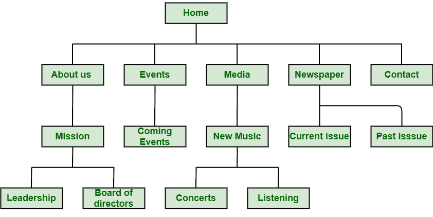

# 网站导航及其重要性

> 原文:[https://www . geesforgeks . org/网站-导航-及其重要性/](https://www.geeksforgeeks.org/website-navigation-and-its-importance/)

网站导航，顾名思义，是一种显示网站上页面、内容和信息的重要性和相关性的方式。这是一种帮助用户或访问者找到他们想看的内容的方式。它只是一种利用互联网在网站上导航页面、内容和信息的方式。它可以以不同的方式呈现，如侧面条、页眉或页脚中的菜单等。对于好的网站导航来说，简单是非常必要和重要的。

#### 网站导航的结构

网站导航的结构非常重要，因为它对销售、用户体验和搜索引擎优化排名有更大的影响。它不仅包括草图页面，还包括更高层次的抽象。设计和组织网站一点也不容易。让我们看一个例子:

在上图中，关于我们、事件、媒体、联系人、报纸等。，都链接到主菜单。访问其他页面，如任务、即将发生的事件、新音乐等。，你必须先访问关于我们、事件、媒体等。那你想开什么就开什么。

#### 网站导航的重要性

网站导航是一种可以轻松增加网站受众或访问者数量的方式。如果网站导航不够好和有效，那么拥有一个有创意的网站就没有意义了，因为用户将无法在它周围轻松导航以找到他们想要的信息。因此，保持简单、有效以增加用户体验并让客户和访问者满意是非常重要的。下面给出了一些理由，告诉你为什么网站导航很重要。让我们看看。

1.  **增加访问时长:**网站导航帮助人们非常轻松有效地找到自己想看的信息。好的网站导航提供清晰简单的导航栏和链接，鼓励访问者或人们进行越来越多的探索。这反过来增加了他们在网站上的访问时间，因为导航非常容易使用和理解，现在每个人都想让事情变得容易。
2.  **增加销售机会:**网站导航通常有助于向访问者展示网站的实际内容，而不会浪费时间。这反过来增加了访问者在网站上花费的时间，并且访问者在网站上停留的时间更长。访问者然后通过网站，轻松轻松地购买产品。这将自动增加产品的购买和销售。
3.  **提升用户体验:**导航对于网站来说非常重要，因为没有导航，网站就不会好看，而且会显得无组织。如今，没有人愿意浪费时间去决定网站如何运作。每个人都想轻松找到自己想要的。好的导航一般能帮助访问者找到他们想要搜索的信息，提高访问者搜索的速度。清晰简单的导航就是简单地理解，反过来增加用户体验。
4.  **好的设计:**好的导航让网站看起来更有吸引力、更有效、更好。导航对用户或访问者如何查看网站以及他们在网站上停留的时间有更大的影响。网站导航的设计对网站的成功有较大的影响。几乎影响流量、SEO 排名、用户体验、转化率、销量等。所以，好的导航对提升网站设计和公司或企业的品牌非常有用。好的导航让游客开心和满足。