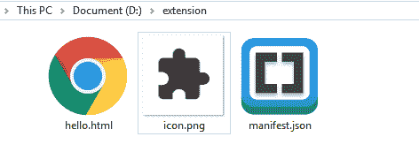
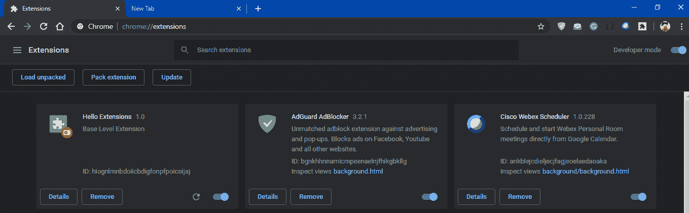

# 什么是 chrome 扩展？

> 原文:[https://www.geeksforgeeks.org/what-are-chrome-extensions/](https://www.geeksforgeeks.org/what-are-chrome-extensions/)

这是一个小程序，用于修改体验或为 chrome 浏览器添加功能。它们是使用网页技术创建的，如 HTML、CSS、JavaScript 等。
扩展的主要目的是服务于构建整个程序的单一目的，尽管它可以有多个组件，但它们应该有助于实现程序的主要目的。
扩展应该有最小的接口，或者它也可以扩展到网页，但是主要的焦点是以更少的开销提供良好的功能。
分机被压缩到**中。crx** 包，用户需要下载并安装该包。Chrome 扩展发布在 Chrome 网络商店中。


**铬延伸的一些例子是:**

*   密码管理器
*   广告拦截器
*   向 Chrome 添加待办事项列表或注释
*   使从网站复制文本变得更加容易

让我们创建一个简单的扩展来演示工作过程:

*   每个扩展名都需要一个清单文件
    首先，创建一个**清单文件**

```
 {
    "name": "Hello Extensions",
    "description" : "Base Level Extension",
    "version": "1.0",
    "manifest_version": 2
  }
```

*   然后，为了演示，我们将在扩展中添加一个图标，点击该图标将打开我们创建的网页。
    将此添加到文件中

    ```
    "browser_action": {
          "default_popup": "hello.html",
          "default_icon": "icon.png"
        }   

    ```

    *   Then add this to include a shortcut to display the HTML page

    ```
    "commands": {
          "_execute_browser_action": {
            "suggested_key": {
              "default": "Ctrl+Shift+F"
            },
            "description": "Opens hello.html"
          }
        }

    ```

    

    

    