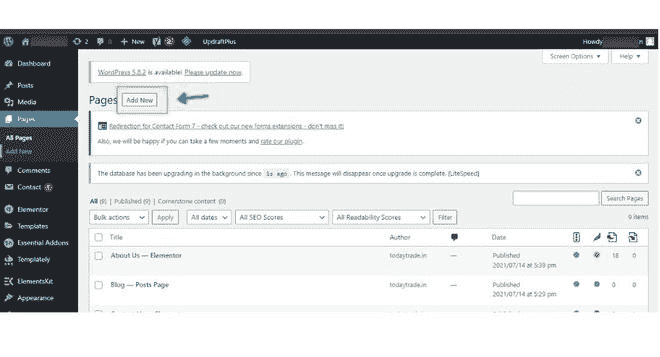
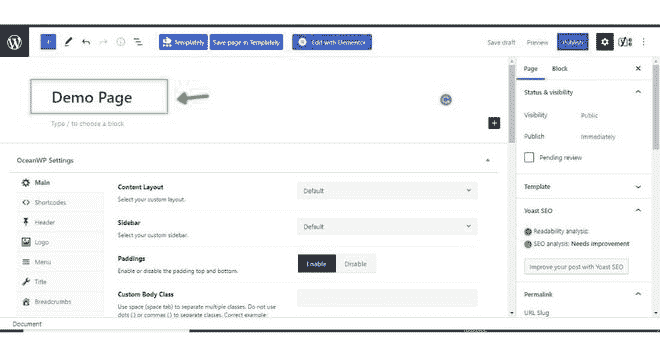
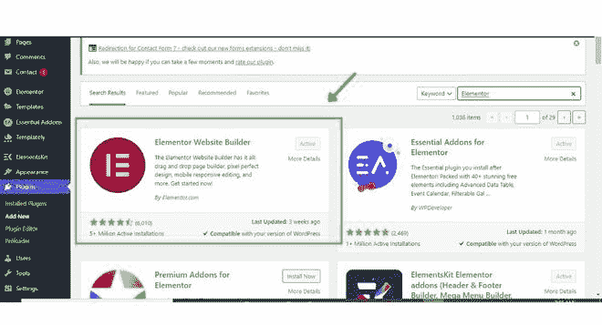
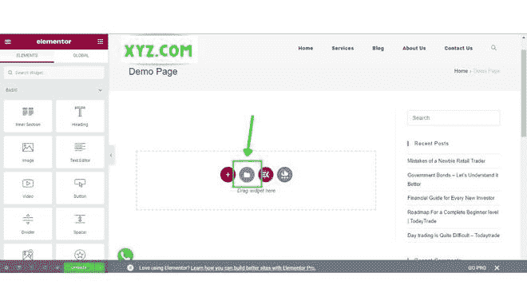
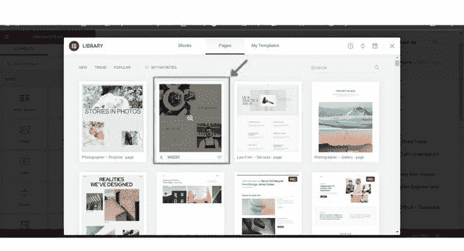
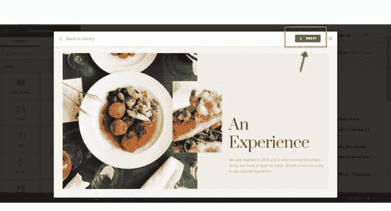

# WordPress 上有哪些模板？

> 原文:[https://www . geesforgeks . org/什么是模板-on-wordpress/](https://www.geeksforgeeks.org/what-are-templates-on-wordpress/)

在本文中，我们将研究什么是 WordPress 中的模板。在进入 WordPress **模板**之前，我们应该了解一下什么是 WordPress！ [**WordPress**](https://www.geeksforgeeks.org/wordpress/) 是一个免费开源的内容管理系统(CMS)框架。它是最近使用最广泛的内容管理系统框架。

**WordPress 模板:**模板是预先制作的文件，它将定义你的网站的外观、WordPress 网站的结构和帖子。模板给你的网站设计。

WordPress 有很多主题，给了 WordPress 用户更多的灵活性来定制他们网站的设计，它在一个主题下给了很多模板。这些模板中的每一个都被定义为根据用户的要求在特定情况下使用。

模板文件是组成网站网页的最小块，或者我们可以说它们是 WordPress 网站的构建块。这些就像拼图块，组合在一起形成完整的网站。有些模板，如页眉和页脚，用于网站的每一页，其他模板根据用户的要求使用。

在 WordPress 中，HTML 决定了网站的结构，CSS 样式表给网站提供了设计和颜色，但所有这些都是在模板文件的帮助下在场景后面发生的。模板文件和 CSS 样式表作为一个 WordPress 主题存储在一起。

**我们为什么使用模板:**模板文件从 WordPress 数据库即 MySQL 中抽取信息，通过 HTML 代码生成网站的前端，并将所有信息发送到网页浏览器。网络浏览器向用户显示网站，这就是模板在 WordPress 中的工作方式。

模板是用来设计网页的，通过组合网页的页眉部分、侧边栏、内容部分和页脚，所有这些都是通过使用模板来完成的。模板使我们能够方便地使用页面上的每个部分和小部件，并帮助设计标题部分。它定制了你的标题部分，添加了作者模板，类别模板，标签模板，以及更多自定义到你的 WordPress 网站的网页。

**如何在 WordPress 网站上添加模板**

1.  首先，创建要添加模板的页面。点击**新增**页面。

    

2.  在这里输入页面名称，点击**发布**按钮发布页面。

    

3.  创建页面后，您必须通过点击添加新插件来添加插件名称**“元素”或**。然后点击激活插件。

    

4.  添加“元素”插件后，转到您创建的页面，然后点击“用元素编辑”。然后单击文件夹图标添加模板。

    

5.  选择要添加到网站页面的模板。

    

6.  单击插入按钮，将模板添加到您创建的网站页面。

    

7.  最后，模板在您创建的页面上。

    