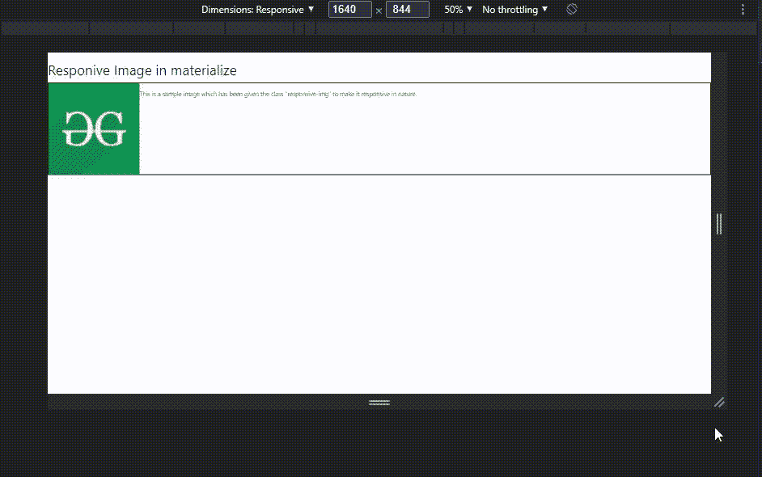
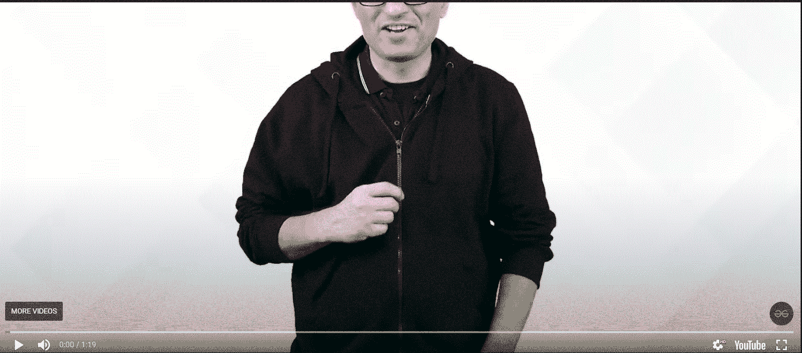

# 物化中有哪些类可以创建响应图像&视频？

> 原文:[https://www . geeksforgeeks . org/什么是类-创建-响应-图像-视频-物化/](https://www.geeksforgeeks.org/what-are-the-classes-to-create-responsive-image-video-in-materialize/)

在本文中，我们将看到如何使用物化 CSS 向 HTML 文件添加响应图像和视频&还将通过示例看到它们的实现。

物化是一种将成功设计的经典原则与创新和技术相结合的设计语言。物化 CSS 是一个流行的前端框架，通过从物化 CSS 包中导入各种类，它有助于添加高级功能，并支持制作响应性网站。它还有助于向网站添加响应图像和视频。

**响应性:**响应性是网站的文本、图像、视频和其他元素在不同设备宽度下查看时，根据屏幕大小自动调整自身大小的功能。通过示例，我们将理解在我们网站上的图像中添加响应行为。

**向网站添加响应图像:**我们可以使用类**“响应-img”向网站添加响应图像。**这个类会让形象有反应。默认情况下，它将具有“宽度= 100%，高度=自动”。

**语法:**

```

```

**示例:**此示例说明了使用物化 CSS 属性添加响应图像。

## 超文本标记语言

```
<!DOCTYPE html>
<html>

<head>
    <title>Materialize CSS</title>

    <!-- Compiled and minified CSS -->
    <link rel="stylesheet" 
          href=
"https://cdnjs.cloudflare.com/ajax/libs/materialize/1.0.0/css/materialize.min.css">

    <!-- Compiled and minified JavaScript -->
    <script src=
"https://cdnjs.cloudflare.com/ajax/libs/materialize/1.0.0/js/materialize.min.js">
    </script>
</head>

<body>
    <h4>Responive Image in materialize</h4>
    <div style="border: 2px solid black; display: flex;">
        
        <p>
            This is a sample image which has 
            been given the class "responsive-img" 
            to make it responsive in nature.
        </p>
    </div>
</body>

</html>
```

**输出:**



使用物化 CSS 的响应图像

**向网站添加响应视频:**我们可以使用类“**响应视频**向网站添加响应视频，这将使视频具有响应性。

**语法:**

```
<video class="responsive-video" controls>
    <source src="..." type="....">
</video>
```

在这里，我们将添加一个 YouTube 视频链接，所以我们使用一个带有类“**视频容器**的

标签。如果您正在添加已经下载到电脑的视频，您可以在此情况下使用<视频>标签。

```
<div class="video-container responsive-video">
    <iframe width="853" height="480" src=
"https://www.youtube.com/embed/gaNp9i6rQHc?rel=0" 
        frameborder="0" allowfullscreen>
    </iframe>
</div>
```

**示例:**该示例说明了在物化 CSS 中使用**视频容器**类添加响应视频。

## 超文本标记语言

```
<!DOCTYPE html>
<html>

<head>
    <title>Page Title</title>

    <!-- Compiled and minified CSS -->
    <link rel="stylesheet" 
          href=
"https://cdnjs.cloudflare.com/ajax/libs/materialize/1.0.0/css/materialize.min.css">

    <!-- Compiled and minified JavaScript -->
    <script src=
"https://cdnjs.cloudflare.com/ajax/libs/materialize/1.0.0/js/materialize.min.js">
      </script>
</head>

<body>
    <h4>Responsive Video in materialize</h4>
    <div class="video-container responsive-video">
        <iframe width="850" 
                height="400" 
                   src=
"https://www.youtube.com/embed/gaNp9i6rQHc?rel=0%22" 
                frameborder="0"
                allowfullscreen>
      </iframe>
    </div>
</body>

</html>
```

**输出:**



使用物化 CSS 的响应视频