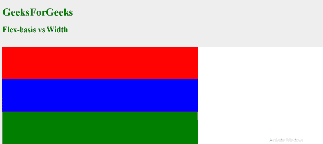
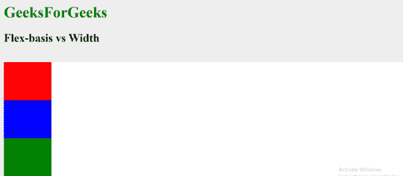

# Flexbox 中的 flex-basis 和 width 有什么区别？

> 原文:[https://www . geeksforgeeks . org/flex-basis-and-width-in-flex box/](https://www.geeksforgeeks.org/what-are-the-differences-between-flex-basis-and-width-in-flexbox/)的区别是什么

本文描述了 flex-basis 和 width 属性之间的区别以及用法示例。灵活基础属性根据灵活方向值定义灵活项目的初始大小。它具有以下可以改变其行为的附加属性:

*   **挠曲方向**值可以设置为行或列。如果其值为 row，则定义宽度；如果其值为 column，则定义高度。
*   **柔性基础**属性只能应用于柔性项目，**宽度**属性可以应用于所有项目。
*   使用 flex 属性时，flex 项的所有三个属性，即 **flex-row、flex-shrink** 和 **flex-basis** 可以组合成一个声明，但是使用 width，做同样的事情需要多行代码。
*   如果**挠曲方向**值设置为列，则使用宽度属性来调整挠曲项目的水平尺寸。

以下示例显示了 flex-basis 与宽度和高度属性之间的差异:

**示例 1:** 当伸缩方向设置为行时，使用伸缩基准。

## 超文本标记语言

```html
<!DOCTYPE html>
<html>

<head>
    <title>FlexBox</title>
    <style>
        body {
            background: #eee;
        }

        h1 {
            color: green;
        }

        .wrapper {
            width: 100%;
            margin: 0 auto;
        }

        .flex-container {
            display: flex;
            background: #fff;
            flex-wrap: wrap;
            flex-direction: row;
        }

        .box {
            /*
      Since flex-direction is set to
      row therefore flex-basis defines 
      the width. Either of the width
      property or flex-basis property
      can be used as both perform
      a similar task in this case.
      */

            height: 100px;
            flex-basis: 600px;
        }

        .one {
            background: red;
        }

        .two {
            background: blue;
        }

        .three {
            background: green;
        }
    </style>
</head>

<body>
    <h1>GeeksForGeeks</h1>
    <h2>Flex-basis vs Width </h2>
    <br>
    <div class="wrapper">
        <div class="flex-container">
            <div class="box one"></div>
            <div class="box two"></div>
            <div class="box three"></div>
        </div>
    </div>
</body>

</html>
```

**输出:**



**示例 2:** 当伸缩方向设置为列时，使用伸缩基准。

## 超文本标记语言

```html
<!DOCTYPE html>
<html>

<head>
    <title>FlexBox</title>
    <style>
        body {
            background: #eee;
        }

        h1 {
            color: green;
        }

        .wrapper {
            width: 100%;
            margin: 0 auto;
        }

        .flex-container {
            display: flex;
            background: #fff;
            flex-wrap: wrap;
            flex-direction: column;
        }

        .box {
            /* 
      Since flex-direction is set to
      column therefore flex-basis defines 
      the height and hence overrides the
      height property. The height of
      flex-item will therefore be 80px.
      The width property has to be separately
      assigned a horizontal width.
      */

            height: 100px;
            width: 100px;
            flex-basis: 80px;
        }

        .one {
            background: red;
        }

        .two {
            background: blue;
        }

        .three {
            background: green;
        }
    </style>
</head>

<body>
    <h1>GeeksForGeeks</h1>
    <h2>Flex-basis vs Width </h2>
    <br>
    <div class="wrapper">
        <div class="flex-container">
            <div class="box one"></div>
            <div class="box two"></div>
            <div class="box three"></div>
        </div>
    </div>
</body>

</html>
```

**输出:**

