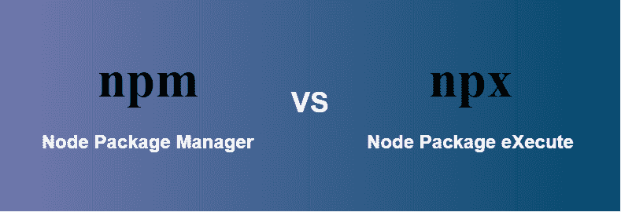

# NPM 和 npx 有什么区别？

> 原文:[https://www . geesforgeks . org/NPM 和-npx 的区别是什么/](https://www.geeksforgeeks.org/what-are-the-differences-between-npm-and-npx/)



[**NPM:**](https://www.geeksforgeeks.org/node-js-npm-node-package-manager/)**NPM 代表**节点包管理器**而它是 [**节点的默认包管理器. js .**](https://www.geeksforgeeks.org/introduction-to-nodejs/)[T21 它](https://www.geeksforgeeks.org/introduction-to-nodejs/) 完全是用 [**JavaScript、**](https://www.geeksforgeeks.org/javascript-tutorial/)T30 编写的 **npm** 管理 node.js 的所有包和模块，由命令–线路客户端 **npm** 组成。通过 [**安装 node.js.**](https://www.geeksforgeeks.org/installation-of-node-js-on-windows/) 安装到系统中，node 项目中需要的包和模块使用 **npm** 安装。一个包包含一个模块所需的所有文件，模块是可以根据项目的要求包含在 Node 项目中的 JavaScript 库。**

****用 npm 执行包:****

*   ****通过输入本地路径:**你必须写下你的包的本地路径如下:

    ```html
    ./node_modules/.bin/your-package-name
    ```** 
*   ****本地安装:**你要打开 **package.json** 文件，写下下面的脚本:

    ```html
    {
        "name": "Your app",
        "versiuon":  "1.0.0",
        "scripts":  {
                "your-package":  "your-package-name"
         }
    }
    ```** 

****要运行包:**之后，您可以通过运行以下命令来运行包:**

```html
npm run your-package-name
```

****NPX:**NPX 代表**节点包执行**并且自带 npm，当你安装了 5.2.0 以上版本的 npm，那么自动会安装 npx。它是一个 npm 包运行器，可以从 npm 注册表中执行任何你想要的包，甚至不需要安装那个包。npx 在一次性使用包中非常有用。如果您安装了 5.2.0 以下的 npm，那么您的 sy s tem 中不会安装 npx。您可以通过运行以下命令来检查 npx 是否已安装:**

```html
npx -v
```

**如果没有安装 npx，您可以通过运行下面的命令单独安装它。**

```html
npm install -g npx
```

****用 npx 执行包:****

*   ****直接可运行:**你可以不安装就执行你的包，为此运行以下命令。

    ```html
    npx your-package-name
    ```** 

****npm 和 npx 的区别:****

<figure class="table">

| **NPM** | **npx** |
| If you want to run the package through NPM, then you must specify that package in your package.json and install it locally. | A package can be executed without installation. It is an npm package operator, so if there is a package that has not been installed, it will be installed automatically. |
| The command to use create-react -app in npm is npm to install create-react -app and then create-react -app myApp (need to install). | But in npx, you don't need to install create-react-app myApp like npx. This command is only needed once in the life cycle of each application. |
| Npm is a tool for installing software packages. | Npx is a tool for package execution. |
| The bags used by NPM are installed all over the world, so you should be concerned about pollution for a long time. | The software package used by npx is not installed all over the world, so you should worry about long-term pollution. |

</figure>