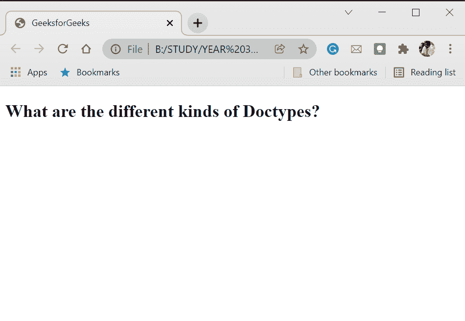

# 有哪些不同种类的 Doctypes 可用？

> 原文:[https://www . geeksforgeeks . org/有哪些不同类型的文档可供使用/](https://www.geeksforgeeks.org/what-are-the-different-kinds-of-doctypes-available/)

一个**文档类型**声明或文档类型声明是给浏览器的关于它应该期望什么文档类型的信息。它不是一个 HTML 标记。所有你编码的 HTML 文档都应该以<开头！DOCTYPE >申报。

文档类型声明写在标签的正上方，在您编写的每个文档的最开始。

**HTML5 文档类型:**这是目前使用的文档类型的最新版本。它没有缺点，更容易实现和调用。它将正确验证所有 HTML 5 特性，以及大多数 HTML 4/XHTML 1.0 特性。

**语法:**

```html
<!DOCTYPE html>
```

**严格文档类型(HTML 4.01):**HTML 4.01 严格文档类型根据 HTML 4.01 规范验证编写的代码。但是，它不允许使用任何不推荐使用的元素或表示标记，如<字体>元素或框架集。它验证松散的 HTML 样式标记，例如，最小化属性和非引用属性(例如必需的，而不是必需的=“必需的”)。

**语法:**

```html
<!DOCTYPE HTML PUBLIC "-//W3C//DTD HTML 4.01//EN"
"http://www.w3.org/TR/html4/strict.dtd">
```

**过渡文档类型(HTML 4.01):**HTML 4.01 过渡文档类型还根据 HTML 4.01 规范验证编写的代码，与严格的文档类型相同。它允许一些表示标记和不推荐使用的元素(如<字体>元素)，但不允许框架集。就像严格的 doctype 一样，它也验证松散的 HTML 样式标记。

**语法:**

```html
<!DOCTYPE HTML PUBLIC "-//W3C//DTD HTML 4.01 Transitional//EN"
"http://www.w3.org/TR/html4/loose.dtd">
```

**严格的和过渡的文档类型(XML 1.0):** 这些是与我们上面讨论的 HTML 4.01 文档类型完全相同的 XHTML 1.0，所以在功能上它们是相同的，除了它们不会验证松散的 HTML 样式标记:它们都必须是格式良好的 XML。

**语法:**

```html
<!DOCTYPE html PUBLIC "-//W3C//DTD XHTML 1.0 Strict//EN"
"http://www.w3.org/TR/xhtml1/DTD/xhtml1-strict.dtd">
```

和

```html
<!DOCTYPE html PUBLIC "-//W3C//DTD XHTML 1.0 Transitional//EN"
"http://www.w3.org/TR/xhtml1/DTD/xhtml1-transitional.dtd">
```

**框架集文档类型(HTML 4.01 和 XML 1.0):** 它们在功能上独立地与 HTML 4.01 transitional 和 XHTML 1.0 transitional 相同，但是它们允许使用框架集。

**注意:**我们建议您避免使用框架集和框架集文档类型。它们已经过时，在现代和编码实践中没有使用。

如果您想使用框架集并且仍然验证您的标记，您可以使用以下两种文档类型之一:

**语法:**

```html
<!DOCTYPE HTML PUBLIC "-//W3C//DTD HTML 4.01 Frameset//EN"
"http://www.w3.org/TR/html4/frameset.dtd">
```

而且，

```html
<!DOCTYPE html PUBLIC "-//W3C//DTD XHTML 1.0 Frameset//EN"
"http://www.w3.org/TR/xhtml1/DTD/xhtml1-frameset.dtd">
```

**其他文档类型:**有一些更古老、更罕见的文档类型版本，但它们甚至比 frameset 文档类型更过时。如果您遇到任何其他文档类型，这里没有提到，这是因为它们不再被使用。您发现的这类文档类型的代码很可能是在早期版本中编写或使用的。

**示例:**

## 超文本标记语言

```html
<!DOCTYPE html>
<html>
    <head>
        <meta charset="utf-8" />
        <title>GeeksforGeeks</title>
    </head>
    <body>
        <h2>What are the different kinds of Doctypes?</h2>
    </body>
</html>
```

**输出:**

