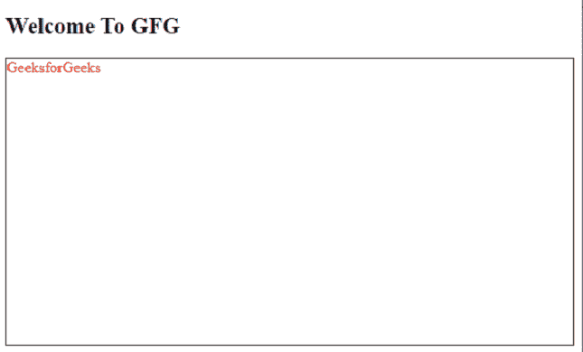

# Mixin 参数有哪些不同类型？

> 原文:[https://www . geesforgeks . org/什么是不同类型的混合参数/](https://www.geeksforgeeks.org/what-are-the-different-types-of-mixin-arguments/)

[**Mixin**](https://www.geeksforgeeks.org/sass-mixin-and-include/) 允许我们创建一个可以根据需求再次重用的 CSS 代码。参数是定义混合时编写的变量名。这些用逗号隔开。

mixin 参数是可以作为变量使用的 SassScript 值，并且在包含 mixin 时传递。有两种不同类型的混合参数。

*   **关键词参数**
*   **可变参数**

**关键字参数:**参数用于包含在 mixins 中。这些类型的参数(如果命名的话)可以以任何顺序传递，并且可以跳过它们的默认值。让我们看一个例子来更好地理解。

**SASS 代码:**

```
@mixin design($color, $height:1px) {
    color: red;
    border: $height solid black;
    height: 300px;
}
.temp {
    @include design($color:red, $height:1px);
}
```

这个 SASS 代码将被编译成如下的 CSS 代码。

**CSS 代码:**将以下文件命名为“style.css”。

## 半铸钢ˌ钢性铸铁(Cast Semi-Steel)

```
.temp {
  color: red;
  border: 1px solid black;
  height: 300px;
}
```

**HTML 代码:**让我们在下面的 HTML 文档中链接出这个 CSS 文件(style.css)。

## 超文本标记语言

```
<!DOCTYPE html>
<html>
<head>
  <title>Keyword Arguments</title>
  <link rel="stylesheet" 
        type="text/css" 
        href="style.css" />
</head>
<body>
  <h2>Welcome To GFG</h2>
  <p class="temp">GeeksforGeeks</p>
</body>
</html>
```

**输出:**



**变量参数:**当我们需要向 mixin 传递未知数量的参数时，我们使用变量参数。它包含所有需要传递的关键字参数。这些关键字参数可以在以后使用*关键字函数($args)* 访问，该函数以哈希映射的形式返回值。让我们看一个例子来更好地理解。

**SASS 代码:**

```
@mixin design($var) {
   color: $var;
}

$values: red, blue, green;
.temp {
   @include design($values...);
}
```

**CSS 代码:**

## 半铸钢ˌ钢性铸铁(Cast Semi-Steel)

```
.temp {
  color: red;
}
```

**HTML 代码:**让我们在一个 HTML 文件中使用这个 CSS 文件(style.css)。

## 超文本标记语言

```
<!DOCTYPE html>
<html>
<head>
  <title>Variable Arguments</title>
  <link rel="stylesheet" 
        type="text/css" 
        href="style.css" />
</head>
<body>
  <h2 class="temp">Welcome To GFG</h2>
  <p>Online Learning Platform</p>
</body>
</html>
```

**输出:**

