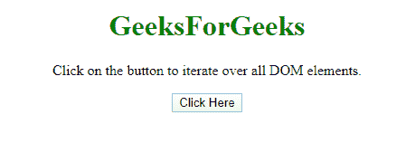
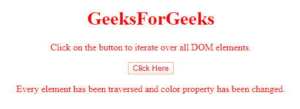
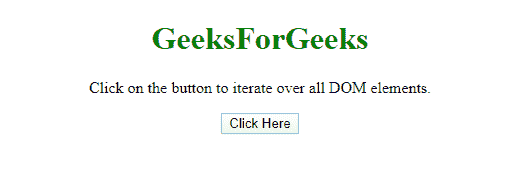
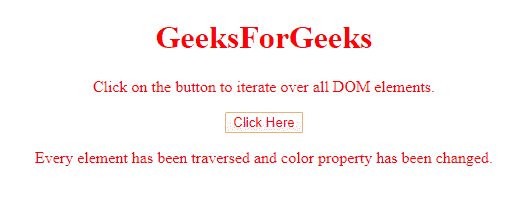

# 迭代所有 DOM 元素的有效方法有哪些？

> 原文:[https://www . geeksforgeeks . org/什么是迭代所有 dom 元素的最有效方法/](https://www.geeksforgeeks.org/what-are-the-efficient-ways-to-iterate-over-all-dom-elements/)

任务是以有效的方式迭代所有的 DOM 元素。以下是在 JavaScript 帮助下讨论的一些主要技术。

**方法 1:**

*   使用**document . getelementsbytagname(' *)**方法选择文档的所有 DOM 元素。
*   运行一个循环，并通过索引一个接一个地访问它们(例如，第 i <sup>个</sup>元素的 El【I】)。

**示例:**该示例实现了上述方法。

```
<!DOCTYPE HTML>
<html>

<head>
    <title>
        Efficient way to iterate
        over all DOM elements
    </title>
</head>

<body style="text-align:center;">

    <h1 style="color: green"> 
        GeeksForGeeks 
    </h1>

    <p id="GFG_UP"></p>

    <button onclick="gfg_Run()">
        Click Here
    </button>

    <p id="GFG_DOWN" style="color:green;"></p>

    <script>
        var el_up = document.getElementById("GFG_UP");
        var el_down = document.getElementById("GFG_DOWN");
        el_up.innerHTML = "Click on the button to "
                    + "iterate over all DOM elements.";

        function gfg_Run() {
            var x = document.getElementsByTagName('*');

            for (var i = x.length; i--;) {
                x[i].style.color = "red";
            }

            el_down.innerHTML = "Every element has "
                        + "been traversed and color "
                        + "property has been changed.";
        }
    </script>
</body>

</html>
```

**输出:**

*   **点击按钮前:**
    
*   **点击按钮后:**
    

**方法 2:**

*   使用**$(“*”)选择器**选择文档的所有 DOM 元素。
*   通过将元素应用于选择器来更改元素的任何属性。

**示例:**该示例实现了上述方法。

```
<!DOCTYPE HTML>
<html>

<head>
    <title>
        Efficient way to iterate
        over all DOM elements
    </title>

    <script src=
"https://ajax.googleapis.com/ajax/libs/jquery/3.4.1/jquery.min.js">
    </script>
</head>

<body style="text-align:center;">

    <h1 style="color: green"> 
        GeeksForGeeks 
    </h1>

    <p id="GFG_UP"></p>

    <button onclick="gfg_Run()">
        Click Here
    </button>

    <p id="GFG_DOWN" style="color:green;"></p>

    <script>
        var el_up = document.getElementById("GFG_UP");
        var el_down = document.getElementById("GFG_DOWN");
        el_up.innerHTML = "Click on the button to "
                    + "iterate over all DOM elements.";

        function gfg_Run() {
            $("*").css("color", "red");
            el_down.innerHTML = "Every element has "
                   + "been traversed and color "
                   + "property has been changed.";
        }
    </script>
</body>

</html>
```

**输出:**

*   **点击按钮前:**
    
*   **点击按钮后:**
    