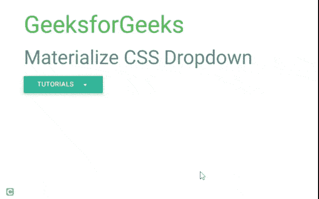

# 下拉的物化类有哪些？

> 原文:[https://www . geesforgeks . org/什么是物化类下拉菜单/](https://www.geeksforgeeks.org/what-are-the-materialize-classes-of-dropdowns/)

[物化](https://www.geeksforgeeks.org/materialize-introduction-and-installation/)是一个基于谷歌 Material Design 的现代响应式 CSS 框架。它的目标是开发一个设计系统，允许在任何平台上的所有服务中集成用户体验。物化是一种将成功设计的经典原则与创新和技术相结合的设计语言。物化带来了各种有用的组件，帮助开发人员创建响应网站。

[下拉菜单](https://www.geeksforgeeks.org/materialize-css-dropdown/)是物化 CSS 的内置组件之一。物化 CSS 中的下拉菜单主要用于允许用户选择列表中的一个值。物化 CSS 有一个时尚的下拉列表，有各种互动选项。

物化 CSS 提供了各种 CSS 类，以一种简单的方式创建一个漂亮的下拉列表。以下是可用的类及其用法。

*   **下拉列表-内容:**用于将无序列表(ul)标识为物化下拉组件。这是[T3ul](https://www.geeksforgeeks.org/html-ul-tag/)元素所必需的。
*   **数据-激活:**用于指定下拉无序列表(ul)元素的 ID。

物化 CSS 中的下拉列表提供了几个 CSS 类来为任何按钮添加下拉列表。只需确保 ***数据激活*** 属性 **id** 与无序列表元素标签中的 **id** 匹配即可，即 **< ul >** 。您可以添加一个分割线来分割 *ul* 标签的两个元素，类为“分割线”。您还可以添加图标，如下例所示。

**示例 1:** 以下示例演示了一个简单的下拉框。

## 超文本标记语言

```
<!DOCTYPE html>
<html>

<head>

    <!-- Imported Materialize Font Icon library -->
    <link rel="stylesheet" href=
"https://fonts.googleapis.com/icon?family=Material+Icons" />

    <link rel="stylesheet" href=
"https://cdnjs.cloudflare.com/ajax/libs/materialize/0.97.3/css/materialize.min.css" />
    <script type="text/javascript" 
        src="https://code.jquery.com/jquery-2.1.1.min.js">
    </script>

    <script src=
"https://cdnjs.cloudflare.com/ajax/libs/materialize/0.97.3/js/materialize.min.js">
    </script>
</head>

<body class="container">
    <h2 class="green-text">GeeksforGeeks</h2>
    <h3 class="blue-grey-text">
        Materialize CSS Dropdown
    </h3>

    <!-- Dropdown Initiated -->
    <ul id="dropdownId" class="dropdown-content">
        <li><a href="#">CSS</a></li>
        <li><a href="#">HTML</a></li>
        <li><a href="#">PHP</a></li>
        <li><a href="#">Java</a></li>

        <!-- Setting a divider -->
        <li class="divider"></li>
        <li><a href="#" class="black-text">End</a></li>
    </ul>

    <!-- DropdownId assigned to data-activates property  -->

    <a class="btn dropdown-button" href="#" 
        data-activates="dropdownId">
        Tutorials

        <!-- Icons used here -->
        <i class="mdi-navigation-arrow-drop-down 
            right material-icons">
        </i>
    </a>
</body>

</html>
```

**输出:**



**示例 2:** 以下示例演示了一个带有物化 CSS 徽章组件的下拉列表，该组件在下拉插件的初始化中设置了一些选项。

## 超文本标记语言

```
<!DOCTYPE html>
<html>

<head>

    <!-- Imported Materialize Font Icon library -->
    <link rel="stylesheet" href=
"https://fonts.googleapis.com/icon?family=Material+Icons" />
    <link rel="stylesheet" href=
"https://cdnjs.cloudflare.com/ajax/libs/materialize/0.97.3/css/materialize.min.css" />
    <script type="text/javascript" 
        src="https://code.jquery.com/jquery-2.1.1.min.js">
    </script>
    <script src=
"https://cdnjs.cloudflare.com/ajax/libs/materialize/0.97.3/js/materialize.min.js">
    </script>
</head>

<body class="container">

    <br />
    <h2 class="green-text">GeeksforGeeks</h2>
    <h3 class="blue-grey-text">
        Materialize badge classes
    </h3>

    <!-- Dropdown Initiated -->
    <ul id="dropdownId" class="dropdown-content">
        <li>
            <!-- use of Badge class -->
            <a href="#">Checked<span 
                class="card badge">89+</span>
            </a>
        </li>
        <li>
            <a href="#!">Unchecked
                <span class="card new badge blue">20</span>
            </a>
        </li>
        <li><a href="#" class="card badge">Spam</a></li>

        <li class="divider"></li>
        <li><a href="#">Junk<span 
            class="badge">14</span></a>
        </li>
    </ul>

    <!-- DropdownId of ul is assigned 
        to data-activates property -->
    <a class="btn dropdown-button" href="#" 
        data-activates="dropdownId">
        My mails

        <!-- Using Icons -->
        <i class="mdi-navigation-arrow-drop-down right"></i>
    </a>

    <script>
        $('.dropdown-button').dropdown({
            inDuration: 250,// Enter transition in ms
            outDuration: 250,// Out transition in ms
            constrainWidth: true,// Width takes size of activator
            hover: true, // Activate on hover    
            belowOrigin: true, //Dropdown is below activator
            alignment: 'right'
        });
    </script>
</body>

</html>
```

**输出:**

