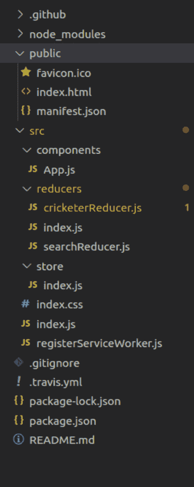
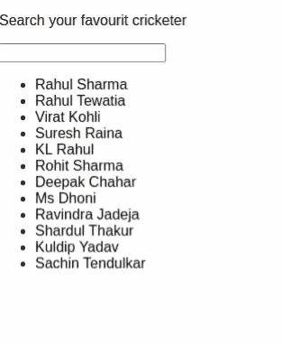

# 【Redux 遵循的三个原则是什么？

> 原文:[https://www . geeksforgeeks . org/redux 遵循的三大原则是什么/](https://www.geeksforgeeks.org/what-are-the-three-principles-that-redux-follows/)

回到应用开发刚刚开始的时候，前端很容易实现。然而，随着对最终用户体验的日益关注，开发前端的复杂性正在上升，并变得势不可挡。

为了满足新时代用户的迫切和不断发展的需求，前端开发人员着眼于 Vue 来帮助他们克服复杂性的困扰。除此之外，角度和反应也是可能的选择。然而，前端应用程序缺乏一致性，这使得 JavaScript 应用程序需要一个稳定的容器。因此，redux 的开发是为了帮助前端开发人员编写行为一致的应用程序。除此之外，redux 还有助于解决 [React 性能问题](https://www.trootech.com/top-challenges-solutions-to-optimize-the-performance-of-react-native-app/)。因此，当在不同的环境(本机、服务器和客户端)中运行时，Redux 是不变的。通常，Redux 与 React 一起工作，以消除在大量应用程序中遇到的状态管理问题。此外，由于 React 与根组件紧密耦合，恢复组件很麻烦，因此 redux 有助于降低复杂性。除此之外，它还为构建易于测试的应用程序提供了全局可访问性。

如果您刚刚开始使用 redux 并想详细探索它，请先了解基础知识。

为了理解 redux 的核心，你只需要知道三个原则。

1.  **Redux 是真理的单一来源:**应用程序的全局状态存储在单一存储中的对象树内。结果，由于服务器的状态被序列化到客户端而没有任何额外的代码，构建通用应用变得更加容易。反过来，一个单一的状态树使得检查应用程序变得很容易。除此之外，它还支持更快、更短的开发周期。此外，一些传统上很难实现的功能，如撤销/重做，在状态位于单一树中时，对于实现来说可能变得微不足道。
2.  **状态为只读状态:**改变状态的方法只有一个——发出描述发生了什么的动作或对象。根据第二个原则，网络和视图回调都不会写入状态。取而代之的是，这些表达了形式转换的意图。由于所有这些变化都是集中的，并且只能以严格的顺序发生，因此没有条件可寻。由于操作是普通对象，因此可以对它们进行序列化、记录、存储，然后重放以进行调试或测试。
3.  **用纯函数完成修改:**为了指定状态树如何通过动作进行转换，您可以编写纯缩减器。减压器仅仅是纯粹的功能，它接受先前的状态和动作，并将其移动到下一个状态。您应该记住，您应该返回到新的状态对象，而不是变异到最后一个状态。首先，你应该从一个减速器开始。现在，当您的应用程序增长时，您可以将它分成小的缩减器，这些缩减器可以处理状态树的特定部分。因为缩减器仅仅是功能，你应该控制顺序，其中顺序可以变成普通任务的可重用的缩减器。

**创建反应应用程序以及安装模块:**

**步骤 1:** 首先，使用下面提到的命令创建一个 React 应用程序:

```html
npx create-react-app Principle
```

**步骤 2:** 一旦您用适当的文件夹名称创建了文件夹–原则–并使用以下命令执行:

```html
cd Principle
```

**步骤 3:** 创建完 ReactJS 应用程序后，使用下面提到的命令安装模块:

```html
npm install
```

**项目结构:**如下图:

[](https://www.trootech.com/hire-remote-developers/)

**示例:**在下面的示例中，我们从存储信息的数据层开始。根据第一个原则，Redux 是数据共享的单一存储。因此，我们将从为存储创建单例开始。根据第二个原理，纯函数具有可预测的特性。这些函数不会有任何数据库调用或网络调用。当我们使用相同的参数或参数集调用纯函数时，将返回相同的值。以下代码将在 **App.js.** 中编写除此之外，我们还将使用 React-Redux 将视图层连接到状态层。在下面的代码中，当用户触发一个动作时，先前的状态将改变，这意味着 on 将返回到新的状态。

## App.js

```html
import React from "react";
import { connect } from "react-redux";

const applyFilter = (searchFruite) => (article) => article
  .name.toLowerCase().includes(searchFruite.toLowerCase());

const App = ({ cricketerList, searchFruite, onSearch }) => (
  <div>
    <Search value={searchFruite} onSearch={onSearch}>
      <p>Search your favourite cricketer</p>
    </Search>

    <UL list={cricketerList.filter(applyFilter(searchFruite))} />
  </div>
);

const Search = ({ value, onSearch, children }) => (
  <div>
    {children}{" "}
    <input
      value={value}
      onChange={(event) => onSearch(event.target.value)}
      type="text"
    />
  </div>
);

const UL = ({ list }) => (
  <ul>
    {list.map((cricketer) => (
      <li key={cricketer.id}>
        <span>{cricketer.name}</span>
      </li>
    ))}
  </ul>
);

// Connecting view layer to state layer with react-redux
const mapStateToProps = (state) => ({
  cricketerList: state.cricketerState.cricketer,
  searchFruite: state.searchState.searchFruite,
});

const mapDispatchToProps = (dispatch) => ({
  onSearch: (searchFruite) =>
    dispatch({
      type: "SEARCH_SET",
      searchFruite,
    }),
});

export default connect(mapStateToProps, 
              mapDispatchToProps)(App);
```

根据这个原则，应用程序的整个状态可以表示为一个统一的 JavaScript 对象。以下数据将存储在**cricketterreducer . js**中

## cricketterreducer . js

```html
const INITIAL_STATE = {
  cricketer: [
    { id: "0", name: "Rahul Sharma", type: "Spin Bolwer" },
    { id: "1", name: "Rahul Tewatia", type: "All-Rounder" },
    { id: "2", name: "Virat Kohli", type: "Batsman" },
    { id: "3", name: "Suresh Raina", type: "Batsman" },
    { id: "4", name: "KL Rahul", type: "Batsman - WK" },
    { id: "5", name: "Rohit Sharma", type: "Batsman" },
    { id: "6", name: "Deepak Chahar", type: "Fast Bowler" },
    { id: "7", name: "Ms Dhoni", type: "Batsman-WK" },
    { id: "8", name: "Ravindra Jadeja", type: "All-Rounder" },
    { id: "9", name: "Shardul Thakur", type: "Fast Bowler" },
    { id: "10", name: "Kuldip Yadav", type: "Spin Bowler" },
    { id: "11", name: "Sachin Tendulkar", type: "Batsman" },
  ],
};

function cricketerReducer(state = INITIAL_STATE, action) {
  switch (action.type) {
    default:
      return state;
  }
}

export default cricketerReducer;
```

## Reducer2.js

```html
const INITIAL_STATE = {
  searchFruite: "",
};

function searchReducer(state = INITIAL_STATE, action) {
  switch (action.type) {
    case "SEARCH_SET":
      return { ...state, searchFruite: action.searchFruite };
    default:
      return state;
  }
}

export default searchReducer;
```

**运行应用程序的步骤:**打开终端，键入以下命令。

```html
npm start
```

**输出:**打开浏览器，移至***http://localhost:3000/***查看如下输出。

