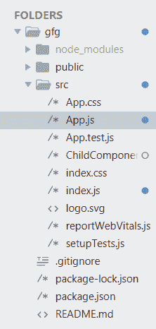
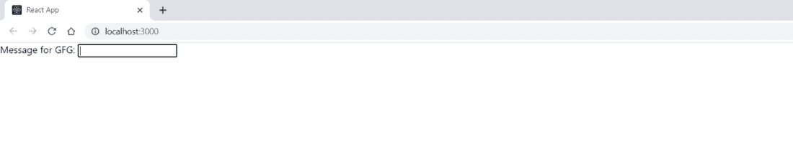
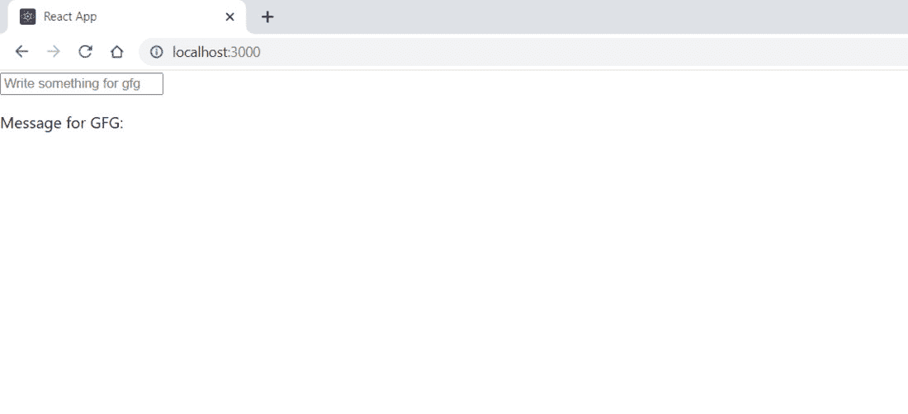
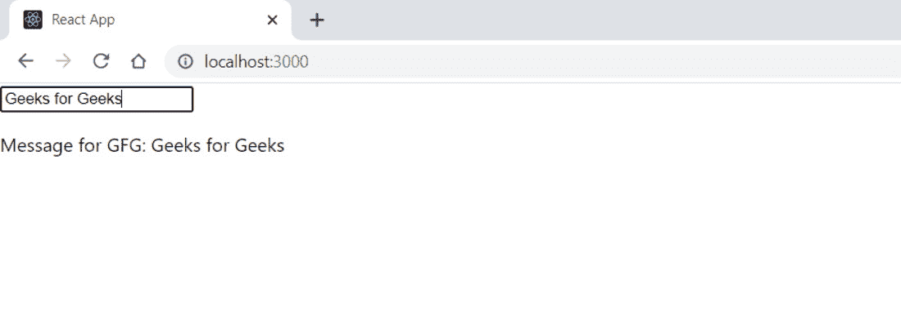

# 控制组件的数据类型有哪些？

> 原文:[https://www . geeksforgeeks . org/控制组件的数据类型是什么/](https://www.geeksforgeeks.org/what-are-the-types-of-data-that-control-a-component/)

一个**组件**是 React 的核心构件之一。换句话说，组件是一个 JavaScript 函数，它接受输入(道具)并返回一个 React 元素，表示用户界面的一部分应该是什么样子。

**受控组件:**表单数据由组件下的状态处理。当客户/用户提交表单时，表单具有浏览新页面的默认 HTML 表单行为。如果你在“反应”中需要类似的行为，它是有效的。然而，一般来说，拥有一个 JavaScript 函数来处理表单的容纳，并处理客户端/用户提交到表单中的信息是很有帮助的。实现这一点的标准方法是采用一种称为“受控部件”的程序。

**为什么要使用受控组件:**您需要为您的信息可以改变的每种方式编写一个事件处理程序，并通过一个反应组件对整个输入状态进行排队。

表单数据包括:

*   文本输入
*   数字输入
*   无线电输入
*   复选框输入
*   文本行
*   选择

**创建反应应用程序:**

*   **步骤 1:** 在终端/命令提示符下使用以下命令创建 React 应用程序:

    ```html
    create-react-app foldername
    ```

*   **步骤 2:** 创建项目文件夹(即文件夹名)后，使用以下命令移动到该文件夹:

    ```html
    cd foldername
    ```

**项目结构:**如下图:



**示例 1:** 现在在 App.js 文件中写下以下代码。在这里，App 是我们编写代码的默认(父)组件。

## App.js

```html
import React, {Component}  from 'react';

class App extends React.Component {
  constructor(props) {
    super(props);

    this.onChange = this.onChange.bind(this);

    this.state = {
      name: ''
    };
  }

  onChange(e) {
    this.setState({
      name: e.target.value
    });
  }

  render() {
    return (
      <div>
        <label for='name-input'>Message for GFG: </label>
        <input
          id='name-input'
          onChange={this.onChange}
          value={this.state.name} />
      </div>
    )
  }
}

export default App;
```

上面的示例显示了 value 属性如何表征输入的当前值，onChange 事件处理程序如何使用客户端的信息/输入更新组件的状态。

**输出:**在可能的情况下，表单输入应被描述为受控组件。这保证了组件状态和输入尊重始终处于和谐的状态，而不管值是否被客户端输入以外的触发器改变。



表单输入

**示例 2:** 现在在 App.js 文件中写下以下代码。在这里，App 是我们编写代码的默认(父)组件。

## App.js

```html
import React, { Component } from 'react';

class App extends Component {
    state = {
        message: ''
    }
    updateMessage = (newText) => {
        console.log(newText);
        this.setState(() => ({
            message: newText
        }));
    }
    render() {
        return (
            <div className="App">
                <div className="geeks">
                    <input type="text"
                        placeholder="Write something for gfg"
                        value={this.state.message}
                        onChange={(event) => this
                          .updateMessage(event.target.value)}
                    />
                    <p>Message for GFG: {this.state.message}</p>
                </div>
            </div>
        );
    }
}

export default App;
```

**输出:**在本例中，一个组件在页面上呈现一个文本框，并重复客户端在文本框中键入的内容。创建一个状态对象，该对象保存一个名为**消息**的属性。这是用户输入给定文本框的值的存储位置。此外，onChange 事件处理程序是为控制组件而声明的。



受控部件

