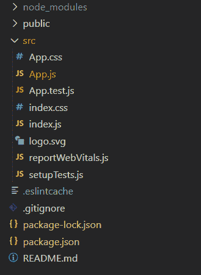
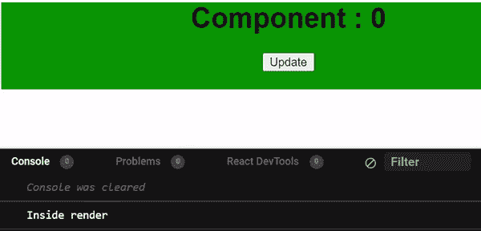

# should component update 是做什么的，为什么重要？

> 原文:[https://www . geesforgeks . org/what-do-should component update-do-and-why-it-important/](https://www.geeksforgeeks.org/what-does-shouldcomponentupdate-do-and-why-is-it-important/)

“应该组件更新”是“反应”中的生命周期方法。此方法使组件仅在组件的状态或道具发生变化并且该变化将影响输出时才重新呈现。

当接收到新的道具或状态时，在渲染已经安装的组件之前调用 **shouldComponentUpdate()** 。

**语法:**

```html
shouldComponentUpdate(nextProps, nextState)
```

**参数:**接受 *nextProps* 和 *nextState* 两个参数。shouldComponent 通过将现有的道具和状态与 nextProps 和 nextState 进行比较，返回是否返回组件的布尔值。

**返回值:**默认情况下，该方法返回 true，这意味着组件将重新呈现，如果返回 false，则不会调用 render()、componentWillUpdate()和 componentDidUpdate()方法。

**创建反应应用程序:**

*   **步骤 1:** 使用以下命令创建一个反应应用程序:

    ```html
    npx create-react-app foldername
    ```

*   **步骤 2:** 在创建项目文件夹(即文件夹名**)后，使用以下命令将**移动到该文件夹:

    ```html
    cd foldername
    ```

**项目结构:**如下图。



项目结构

**实现:**在 App.js 文件中写下以下代码。

## App.js

```html
import React, { Component } from 'react';
import "./styles.css";
class App extends Component {
  constructor() {
    super();
    this.state = {
      value: 0
    }
  }

  shouldComponentUpdate(prevProps, prevState) {
    if (prevState.value !== this.state.value) {
      return true;
    }
    else {
      return false;
    }
  }

  render() {
    console.log("Inside render");
    return (

      <div className="App">
        <h1>Component : {this.state.value}</h1>
        <button onClick={() => {
          this.setState({ value: this.state.value + 1 })
        }}>Update</button>
      </div>
    );
  }
}

export default App;
```

## styles.css

```html
.App {
  font-family: sans-serif;
  text-align: center;
  width: 460px;
  background: green;
}
```

**运行应用程序的步骤:**从项目的根目录使用以下命令运行应用程序:

```html
npm start
```

**输出:**现在打开浏览器，转到***http://localhost:3000/***，会看到如下输出:



**说明:**以上是点击按钮，状态值发生变化的例子。在函数 shouldComponentUpdate()中，我们正在检查当前的状态值是否与以前不同。如果不同，则函数返回 true，这意味着组件将重新呈现。在控制台中，我们可以看到，当组件一次又一次地重新呈现时，每次单击按钮都会出现消息“内部呈现”。在这种情况下，状态的当前值与之前相同，那么 shouldComponentUpdate()函数将返回 false，组件将不会重新呈现。

**should component update()的重要性:**

*   它有助于检查是否需要重新呈现组件。如果不需要重新渲染，那么应该组件更新不渲染组件。例如，如果我们希望我们的组件不在某些特定条件下呈现，那么 shouldComponentUpdate 会非常有用。
*   它有助于提高性能。
*   它增加了网站的响应性和优化