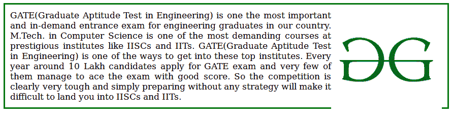
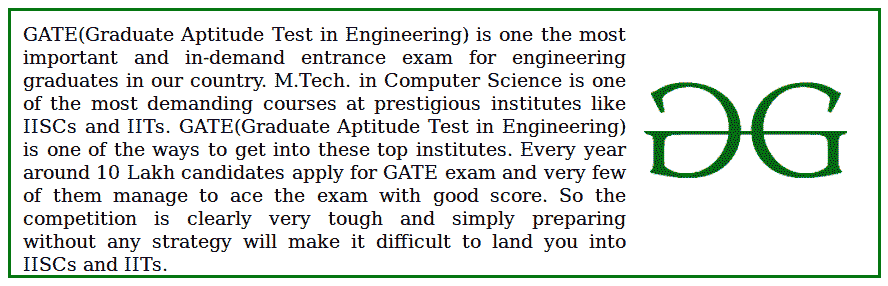
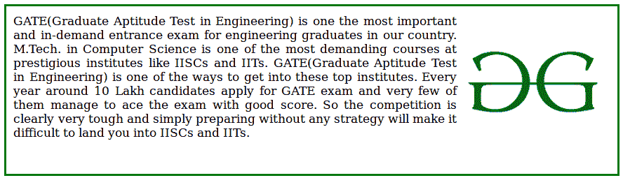

# 什么是 clearfix？

> 原文:[https://www.geeksforgeeks.org/what-is-a-clearfix/](https://www.geeksforgeeks.org/what-is-a-clearfix/)

一个 **clearfix** 是一种元素自动清除或固定其元素的方式，这样它就不需要添加额外的标记。它通常用在浮动布局中，在浮动布局中，元素被水平堆叠。如果元素比包含它的元素高，那么使用 CSS 的[溢出属性](https://www.geeksforgeeks.org/css-overflow/)，将其值设置为*自动*，以克服&修复问题。

**示例:**从下图来看，徽标不适合 div 元素。要解决这个问题，有两种方法。第一种是通过增加 div 块的高度，第二种是通过使用 clearfix CSS 属性。



我们将通过示例了解这些概念及其实现。

请参考 [CSS Float](https://www.geeksforgeeks.org/css-float/) 一文，了解 CSS 中的浮动概念。

**示例 1:** 在下面的代码中，在不使用的*溢出*属性的情况下，问题得到了解决。

## 超文本标记语言

```html
<!DOCTYPE html>
<html>

<head>

    <!-- CSS code to show the working
        of this property -->
    <style>
    div {
        border: 3px solid green;
        padding: 10px;
        height: 200px;
        text-align: justify;
    }

    img {
        float: right;
    }
    </style>
</head>

<body>
    <div>
        
        GATE(Graduate Aptitude Test in Engineering) is one the most
        important and in-demand entrance exam for engineering graduates
        in our country. M.Tech. in Computer Science is one of the most
        demanding courses at prestigious institutes like IISCs and IITs.
        GATE(Graduate Aptitude Test in Engineering) is one of the ways
        to get into these top institutes. Every year around 10 Lakh
        candidates apply for GATE exam and very few of them manage to
        ace the exam with good score. So the competition is clearly
        very tough and simply preparing without any strategy will make
        it difficult to land you into IISCs and IITs.
    </div>
</body>

</html>
```

**输出:**



**示例 2:** 在本代码中，使用*[*溢出*](https://www.geeksforgeeks.org/css-overflow/) 属性修复了该问题。*

## *超文本标记语言*

```html
*<!DOCTYPE html>
<html>

<head>

    <!-- CSS code to show the working
        of this property -->
    <style>
    div {
        border: 3px solid green;
        padding: 10px;
        text-align: justify;
    }

    img {
        float: right;
    }

    .gfg {
        overflow: auto;
    }
    </style>
</head>

<body>
    <div class="gfg">
        
        GATE(Graduate Aptitude Test in Engineering) is one the most
        important and in-demand entrance exam for engineering graduates
        in our country. M.Tech. in Computer Science is one of the most
        demanding courses at prestigious institutes like IISCs and IITs.
        GATE(Graduate Aptitude Test in Engineering) is one of the ways
        to get into these top institutes. Every year around 10 Lakh
        candidates apply for GATE exam and very few of them manage to
        ace the exam with good score. So the competition is clearly
        very tough and simply preparing without any strategy will make
        it difficult to land you into IISCs and IITs.
    </div>
</body>

</html>*
```

***输出:***

**