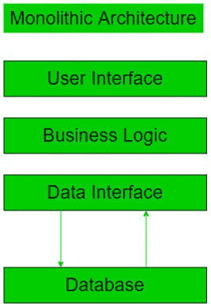

# 什么是独石服务器？

> 原文:[https://www.geeksforgeeks.org/what-is-a-monolith-server/](https://www.geeksforgeeks.org/what-is-a-monolith-server/)

单块服务器是利用单块架构的服务器，因为单块服务器是独立的，不需要依赖任何其他服务器。这种设计背后的原因遵循一种逻辑方法，即服务器本身能够并负责所有必须执行的任务，并且能够执行执行某项功能所需的每一个步骤，因此它不会因为某个外部服务器的故障而忙于不处理任何请求。

**单体建筑:**

如果一个体系结构由单个程序中的所有依赖项组成，那么它可以被归类为单片。整体架构由以下单个平台组件组成，可使整个服务器正常运行:

1.  **授权:**如果用户与服务器是否关联，则授权，如果服务器无法验证用户，则授权失败并返回错误。
2.  **表示:**它处理 HTTP 请求，并以 HTML 或 XML/JSON(对于 web 服务 API)进行响应。
3.  **数据库层:** 该层负责用数据访问对象访问数据库。
4.  **业务逻辑:** 这包括服务器架构的业务模型。
5.  **应用集成:** 这是与 REST APIs 的集成或者与任何其他数据源的集成。
6.  **通知模块:** 该模块执行每当满足要求条件时发送邮件通知的操作。

**单片服务器的应用:**

*   这些可以用来实现简单的架构项目，比如静态网站。
*   当开始一个新的项目或软件时，这些可以作为基础，因为我们可以在以后需要的时候切换到微服务。
*   这些主要用于静态设计，因为它们易于在单个文件或目录中维护。
*   当应用程序需要与数据库的直接数据接口时，可以使用它们。

**单片服务器的优势:**

*   在单片体系结构的开始工作非常简单。
*   我们可以简单地用 Selenium 实现端到端的 UI 测试。
*   部署到服务器很容易，因为您必须将打包的应用程序复制到服务器。
*   扩展很简单，因为我们可以在负载平衡器后面运行多个副本。
*   对代码库的适当管理可以确保更长时间内的生产力。

**单片服务器的缺点:**

*   如果应用程序太大，将很难维护服务器。
*   如果应用程序很复杂，更改可能需要时间才能正确完成。
*   该大小可以减慢应用程序的启动时间。
*   如果不同的模块有冲突的需求，在扩展时将会很有挑战性。
*   单块服务器在 bug 方面不太可靠，因为这可能会破坏整个过程。
*   单片服务器在开发的后期阶段使用先进技术有困难。