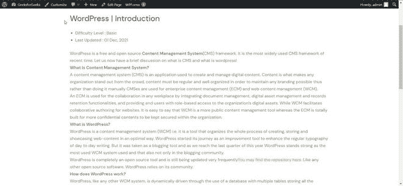
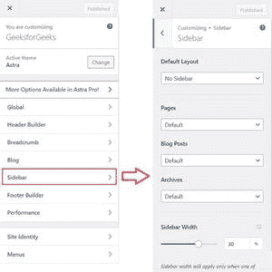
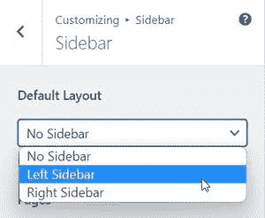
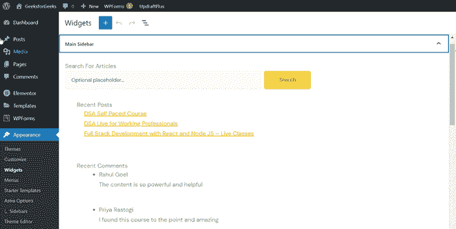
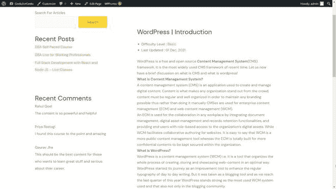

# 什么是 WordPress 中的侧边栏？

> 原文:[https://www . geesforgeks . org/什么是 wordpress 中的侧边栏/](https://www.geeksforgeeks.org/what-is-a-sidebar-in-wordpress/)

[WordPress](https://www.geeksforgeeks.org/introduction-wordpress/) 是一个免费开源的**内容管理系统** (CMS)框架。这是最近最广泛使用的内容管理系统框架。WordPress 是如此的可定制，以至于我们可以根据自己的需求改变几乎所有的东西。在本文中，我们将学习 WordPress 中的**侧栏。**

A **侧边栏**是放置在网页右侧或左侧的栏，显示关于网站的附加信息和功能。例如:

*   最近的帖子
*   最近的评论
*   档案
*   种类
*   还有更多。

我们可以根据自己的需要完全定制侧边栏。假设我们有一个投资组合网站，那里没有文章或帖子页面，所以我们可以从侧边栏菜单中删除最近的帖子部分，但另一方面，我们有一个旅游网站，我们确实有博客部分。在这种情况下，我们可能需要用户在侧边栏菜单中看到我们的最新帖子，这样我们就可以添加它。侧边栏在每个不同的 WordPress 主题上会看起来不同。在[极客博客](https://www.geeksforgeeks.org/)网站上，我们也有一个右侧边栏，显示一些额外的信息，如最新动态、快速链接、特色文章和推荐(它可能会在未来更新)。您可以在下图中看到:

**如何在 WordPress 网页上添加侧边栏？**

我们已经了解了侧边栏及其一些好处。现在，我们将了解如何在 WordPress 网页中激活侧栏并对其进行自定义。没有侧边栏的网页是这样的:

现在要添加侧边栏，打开仪表板，转到**外观> >定制。**您也可以通过点击顶部菜单栏中的自定义选项从网页中打开它。它会打开你网站的定制窗口，列出所有选项，包括**侧栏。**

在那里，您将看到在网页上启用侧栏并对其进行自定义的选项。与上图一样，我们可以更改侧边栏设置，并将其从无侧边栏启用到左侧边栏或右侧边栏之间的任何位置，选择您想要在网页上显示它的选项，然后单击发布以使更改反映到实时网站上。此外，您可以自定义是否希望此设置反映在每个网页或任何特定类型的网页上。

**注意:** 选项可能因主题而异，根据主题支持有或多或少的定制。您可以通过查看主题的文档来检查主题的可访问性。

此时，侧边栏必须在您的网页上启用，但它可能不会显示您想要显示的功能的适当信息。但是没有必要担心，我们也可以很容易地定制它，并显式地更改侧边栏的内容。为此，转到仪表板，然后转到**外观> >小部件。**在小部件面板下，你会看到一个标题为**边栏的选项。**你会在那边找到侧边栏的所有内容，可以自定义。

更改评论、博客、最近的帖子、广告、类别或您希望在侧栏菜单上显示的任何内容，然后单击**更新**将其反映在直播中。在我的主题中，完成所有步骤并更改内容后，我得到了左侧边栏，其中包含最近的帖子、最近的评论、档案和类别，如下图所示:

