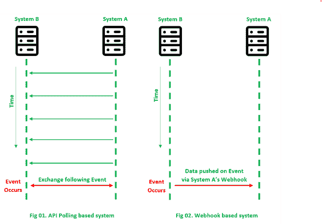
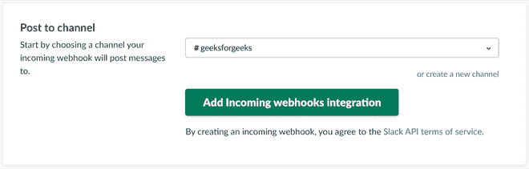
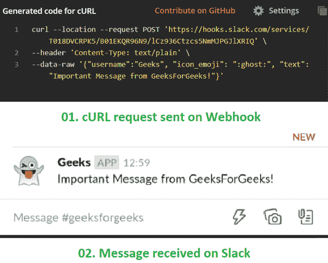
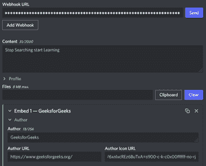

# 什么是网钩，如何使用？

> 原文:[https://www . geeksforgeeks . org/什么是网络钩子和如何使用它/](https://www.geeksforgeeks.org/what-is-a-webhook-and-how-to-use-it/)

Webhooks 允许基于 web 的应用程序之间通过使用自定义回调进行交互。webhooks 的使用允许 web 应用程序自动与其他 web 应用程序通信。与一个系统(主体)不断轮询另一个系统(观察者)以获取某些数据的传统系统不同，Webhooks 允许观察者在某个事件发生时自动将数据推入主体的系统。

这样就不需要受试者不断检查。Webhooks 完全在互联网上运行，因此，系统之间的所有通信都必须以 HTTP 消息的形式进行。

### 网络挂钩的使用

Webhooks 依赖于静态 URL 的存在，静态 URL 指向主体系统中的 API，当观察者系统上发生事件时，必须通知这些 API。这方面的一个例子是一个网络应用程序，旨在收集和管理用户亚马逊账户上的所有订单。在这个场景中，亚马逊作为观察者，定制订单管理网络应用程序作为主体。

不是让定制网络应用程序定期调用亚马逊的应用编程接口来检查创建的订单，而是在定制网络应用程序中创建一个网络钩子，允许亚马逊通过注册的网址自动将新创建的订单推送到网络应用程序中。因此，为了能够使用 webhooks，主题必须指定接受观察者事件通知的 URL。这大大减轻了主题的负担，因为只有在事件发生时，双方才会进行 HTTP 调用。

基于轮询的系统与基于网络钩子的系统

一旦观察者调用了主题的网络钩子，主题就可以对这个新推送的数据采取适当的行动。通常，网络钩子是通过特定网址上的发布请求来执行的。开机自检请求允许向主题推送附加信息。此外，它还可以用来识别一组各种可能的事件，而不是为每个事件创建单独的网络钩子网址。

### web 手册工作流

要在应用程序上实现传入的 webhooks，需要完成以下基本步骤:

1.  在您的应用服务器上公开一个接受和处理 HTTP POST 调用的应用编程接口端点
2.  为 webhook 的潜在用户提供对此端点的访问。只要满足相关条件，应用编程接口端点就会被称为数据源应用程序。
3.  处理开机自检数据，并向网络挂钩呼叫发起者返回响应以指示状态。该步骤可能存在，也可能不存在。

### 网络挂钩与应用编程接口

Webhooks 和 API 的目标都是在应用程序之间建立通信。然而，使用网络钩子而不是应用程序接口来实现应用程序集成有一些明显的优点和缺点。

如果以下几点与正在实施的系统更相关，Webhooks 往往是更好的解决方案:

*   如果服务器上的数据经常更新，Webhooks 往往是更好的解决方案，因为消除了客户端对服务器不必要的 API 调用。根据[resthooks.com](www.resthooks.com)，98.5%的 API 轮询被浪费。
*   Webhooks 为需要近实时数据更新的系统提供了更好的解决方案。API 的轮询通常以预先指定的时间间隔运行，这可能会阻止实时数据更新。使用 webhook，一旦 web hook 被触发，服务器就会将更新推送到客户端。

在某些其他情况下，应用编程接口的使用应该比网络钩子更受欢迎。通过网络钩子使用应用编程接口需要考虑的重要方面有:

*   API 的使用允许更多地定制何时从服务器轮询数据，以及从服务器轮询多少数据。要轮询的数据量通过 API 轮询大小来调整。使用 webhooks，服务器通常决定数据以及推送数据的时间。
*   对于具有高度可变数据的系统(如实时系统、物联网系统等。)，基于 API 的轮询可能是一个更好的选择，因为对于每个 API 调用，都有很高的可能性做出可操作的响应。
*   如果 REST 端点离线，服务器通过网络钩子推送的数据可能会被客户端完全忽略。如果服务器没有重试此类失败推送的机制，数据更新将完全丢失。

为了解决当 Webhook 脱机时丢失服务器推送的数据的可能性，您可以使用事件消息队列来存储这样的调用。提供此类功能的平台包括**Rabbtmq、**或**亚马逊的简单队列服务(SQS)。**两者都被设计成作为中间消息存储设施，避免丢失网络钩子调用的可能性。

### 松弛状态下的挂钩

许多流行的平台提供了创建可用于定制应用程序的网络钩子的功能。消息平台 Slack 也提供了这样一个系统，允许消息在被调用时被推入用户的 Slack 帐户。

要创建一个松弛网络钩子网址，我们需要通过松弛控制台设置一个传入网络钩子集成，如下所示:

1.  从您需要创建网页挂钩的帐户登录到 slack.com
2.  导航到 https://my.slack.com/services/new/incoming-webhook.
3.  选择将推送消息的默认频道。
4.  您还可以指定帐户名称和个人资料图片等详细信息，以识别这些推送消息的来源。
5.  复制生成的网页挂钩网址

在可宽延时间中添加传入的网络钩子

要将消息推送到 Slack 通道，必须在 Webhook URL 上执行 POST 请求，在请求正文中指定要发送的消息。成功执行请求后，消息应该被推送到用户的 Slack 帐户。

使用网络钩子将消息推入 Slack

### 不和谐的网络钩子

如今，许多流行的平台都提供了使用集成创建网络钩子的功能，这些集成可能会在像 Github、Circle CI 这样的定制应用程序中使用。社区平台 Discord 也提供了这样一个系统，允许消息被推入用户的 Discord 服务器。

要创建一个不和谐的网络钩子网址，我们需要通过 Discord 设置一个传入网络钩子集成，如下所示:

1.  从您需要创建网络钩子的帐户登录到 https://discord.com/。
2.  创建服务器或使用现有服务器。
3.  导航到服务器设置，然后选择集成->创建具有相应属性的网络挂钩。
4.  选择您希望消息推送的默认频道。
5.  复制生成的网页挂钩网址。

**添加网钩**

我们将使用 DiscoHook 推送一些通知或发布的 URL。

**disclock–只需给出我们希望我们的通知是什么的所有细节。**T3】

我们所做的是为我们的用户创建一个定制消息，以获得他们需要的所有信息。比如，让我们举个例子:学生们正在为他们的职位面试做准备，我们可以在以下方面帮助他们:

不和机器人会通知:

**不和谐通知- >点击链接，进入** **。**