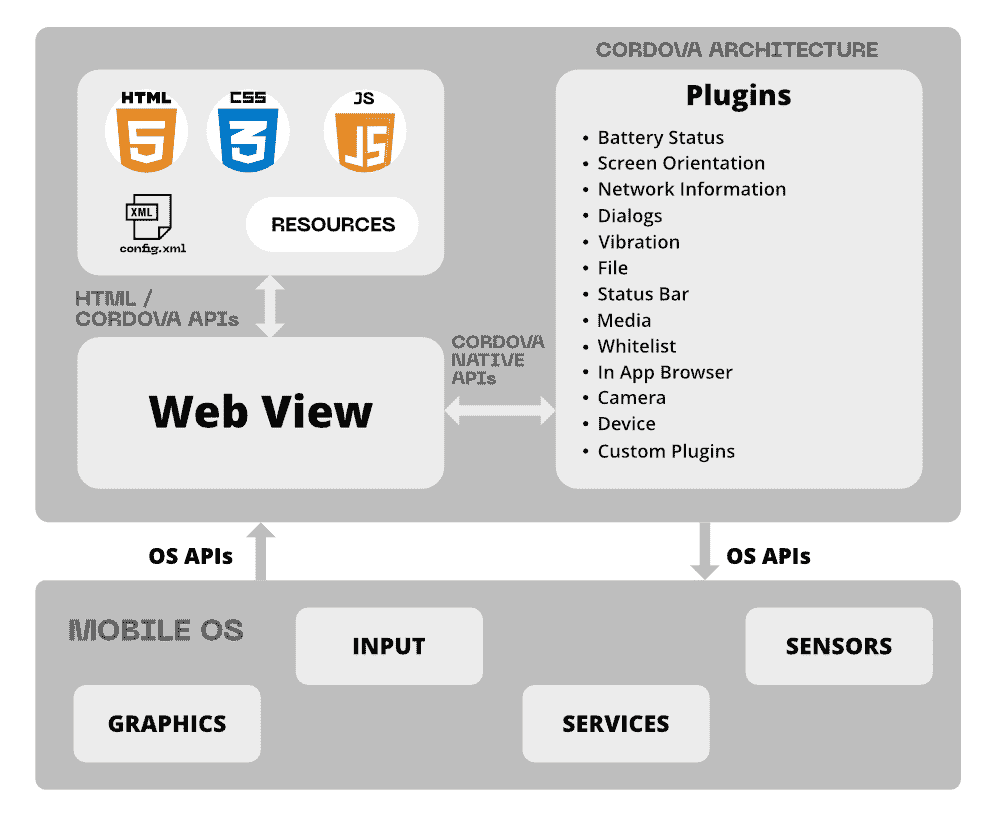

# 什么是阿帕奇科尔多瓦？

> 原文:[https://www.geeksforgeeks.org/what-is-apache-cordova/](https://www.geeksforgeeks.org/what-is-apache-cordova/)

Apache Cordova 是一个开源平台，用于通过 HTML、CSS、JavaScript 等网络应用程序开发移动应用程序。科尔多瓦对网络开发人员非常有用，因为他们可以使用科尔多瓦轻松地将网页转换为具有本地应用功能的网络应用。这是一个非常有用的功能，因为普通的网络应用程序没有这个功能。

Cordova 用于制作跨平台的移动应用程序，并为易于嵌入的应用程序的更好功能提供了广泛的插件。

### 装置

我们正在安装科尔多瓦命令行工具。如果尚未安装，请遵循以下步骤:

1.  下载 Node.js，从[这里](https://nodejs.org/en/download/)安装。
2.  使用 npm 实用程序(Node.js)安装 Cordova 模块

#### 在 Linux / macOS 上安装

将 *sudo* 命令前置到 *npm* 命令可能是安装实用程序所需要的

```
$ sudo npm install -g cordova
```

#### 在 Windows 上安装

-g 标志告诉 npm 实用程序在全局范围内安装 Cordova

```
C:\>npm install -g cordova
```

在命令行中运行 Cordova，检查是否正确安装如果安装，它应该打印帮助文本。

### 科尔多瓦的应用架构

科尔多瓦有一个高层次的设计，下图描述了它的架构



科尔多瓦的应用架构

**Web 视图:**这是 Cordova 应用的用户界面。所使用的应用程序与 web 视图和本机组件集成在一起(对于混合应用程序)。

**Web App:** 这是使用 HTML、CSS、JavaScript 制作的基本网页布局。这是 Cordova 应用程序的核心，web 应用程序在 web 视图中运行。文件 config.xml 负责应用程序上的信息

### 插件

插件是科尔多瓦最好的特性之一。集成插件增加了应用程序的功能和吸引力。科尔多瓦维护着一套名为核心插件的插件，它提供了像相机、电池、文件传输等应用功能。除了核心插件之外，还有几个第三方插件提供对特性的附加绑定。Cordova 不提供任何 mv 框架或小部件。插件对于科尔多瓦和定制本地组件之间的通信等功能是必要的。可以使用 npm 命令搜索插件，也可以通过下面的链接进行搜索

### 发展道路

基本上科尔多瓦有两条发展道路，各有各的优势:

1.  **跨平台工作流:**该工作流以命令行界面(CLI)为中心，主要用于开发人员希望应用程序在不同平台上运行时。这种工作流程对平台特定的开发需求很小。在这里，CLI 将不同平台的资产复制到每个平台的子目录中，并有一个应用插件的公共界面。

2.  **以平台为中心的工作流:**该工作流以特定平台的较低级别的 shell 脚本为中心，当开发人员专注于在单个平台上构建应用程序，并希望在较低级别的平台上对其进行修改(如向基于 web 的组件添加本机组件)时，就会用到该工作流。此工作流没有任何高级工具。如果用户想要使用软件开发工具包修改应用程序，则使用以平台为中心的工作流

### 特点:

1.  命令行界面:用于安装插件和编写命令来构建科尔多瓦应用程序
2.  科尔多瓦插件:许多 API 可以在科尔多瓦中使用，为科尔多瓦应用程序添加功能
3.  Cordova 核心组件:用于构建应用程序的一组组件

### 使用科尔多瓦的优势

1.  易于使用，并且不需要很多时间来与科尔多瓦应用程序。
2.  开发应用程序不需要学习特定的开发编程语言。
3.  科尔多瓦遵循插件架构，许多插件可以添加和修改。我们可以根据我们的优先级启用和禁用插件。
4.  是一个开发可以在不同平台——Ubuntu、Windows、黑莓等——使用的应用的平台。

### 限制

1.  并非所有插件都兼容每个平台。
2.  混合应用程序比本地应用程序慢。
3.  不适合制作需要大量数据的应用程序。