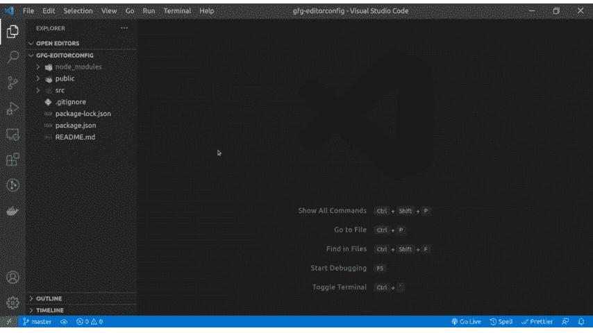

# 是什么。editorconfig？

> 原文:[https://www.geeksforgeeks.org/what-is-editorconfig/](https://www.geeksforgeeks.org/what-is-editorconfig/)

EditorConfig 是一个简单的配置文件，其中包含一系列规则，这些规则可以应用于任何 IDE 或代码编辑器，以便对代码进行正确的格式化。但是为什么要用 EditorConfig 呢？考虑这样一个场景，您的团队正在处理一个项目，但是团队的各个成员使用不同的集成开发环境或代码编辑器，这些差异可能会导致应用于代码的格式不一致，因为每个集成开发环境/编辑器都有自己的配置。EditorConfig 解决了这个问题，它有一个配置文件，在一些插件/扩展的帮助下，所有 IDE 和代码编辑器都可以读取这个文件。这个工具广泛应用于许多大型项目，包括 Angular、Bootstrap、Django、Nodejs、React、Vuejs 等等。


#### 使用 EditorConfig 的优势

1.  您可以有一个通用的缩进样式(制表符/空格)和缩进大小
2.  EditorConfig 将帮助配置字符编码和行尾(lf/crlf)
3.  它还可以强制编辑器在每个文件的末尾都有一个新行，甚至更多。

#### 在项目中设置编辑器配置:

要设置编辑器配置，您需要安装与您的集成开发环境/编辑器相对应的插件/扩展。
以下编辑器不需要任何插件，因为它们自带对 EditorConfig 的支持:

*   IntelliJ
*   Pycharm
*   可视化工作室
*   Github / Gitlab / Gitbucket

如果您使用下面列出的编辑器，那么您应该通过它们各自的链接安装插件:

*   [VS 代码](https://marketplace.visualstudio.com/items?itemName=EditorConfig.EditorConfig)
*   [原子](https://github.com/sindresorhus/atom-editorconfig#readme)
*   [日食](https://github.com/ncjones/editorconfig-eclipse#readme)
*   代码块
*   netbeans
*   [升华文字](https://github.com/sindresorhus/editorconfig-sublime#readme)

一旦安装了相应的插件/扩展，在项目目录的根目录下创建一个名为` . editorconfig '的文件

如果您正在使用 VS 代码，您可以通过浏览器侧边栏的上下文菜单生成一个新的编辑器配置文件，方法是右键单击您想要的文件夹，然后选择生成编辑器配置。



全新的。编辑器配置文件是在 VS-Code 中的编辑器配置扩展的帮助下生成的

#### 配置语法:

*   **root = true :** 无论何时打开编辑器，EditorConfig 插件都会在打开的文件目录和每个父目录中查找一个名为` . editorconfig '的文件，但是如果它到达可以用 root = true 指定的根文件路径，则可以停止该搜索。
*   **注释:**在` . editorconfig '中的注释以“#”或“；”开头。
*   **节头:**以“[”开头，以“]”结尾，用于选择具体的文件并对其应用规则。例如'[*。“js”将把所有规则应用到任何扩展名为“. js”的文件中。
*   **键值对:**这些键值对是位于节标题下的规则(支持的属性)。例如，“缩进大小= 4”将缩进大小设置为 4 个空格/制表符。你可以在他们的[维基页面](https://github.com/editorconfig/editorconfig/wiki/EditorConfig-Properties)上找到所有支持的属性。

#### 配置文件示例:

```
# EditorConfig is awesome: https://EditorConfig.org

# top-most EditorConfig file
root = true

[*]
charset = utf-8
end_of_line = lf
indent_size = 4
indent_style = space
insert_final_newline = true
max_line_length = 80
trim_trailing_whitespace = true

[*.md]
max_line_length = 0
trim_trailing_whitespace = false
```

这里 root=true 向编辑器指定它是最顶层的 EditorConfig 文件，在此部分标题下指定的任何规则- [*]都将应用于所有文件，包括您的*。js，*。css 等。您可以为特定文件设置特定的规则，例如【*】。md]节头有一些规则，这些规则只适用于具有。作为扩展的 md。