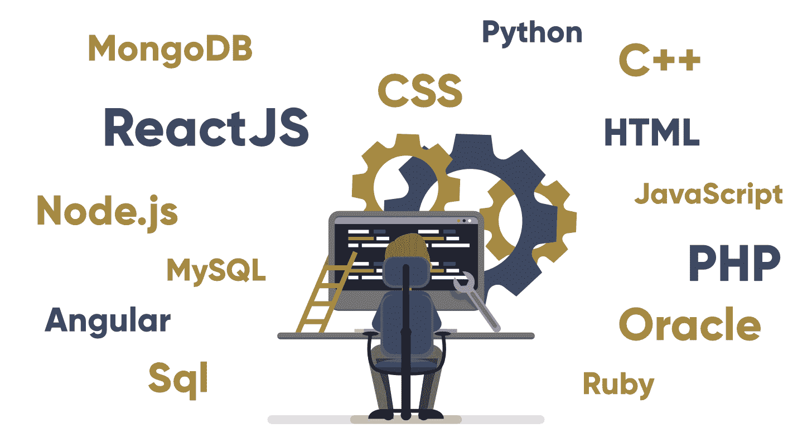

# 什么是全栈开发？

> 原文:[https://www . geesforgeks . org/什么是全栈开发/](https://www.geeksforgeeks.org/what-is-full-stack-development/)

**全栈开发:**是指 web 应用的**前端**(客户端)和**后端**(服务器端)两部分的开发。

**全栈 web 开发人员:**全栈 web 开发人员具备设计完整 web 应用和网站的能力。他们从事 web 应用程序或网站的前端、后端、数据库和调试工作。

**全栈开发相关技术:**

**Front end:**

**Front end Languages:**

*   [**HTML:**](https://www.geeksforgeeks.org/html-tutorials/) HTML 代表超文本标记语言。它用于使用标记语言设计网页的前端部分。HTML 是超文本和标记语言的结合。超文本定义了网页之间的链接。标记语言用于在定义网页结构的标签中定义文本文档。
*   [**CSS:**](https://www.geeksforgeeks.org/css-tutorials/) 层叠样式表，被亲切地称为 CSS，是一种简单设计的语言，旨在简化网页呈现的过程。CSS 允许您将样式应用于网页。更重要的是，CSS 使您能够独立于组成每个网页的 HTML 来完成这项工作。
*   [**JavaScript:**](https://www.geeksforgeeks.org/javascript-tutorial/)JavaScript 是一种著名的脚本语言，用于在网站上创造魔力，使网站与用户互动。它用于增强网站的功能，以运行很酷的游戏和基于网络的软件。

**Front End Frameworks and Libraries:**

*   **[AngularJS](https://www.geeksforgeeks.org/category/web-technologies/angular-js/):**AngularJS 是一个 JavaScript 开源前端框架，主要用于开发单页 web 应用程序(SPAs)。它是一个不断增长和扩展的框架，为开发 web 应用程序提供了更好的方法。它把静态的 HTML 变成了动态的 HTML。这是一个开源项目，任何人都可以自由使用和更改。它用指令扩展 HTML 属性，数据用 HTML 绑定。
*   **[React.js](https://www.geeksforgeeks.org/react-js-introduction-working/) :** React 是一个用于构建用户界面的声明式、高效且灵活的 JavaScript 库。ReactJS 是一个开源的、基于组件的前端库，只负责应用程序的视图层。它由脸书维护。
*   **[Bootstrap](https://www.geeksforgeeks.org/bootstrap-tutorials/):**Bootstrap 是一个免费的开源工具集合，用于创建响应性网站和网络应用。它是最流行的 HTML、CSS 和 JavaScript 框架，用于开发响应迅速、移动优先的网站。
*   **[jQuery](https://www.geeksforgeeks.org/jquery-tutorials/) :** jQuery 是一个开源的 JavaScript 库，它简化了 HTML/CSS 文档，或者更准确地说是文档对象模型(DOM)和 JavaScript 之间的交互。通过阐述这些术语，jQuery 简化了 HTML 文档遍历和操作、浏览器事件处理、DOM 动画、Ajax 交互和跨浏览器 JavaScript 开发。
*   **SASS:** 是目前最可靠、最成熟、最健壮的 CSS 扩展语言。它用于轻松扩展站点现有 CSS 的功能，包括从变量、继承和嵌套的所有内容。
*   其他一些库和框架有:语义用户界面、基础、物化、主干、表达、烬等。

**其他要点:**

*   与文本编辑器一起使用快捷方式及其工具，如 Visual studio、Atom、Sublime 等。
*   使用网格系统使用户界面负责。
*   Git 和 git 命令，如 init、add、commit 等，用于版本控制和团队协作。
*   其他工具，如 npm &纱包管理器，sass css 预处理器，浏览器 DevTools，即 chrome devtools。
*   了解使用 HTTP、JSON、GraphQL APIs 使用 axios 或其他工具获取数据。
*   它还需要一些设计技巧来使布局和外观更好。

**后端:**指 web 应用或网站的服务器端开发，主要关注网站如何工作。它负责通过客户端命令的查询和 API 来管理数据库。这类网站主要由前端、后端和数据库三部分组成。
后端部分是通过使用一些库、框架和语言构建的，这些将在下面讨论:

*   [**PHP:**](https://www.geeksforgeeks.org/php/) PHP 是专门为 web 开发设计的服务器端脚本语言。因为，PHP 代码是在服务器端执行的，所以它被称为服务器端脚本语言。
*   [**C++**](https://www.geeksforgeeks.org/c-plus-plus/) 它是一种通用编程语言，现在广泛用于竞技编程。它也被用作后端语言。
*   [**Java:**](https://www.geeksforgeeks.org/java/) Java 是目前最流行、应用最广泛的编程语言和平台之一。它是高度可扩展的。Java 组件很容易获得。
*   [**Python:**](https://www.geeksforgeeks.org/python-programming-language/) Python 是一种编程语言，可以让你快速工作，更高效地集成系统。
*   [**JavaScript:**](https://www.geeksforgeeks.org/javascript-tutorial/)JavaScript 可以同时作为(前端和后端)编程语言使用。
*   **[Node.js](https://www.geeksforgeeks.org/introduction-to-nodejs/) :** Node.js 是一个开源的跨平台运行时环境，用于在浏览器之外执行 JavaScript 代码。你需要记住 NodeJS 不是一个框架，也不是一种编程语言。大多数人都很困惑，明白这是一个框架或者一种编程语言。我们经常使用 Node.js 来构建后端服务，比如像 Web App 或者移动 App 这样的 API。贝宝、优步、网飞、沃尔玛等大公司都在生产中使用。
*   **后端框架:**后端框架列表有:Express、Django、Rails、Laravel、Spring 等。
*   其他后端程序/脚本语言有:C#、Ruby、REST、GO 等。

**其他要点:**

*   以高效的方式构建数据。
*   处理用于存储和检索数据的应用编程接口的请求-响应。
*   数据安全很重要。

**注意:** JavaScript 对于所有栈都是必不可少的，因为它是 Web 上的主导技术。

**[数据库](https://www.geeksforgeeks.org/dbms/) :** 数据库是相互关联的数据的集合，有助于从数据库中高效地检索、插入和删除数据，并以表格、视图、模式、报告等形式组织数据。

*   **Oracle:** Oracle 数据库是作为一个单元处理的数据集合。该数据库的目的是存储和检索与查询相关的信息。它是一个数据库服务器，用于管理信息。
*   **[MongoDB](https://www.geeksforgeeks.org/mongodb-an-introduction/) :最受欢迎的 NoSQL 数据库** MongoDB 是一个开源的面向文档的数据库。术语“NoSQL”的意思是“非关系的”。这意味着 MongoDB 不是基于类似表的关系数据库结构，而是提供了一种完全不同的数据存储和检索机制。
*   **[Sql](https://www.geeksforgeeks.org/sql-tutorial/) :** 结构化查询语言是一种标准的数据库语言，用于创建、维护和检索关系数据库。

**热门书库:**

*   **均值栈:** MongoDB，Express，AngularJS 和 Node.js
*   **MERN 栈:** MongoDB，Express，ReactJS 和 Node.js
*   **Django 栈:** Django，python 和 MySQL 作为数据库。
*   **Rails 或 Ruby on Rails:** 使用 Ruby、PHP 和 MySQL。
*   **LAMP 栈:** Linux、Apache、MySQL、PHP。