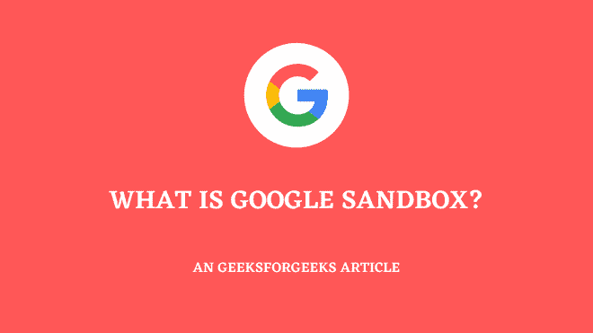

# SEO 中的谷歌沙盒是什么？

> 原文:[https://www . geeksforgeeks . org/什么是 google-sandbox-in-seo/](https://www.geeksforgeeks.org/what-is-google-sandbox-in-seo/)

谷歌目前是世界上最大的搜索引擎，而且它的增长速度与日俱增。我们可以说，它已经成为我们生活中的一个重要部分，我们来谷歌是为了很多事情，一天中有很多次。它给我们提供了许多我们生活中真正想要的东西的信息。你有没有想过谷歌是如何从一大堆网站中展示最合适、最真实的信息的？你们想知道并发现了它，因为你们是计算机科学专业的。很明显，何在用他的算法做，给用户提供最好最真实的信息。

没有人能说谷歌算法有真实性，我们都可以预测它，并可以根据谷歌优化我们的网站。

2004 年，许多搜索引擎优化专家观察到，谷歌在最初的几个月里没有对他们的网站进行排名，尽管他尽了最大努力进行搜索引擎优化，但他们为网站的快速搜索索引所付出的努力毫无价值。

同样的努力，同时，何观察到这种情况只发生在谷歌身上。其他搜索引擎，如 Bing 和 Yahoo，正在按照预期在 SERP 中显示该网站。这个概念是由专家作为谷歌沙盒引入的。

其背后的逻辑表明，一个新生的网站在最初的几个月里不会被正确地索引。专家说，这是因为谷歌引入了一种新的算法，为用户提供更合适的信息，这就像一个新网站的过滤器，在搜索结果中没有正确显示，这个概念被称为谷歌沙盒。

我们可以说，并在心理上假设，谷歌有一个新网站的盒子，新网站将在最初几个月出现在那个盒子里，在此期间，它不会正确地显示在搜索结果中。根据专家的说法，期限从 2 个月到 8 个月不等。

**在谷歌沙盒中识别你的网站:**如果网站没有为长尾关键词和低竞争关键词建立适当的索引，识别非常简单。那么，你的网站可能在沙盒里。

**专家们对于沙盒的说法是什么？**

SEOMoz 的所有者兰德·菲什金(Rand Fishkin)也证实，在最初的几个月里，他们的网站排名不佳，即使他在上面放了尽可能好的内容。这是因为沙盒的概念。他在 2005 年 11 月 4 日告诉我，现在他的网站 8 个月后排名还不错，已经逃过了谷歌不把一个新网站作为授权网站的试用期或沙盒期。

此外，马特·卡茨(美国软件工程师，前谷歌网络垃圾邮件主管)说，如果你的网站是新的，那么它的排名可能不如旧网站的排名。但他说不用担心，几个月后肯定会排名。

**如何摆脱谷歌沙盒？**

在这里，我们将分享一些摆脱它的最佳搜索引擎优化技巧。

**1。选择长尾和低竞争关键词**

因为你在运营一个新的网站，请尽量在低竞争和长尾关键词上排名，而不是在高竞争和长尾关键词上排名。您将能够快速对它们进行排名，这将有助于您的网站走出沙盒。

**2。关注品牌**

尽可能专注于品牌，专注于让你的网站成为最好的品牌。为此，您应该在互联网上的任何地方使用您的品牌名称，无论是社交媒体还是任何其他网站。

**3。使用社交媒体**

顺便说一下，社交媒体一直是一个重要的因素，但是既然你有了一个新的网站，那么它的重要性就更加增加了。在脸书上用你的品牌名做一个页面，试着添加更多的人，并在上面分享信息。你还应该关注像 Pinterest、Linked In、Instagram 等社交媒体。

**4。构建权限**

你可以增加你的网站在谷歌眼中的权威性，为此定期更新和添加你的内容到你的网站。在互联网上，尽量像你的品牌一样活跃。你也可以通过在与你的领域相似的其他网站上发表客座文章来创建你自己的权威和反向链接。

**5。使用内部链接**

内部链接也是很重要的一部分，你也应该跟着它，把你相似的页面互相链接起来。这样搜索引擎和用户也可以轻松地浏览你的网站。

你也可以从极客博客的内部链接中获得灵感。

**6。不要太咄咄逼人**

不要太草率，给搜索引擎 bot 一些时间来分析你的网站。与此同时，继续做你的工作，过一段时间你一定会得到预期的结果。

**最终想法**

最后，耐心是你所有问题的解决方案，只需等待并继续为网站的排名而努力。耐心工作几个月后，你肯定会被编入 SERP。