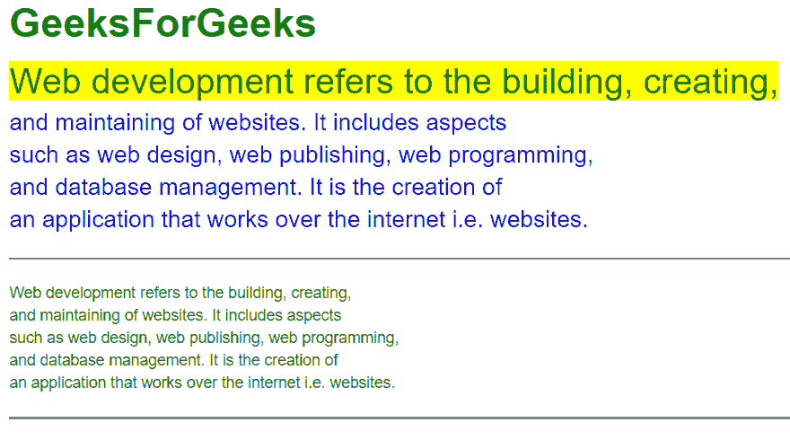

# 什么是铅体复制？

> 原文:[https://www.geeksforgeeks.org/what-is-lead-body-copy/](https://www.geeksforgeeks.org/what-is-lead-body-copy/)

[**Bootstrap**](https://www.geeksforgeeks.org/bootstrap-tutorials/) 是通过使用预先编写的类来更快地开发响应性网站的过程。它还使网站反应灵敏，并增加了风格。其中一个特征是引线主体复制。引线主体副本用于增加主体标签中段落的重点。段落标签位于正文标签内。这给了我们轻量级的大字体和很高的行高。此功能可以使用预定义的类“**”来使用。引领**”看看它的功能性。

让我们通过下面的分步实施来了解销售线索正文拷贝。

**步骤 1:** 在所有其他样式表之前，将 Bootstrap 和 jQuery CDN 包含到<头>标签中，以加载我们的 CSS。

> <src 脚本= " http://Ajax . Google APIs . com/Ajax/libs/jquery/1 . 11 . 1/jquery . min . js "></script><src 脚本= " http://maxcdn . bootstracdn . com/bootstrap/3 . 2 . 0/

**第二步**:使用 [**<u><样式></u>**](https://www.geeksforgeeks.org/html-style-tag/#:~:text=The%20tag%20in%20HTML,ar%20part%20of%20a%20page.&text=The%20property%20is%20borrowed%20from,size%2C%20font%2Dfamily%20etc.) 标记内部 [**<u><头部></u>**](https://www.geeksforgeeks.org/html-head-tag/) 标记。

**第三步:**使用。lead::第一个字母选择器在<样式>标签中为指定选择器的第一个字母添加样式。

**第四步:**用类容器在 HTML 体中添加 [< div >标签](https://www.geeksforgeeks.org/div-tag-html/)。

**第五步:**在 HTML bode 中添加 [< p >标签](https://www.geeksforgeeks.org/html-paragraph/)。领导阶层。

**示例:**以下示例显示了的用法。用一些额外的样式引导类。

## 超文本标记语言

```
<!DOCTYPE html>
<html lang="en" dir="ltr">

<head>
    <head>
        <title>Bootstrap lead body copy example</title>
        <link rel="stylesheet" href=
"http://maxcdn.bootstrapcdn.com/bootstrap/3.2.0/css/bootstrap.min.css">
        <style media="screen">
            .lead {
                color: blue;
            }

            .lead::first-line {
                font-size: 150%;
                background-color: yellow;
                color: green;
            }
        </style>
    </head>

<body>
    <div class="container">
        <div class="col-md-12">
            <h1><b>
                    <span style="color:green">
                        Geeks
                    </span>For
                    <span style="color:green"> 
                        Geeks 
                    </span>
                </b>
            </h1>
            <p class="lead">
                Web development refers to the building, 
                creating, and maintaining of websites. 
                It includes aspects such as web design,
                web publishing, web programming, and 
                database management.It is the creation 
                of an application that works over the
                internet i.e. websites.
            </p>

            <hr style="height: 2px; border-width: 0;
                color: gray; background-color:gray">
            <p style="color:green">
                Web development refers to the building, 
                creating, and maintaining of websites. 
                It includes aspects such as web design,
                web publishing, web programming, and 
                database management.It is the creation 
                of an application that works over the
                internet i.e. websites.
            </p>

            <hr style="height: 2px; border-width: 0;
                color:gray; background-color:gray">
        </div>
    </div>
</body>

</html>
```

**输出:**



。带有一些附加样式的引导类