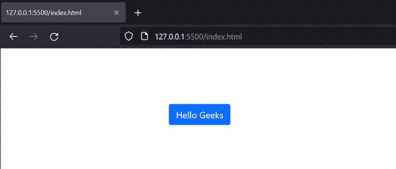

# 什么是本地安装？

> 原文:[https://www.geeksforgeeks.org/what-is-local-installation/](https://www.geeksforgeeks.org/what-is-local-installation/)

**本地安装**包括在我们的系统本地下载像 CSS 这样的静态文件，然后在我们的网页上使用。这确保了给定的 CSS 副本是从我们的本地机器加载的。这与使用托管在 CDN 上的 CSS 文件不同，在 CDN 中，文件将通过调用 CDN 来加载。

有许多需要本地安装的用例。我们可以在没有互联网的情况下开发我们的应用程序，因为 CSS 文件已经存在于我们的系统中。这还可以减少对第三方 cdn 的依赖，因为第三方 cdn 可能会更改给定 URL 上承载的文件版本。拥有本地副本还允许我们在需要时对文件进行更改。

在下面的示例中，我们将下载 Bootstrap 的最新版本，并将文件复制到本地系统。然后，我们将使用 **<链接>** 标签将这些文件包含在我们的项目文件夹中。

**示例:**

## 超文本标记语言

```html
<!DOCTYPE html>
<html lang="en">

<head>

      <!-- Include the local CSS and JS files 
        of Bootstrap on our local system -->
    <link rel="stylesheet" 
          href="/bootstrap-5.1.1-dist/css/bootstrap.css">
    <link rel="stylesheet" 
          href="/bootstrap-5.1.1-dist/js/bootstrap.bundle.js">

    <style>
        .button {
            padding: 150px 700px;
        }
    </style>
</head>

<body>
    <div class="button">
        <button type="button"
            class="btn btn-outline-primary">
            Hello Geeks
        </button>
    </div>
</body>

</html>
```

**输出:**



**参考:**T2】https://www.geeksforgeeks.org/bootstrap-tutorials