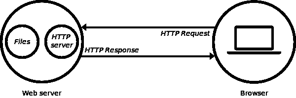
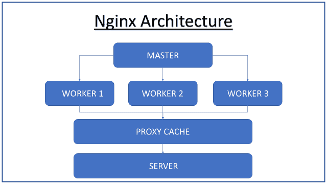
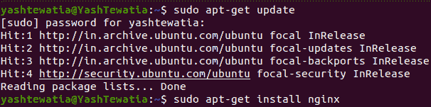
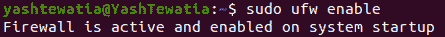
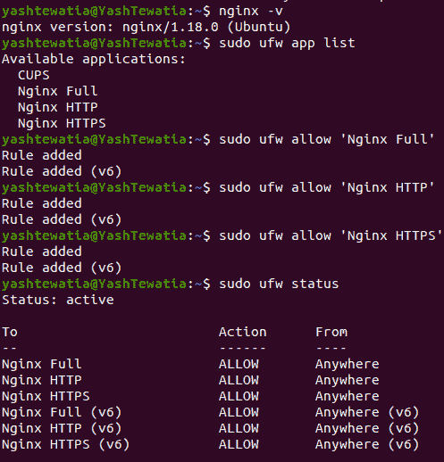
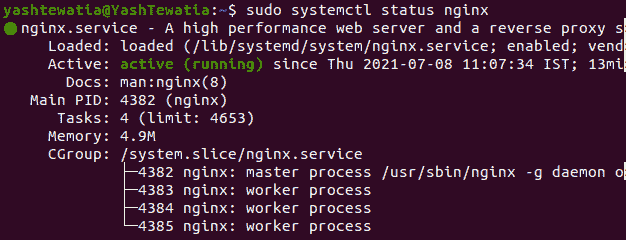

# 什么是 Nginx (Web 服务器)，如何安装？

> 原文:[https://www . geesforgeks . org/什么是 nginx-web-server-以及如何安装它/](https://www.geeksforgeeks.org/what-is-nginx-web-server-and-how-to-install-it/)

## 什么是网络服务器？

每当您打开浏览器时，请键入一个网址，然后单击“输入”。基本上，您是在请求该网址的内容。有没有想过内容在哪里？是的，你是对的，这些内容放在远程计算机上，在接受你的请求后，它会将该网址的内容作为响应发回。

网络服务器是传送所请求的网页的计算机。每个网络服务器都有一个 IP 地址和域名。

让我们以 web 服务器为例进行理解。

你打开你最喜欢的浏览器，输入*www.geeksforgeeks.org/c-plus-plus*，点击进入查看 C++上的资源。在上面的网址中，*www.geeksforgeeks.org*是域名**名称**，， */c-plus-plus* 是你想看的页面。

因此，www.geeksforgeeks.org 会将您的请求路由到网络服务器，然后看到您请求的文件系统。在我们的情况下，就是 */c-plus-plus。*



插图图像

## 什么是 Nginx？

它是开源软件，旨在实现最高性能和稳定性。让我们看看为什么我们需要它，看看我们如何从中受益。

### 为什么我们需要一个专用的网络服务器？

假设我们在 Django 或 Node 上开发应用程序。所有这样的框架都有内置的开发服务器来托管您的项目。但是，每当有人试图用内置的开发服务器在生产级别托管该应用程序时，您将很难处理所有请求，同时遇到宕机，而只能处理 30-40 个并发请求。

Nginx 是一个专门的 web 服务器，它解决了效率问题，并为我们提供了一种同时处理 1000 个请求的最佳方式。

#### 用于反向代理、缓存和负载平衡的 Web 服务器。

反向代理接受来自客户端的请求，将请求转发给能够满足它的服务器，并将服务器的响应返回给客户端。

缓存是一种技术，它存储给定资源的副本，并在请求时提供给用户。当 web 缓存的存储中有请求的资源时，它会拦截该请求并返回其副本，而不是从原始服务器重新下载。

负载平衡器将传入的客户端请求分发到一组服务器，在这些服务器中，它可以处理并发请求，而不会在特定的服务器上遇到负载。

Nginx 的其他特性如下:

*   它提供了 HTTP 服务器功能。
*   旨在提供稳定性和最高性能。
*   充当电子邮件(IMAP、POP3 和 SMTP)的代理服务器。
*   它使用事件驱动的非线程架构，为每个请求提供更少的 CPU 计算。
*   它提供了可扩展性。
*   减少客户端的等待时间。
*   升级可以在 Nginx 托管网站时完成，不会出现任何宕机。

我希望你现在明白为什么我们应该在我们的生产应用程序中使用一个专用的 web 服务器。

#### ginx 体系结构

为了了解 Nginx 的进一步配置设置，我们需要先了解一下 Nginx 在此之前的理解。

Nginx 使用主从架构，在这种架构中，我们有一个主服务器，它通过在服务器上分配负载来将我们的请求重新路由到它下面的任何工作人员，然后寻找代理缓存以获得更快的响应，否则在失败后，网页将从内存本身加载。图像演示将有助于更清楚地理解这个结构。



ginx 体系结构

### Nginx 的一些配置设置

Nginx 所需的主要设置存储在名为 **nginx.conf** 的文件中。这个文件主要由许多上下文组成。

**worker_processes** :一个 worker 进程基本上就是一个 master 将要控制的工人数量。更准确地说，这是一个单线程进程。因此，如果您有一个像 8 核这样的多核处理器，您可以设置 8 个 worker _ processes 来充分利用磁盘带宽，并帮助它完成 CPU 密集型工作。

**worker_connections** :是与不同客户端同时连接的数量。默认值为 512 或 1024。因此，假设您有 8 个 worker_processes 和 512 个 worker_connections，您可以服务的最大客户端数是 worker _ processes * worker _ connections，即 8*512 = 4096 个连接。

**access_log & error_log** :默认情况下，Nginx 服务器将其事件写入两种类型的日志中，如上所述。所有访问者向服务器请求数据的活动都记录在 access_log 中，您可以找到哪些文件被访问过，Nginx 如何响应它们，客户端的 IP 地址等等。但是如果 Nginx 面临任何问题和故障，那么它会将所有这些信息记录在错误日志中，以便进一步调试。

**gzip** :如果你想尽可能的榨取性能，它会压缩所有的响应数据。但是它使用了大量的 CPU 资源，如果您在所有项目上使用此选项，这可能会降低您的 Nginx 速度，因此请保持此选项仅适用于大型项目。

## 如何安装 Nginx？

要遵循的步骤是:

*   install nginx(安装引擎)
*   调整防火墙
*   检查您的服务器

#### Linux(Ubuntu like others)

首先，在你的 Linux 发行版中打开终端，然后输入以下命令在你的系统上安装 Nginx。

```
# Update your system 
sudo apt-get update
# After updating your system 

# Install nginx using CLI, press Y to allow it to install
sudo apt-get install nginx

# Enabling Firewall
sudo ufw enable
```

 

这些是在 Linux 中安装 Nginx 和启用防火墙的一些步骤。让我们检查版本并继续启动服务器。

```
# checking Nginx version
nginx -v
# if output is -> nginx version: nginx/1.xx.x (ubuntu)
# you have successfully installed it
```

现在我们需要将规则添加到防火墙中，这样您的服务器就可以在 Http 和 Https 端口上获取请求。

```
# This commands tells you all the configuration 
# that your firewall know which can be added
sudo ufw app list

# Here you'll see the output and from available options,
# you shall see (Nginx Full, Nginx HTTP, Nginx HTTPS) 
# Let's add these rules to your firewall
sudo ufw allow 'Nginx Full'
sudo ufw allow 'Nginx HTTP'
sudo ufw allow 'Nginx HTTPS'
```

现在，我们需要查看添加到防火墙的规则的状态。

```
# To check status 
sudo ufw status
```



现在我们将检查我们的服务器是否正在运行。

```
# To check the status of the server
sudo systemctl status nginx
```



恭喜你！如果在“活动”标题下可以看到“活动(正在运行)”，则表示您的服务器正在运行。

#### Windows (7/8/10 或 11)

点击这里进入 Nginx 的下载页面，下载一个主线版本(我这里是 *nginx-1.21.1.zip* )。

把它解压到任何你想解压的地方，打开文件夹，打开 Nginx 应用，允许它改变防火墙中的设置和规则。

瞧啊。您的服务器正在运行，您可以通过浏览器中的以下链接进行检查: [http://localhost/](http://localhost/)

现在你可能会对这个网页*(欢迎来到 Nginx)* 来自哪里感到困惑。为此，让我们进入 Nginx 中的*会议*文件夹，解压缩该文件夹，并使用任何编辑器(或记事本)打开 nginx.conf 文件。

在这里，您可以看到 worker _ processes、worker_connections 和其他讨论过的配置设置。您可以在 HTTP ***- >服务器- >位置/*** 下获取网页的位置或打开网页的路线。这里说在根目录下(*这里是一个解压的文件夹*)HTML 文件夹，index.html 页面被作为响应。

因此，每当您启动 Nginx 服务器，并在浏览器中打开本地主机网址时，如果您看到“欢迎使用 Nginx”。我们的服务器已经启动并运行！！

请务必阅读下一篇关于在远程服务器上设置 nginx 的文章:[链接](https://www.geeksforgeeks.org/how-to-deploy-web-applications-using-nginx-on-remote-server-ubuntu-based-set-2/)