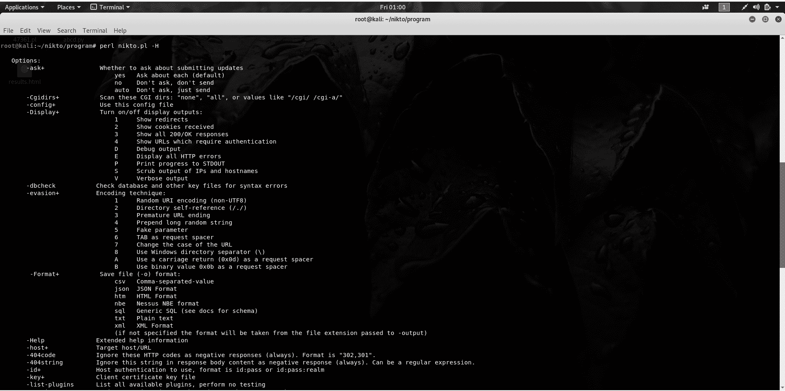
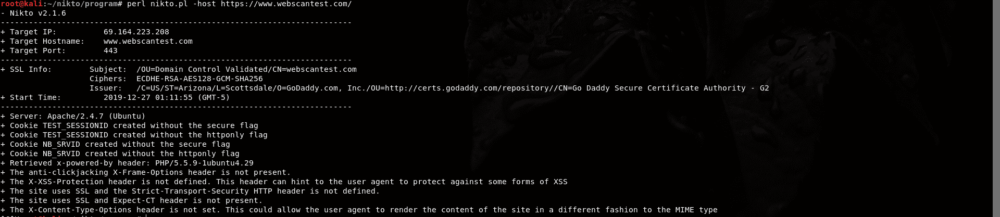

# Nikto 是什么及其用法？

> 原文:[https://www.geeksforgeeks.org/what-is-nikto-and-its-usages/](https://www.geeksforgeeks.org/what-is-nikto-and-its-usages/)

Nikto 是一个用 Perl 语言编写的开源软件，用于扫描网络服务器，寻找可被利用并危及服务器的漏洞。它还可以检查 1200 服务器的过时版本详细信息，并可以检测 200 多台服务器的特定版本详细信息的问题。它还可以使用服务器中存在的 favicon.ico 文件对服务器进行指纹识别。它不是为了成为一个特别隐蔽的工具而设计的，而是为了在很短的时间内快速高效地完成任务而设计的。因此，网络管理员可以通过查看日志文件轻松检测到其服务器正在被扫描。
它还可以显示一些没有安全问题的项目，但只是显示如何充分利用它来更好地保护网络服务器的信息。

**特色:**T2】

*   对 SSL 的全面支持
*   查找子域
*   支持完整的 HTTP 代理
*   过期组件报告
*   结果以多种格式保存(xml、csv 等)
*   猜测用户名
*   提供已安装软件的详细信息
*   将 Nmap 文件作为网络服务器中扫描端口的输入。
*   能够执行字典攻击。
*   轻松更新

**如何在 Linux 中安装 Nikto:**

```
Step 1: root@kali:~# git clone https://github.com/sullo/nikto.git
Step 2: root@kali:~# cd nikto/program
Step 3: root@kali:~/nikto/program# perl nikto.pl 
```

**用途:-**T2]

*   帮助菜单： root@kali：~/无人/程序# perl nikto.pl -H



*   扫描一个网站:root @ kali:~/nikto/program # perl nikto . pl-主持人 https://www.webscantest.com/

