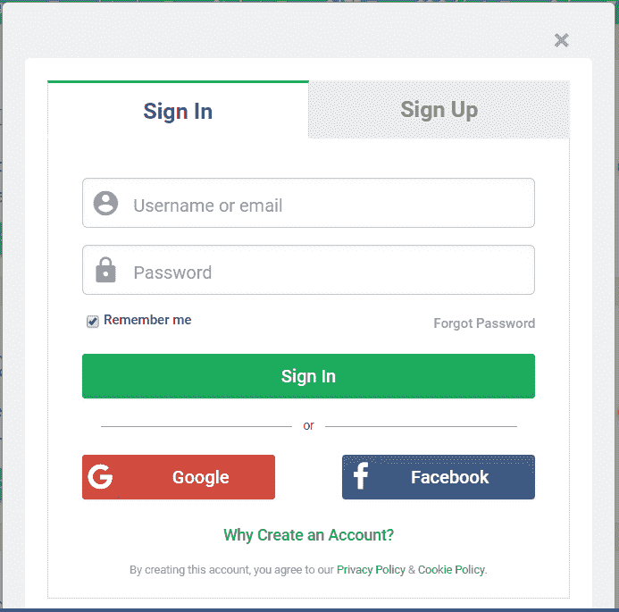

# 什么是开放授权？

> 原文:[https://www . geesforgeks . org/what-is-oauth-open-authorization/](https://www.geeksforgeeks.org/what-is-oauth-open-authorization/)

**OAuth (Open Authorization)** 是一个开放的标准协议，用于授权应用程序使用用户信息，一般来说，它允许第三方应用程序从脸书、谷歌等应用程序访问用户相关信息，如姓名、DOB、电子邮件或其他所需数据。而无需向第三方应用程序提供用户密码。发音为 **oh-auth** 。

您可能已经在网站的登录/注册页面上看到“使用谷歌登录”或“使用脸书登录”按钮，只需登录其中一项服务并授予客户端应用程序访问您的数据的权限，而无需提供密码，就可以更轻松地使用该服务或网站。这是通过 OAuth 完成的。

它旨在与 **[【超文本传输协议】](https://www.geeksforgeeks.org/what-are-the-differences-between-http-ftp-and-smtp/)** 配合使用，并允许授权服务器在获得所有者批准的情况下向第三方应用程序发放访问令牌。

**OAuth 机构**共有 3 个部件–

1.  OAuth 提供商–这是 OAuth 提供商，例如谷歌、FaceBook 等。
2.  OAuth 客户端–这是我们共享或验证信息使用情况的网站。极客博客等。
3.  所有者–登录验证信息共享的用户。

OAuth 可以通过谷歌控制台在网络应用上实现“登录/注册谷歌”。
**需要遵循的模式**–

1.  从谷歌应用编程接口控制台获取 OAuth 2.0 客户端标识
2.  接下来，从谷歌授权服务器获取访问令牌来访问应用编程接口。
3.  将带有访问令牌的请求发送到应用编程接口。
4.  如果需要更长的访问时间，请获取刷新令牌。