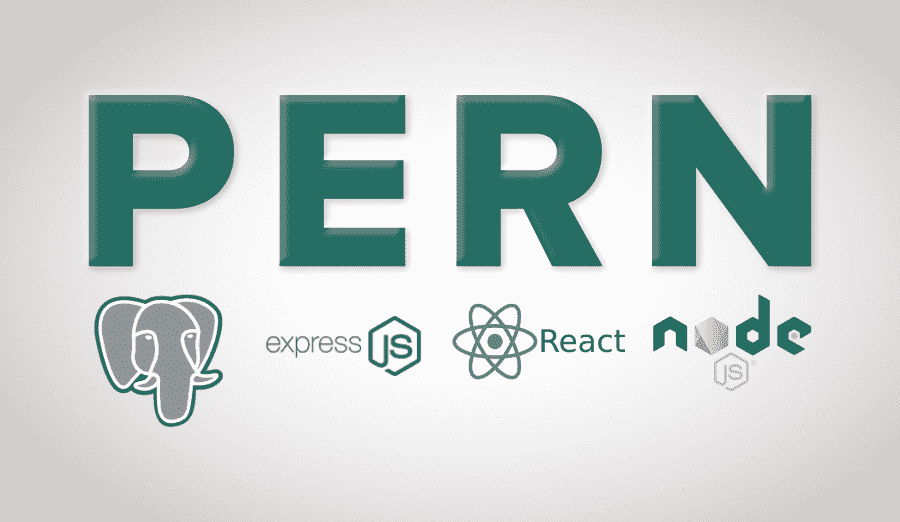
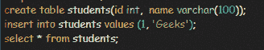

# 什么是 PERN Stack？

> 原文:[https://www.geeksforgeeks.org/what-is-pern-stack/](https://www.geeksforgeeks.org/what-is-pern-stack/)

这个栈由 PostgreSQL、Express、React 和 Node.js 组成，结合这些技术，可以构建一个带有 CRUD 操作的全栈 web 应用程序。每个人都一定听说过 MERN 栈，它基本上是一个用于部署全栈 web 开发的 JavaScript 栈，包含 4 种技术，即:MongoDB、Express、React 和 Node.js。但是 PostgreSQL 似乎越来越受欢迎，因为它为 NoSQL 特性、事务性和标准兼容提供了广泛的支持。它是用 C 语言写的。



**了解 PEN 堆栈组件:**

1.  **PostgreSQL(Object-Relational Database)**
    PostgreSQL 是一个强大的开源对象关系数据库管理系统(ORDBMS)，强调可扩展性和标准合规性，它使用并扩展了 SQL 语言，并结合了许多安全存储和扩展最复杂数据工作负载的功能。PostgreSQL 是符合 ACID 的、事务性的，它以表格格式存储数据，并使用约束、触发器、角色、存储过程和视图作为核心组件。
    **为什么用 PostgreSQL？**
    *   免费开放源码。
    *   有多种语言版本。
    *   高度可扩展。
    *   保护数据完整性。
    *   构建容错环境。
    *   健壮的访问控制系统
    *   支持国际字符。
    *   苹果用 PostgreSQL！
    *   **创造** ***学生*** **表**

```html
 CREATE TABLE students (id INT, name VARCHAR (100)); 

```

*   **将记录插入** ***学生*** **表**

```html
 INSERT INTO students VALUES (1, 'Geeks'); 

```

*   **读书记录来自** ***学生*** **表**

```html
 SELECT * FROM students; 

```




*   **更新** ***学生*** **表**
    中的记录

```html
 UPDATE students SET name="GeeksforGeeks" WHERE id = 1; 

```


*   **从** ***学生*** **表**
    中删除记录

```html
 DELETE FROM students WHERE id = 1; 

```

1.  **Express(后端框架)**
    是 Node.js 的一个 web 应用框架，作为一个自由开放的软件，用于构建 web 应用和专门的 API。Express 提供了一个基础 web 应用程序特性的薄层，而不会模糊您已经知道的 Node.js 特性。
    **为什么用快递？**
    *   为 web 和移动应用程序提供了一组强大的功能
    *   使后端代码更容易编写。
    *   支持多种中间件。
    *   最小和灵活的网络应用框架。
    *   创建高效、健壮的应用编程接口既快捷又容易。
    *   允许您定义错误处理中间件。
2.  **React(前端库)**
    React 基本上是一个构建用户界面的 JavaScript 库。创建交互式用户界面是一种简单、高效、无痛的方法。它由脸书和一个由个人开发者和公司组成的社区维护。为应用程序中的每个状态设计简单的视图，当数据发生变化时，React 将高效地更新和呈现正确的组件，仅出于这个原因，它用于开发单页应用程序或移动应用程序。
    **为什么用 React？**
    *   ReactJS 中的虚拟 DOM 使用户体验更好，开发人员的工作更快
    *   它保证了稳定的代码。
    *   React 允许重复使用其组件，节省了时间和精力。
    *   提供高性能。
    *   提供虚拟 DOM 的特性。
    *   SEO 友好！
3.  **Node.js (JavaScript 运行时环境)**
    Node.js 是一款基于 Chrome 的 V8 JavaScript 引擎构建的 JavaScript 运行时，用于开发服务器端和网络应用。作为异步事件驱动的 JavaScript 运行时，它用于构建快速且可扩展的网络应用程序。Node.js 是运行在许多平台上的免费开源服务器环境。
    **为什么是 Node.js？**
    *   提供事件驱动和异步特性，使其轻量级且高效。
    *   没有缓冲，因此速度非常快。
    *   高度可扩展。
    *   高度可扩展。
    *   提供缓存优势。
    *   用一台服务器处理数千个并发连接。
    *   提供大量的库。