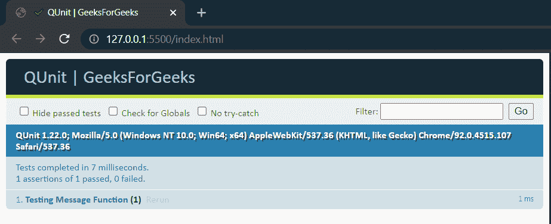
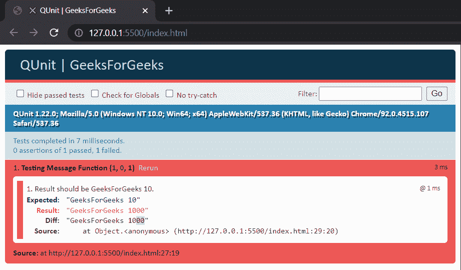

# 什么是 Qunit？

> 原文:[https://www.geeksforgeeks.org/what-is-qunit/](https://www.geeksforgeeks.org/what-is-qunit/)

**简介:** Qunit 是一个用于检查 JavaScript 代码的 JavaScript 测试框架。它主要用于 JQuery 项目。开发 JavaScript 应用程序的开发人员可以使用 QUnit 来测试他们的 JS 代码库。

它主要遵循 CommonJS 单元测试规范，该规范本质上包含在 web 浏览器之外使用 JavaScript 的目标，即使 JS 模块化，并允许它在各种多平台应用程序中使用。

**测试:**测试是审查应用程序功能的过程，以确定它是否符合要求，并确保在开发人员级别使用单元测试。

此外，测试任何单个类或方法的过程被称为**单元测试**，因为它是开发可扩展产品所必需的。此外，该单元测试可以以多种方式执行，可以是在没有任何工具支持的情况下手动执行测试用例，称为**手动测试**，或者是利用工具支持并使用自动化工具执行测试用例，称为**自动化测试**。

现在，由于我们已经熟悉了基本上什么是 QUnit 以及它的目的是什么，让我们继续学习如何使用它以及如何设置它。

**如何安装/使用 QUnit？**

我们可以通过 **NodeJS** (在本机上安装*)或者 **CDN** (浏览器中直接*)来使用**

**QUnit 的官方发布包如下:**

*   ****npm****

    ```
    **npm install --save-dev qunit**
    ```

*   ****纱线****

    ```
    **yarn add --dev qunit**
    ```

*   ****凉亭****

    ```
    **bower install --save-dev qunit**
    ```

****示例:**现在为了演示测试，我们将使用 CDN 来简化可访问性**我们将执行一个基本的测试格式来获得 QUnit 测试背后的症结。这里，我们使用了一个简单的函数 **messageHandler** ，它将打印一个字符串和一个数字，一个**测试用例**将断言它的输出来检查它的正确性。****

******注意:**由于我们使用的是 CDN，只需要制作一个文件夹，在你的 IDE 中打开，制作一个空文件****

## ****index.html****

```
****<!DOCTYPE html>
<html>

<head>
    <meta charset="utf-8" />
    <title>QUnit | GeeksForGeeks</title>

    <!-- The CDN Links for QUnit (IMPORTANT: Only use 
        these CDN links if you are testing without 
        using node.js/dependencies) -->
    <link rel="stylesheet" href=
    "https://code.jquery.com/qunit/qunit-1.22.0.css" />
    <script src=
    "https://code.jquery.com/qunit/qunit-1.22.0.js">
    </script>
</head>

<body>

    <!-- QUnit Frontend Toolbar (Fixture) -->
    <div id="qunit"></div>
    <div id="qunit-fixture"></div>

    <!-- Testing Script -->
    <script>

        // Function which we will test (Unit Testing)
        // Returns a message + a number
        function messageHandler(message, x) {
            const result = (message + " " + x).toString();
            return result;
        }

        // Testcase to assert result
        QUnit.test("Testing Message Function", function(assert) {
            var value = messageHandler("GeeksForGeeks", 10);
            assert.equal(
                value,
                "GeeksForGeeks 10",
                "Result should be GeeksForGeeks 10."
            );
        });
    </script>
</body>

</html>****
```

******输出:******

********

******解释:**当输入与要求的输出匹配时，测试用例成功通过。页面加载后，测试运行人员调用 **QUnit.test()** 将测试添加到队列中。测试用例的执行由测试运行人员延迟和控制。****

****让我们看看如果测试用例得到**失败会发生什么:******

********

******说明:**这次我们传递的是整数 1000 而不是 10，导致测试用例失败，如错误输出所示，这让我们更容易调试代码。****

******现在让我们看看上述测试程序的功能:******

*   ******设置 index.html:** 为了查看测试输出，我们必须使用两个预定义的 QUnit ids，这将有助于在网页的目标 div 中呈现输出。****

    ```
    ****<div id = "qunit"></div>
    <div id = "qunit-fixture"></div>****
    ```

*   ******测试函数:**现在，我们已经定义了需要测试输出的函数，这里是 ***messageHandler(message，x)。*** 它接受一个字符串文本和一个整数，并将其串联返回。这些功能是我们执行单元测试的基础。****

*   ******测试用例断言:******

    ```
    ****QUnit.test("Test", function(assert) {
     //
    });****
    ```

    ****这是 QUnit 的预定义模块，我们用它来断言测试函数的输出是否等于断言的值。这个相同的结果将呈现在网页的输出 div 中。此外，这是任何庞大的测试模块和功能都可以按照测试代码的要求实现的地方。****

*   ******群聚的主要特点:******

    *   ****这是一个用于测试 JS 代码的开源框架。****
    *   ****它包括运行测试的测试夹具，以及一个清晰的问题列表。****
    *   ****QUnit 还通过提供断言来测试预期结果来提供帮助。****
    *   ****易于代码调试。****
*   ******QUnit 提供的一些重要 API:******

    <figure class="table">****【T32****

    | **类别** | **功能** |
    | Asynchronous control | 方法处理需要一些时间来执行的异步操作 |
    | call-back | Provide the method of reading the result. |
    | test | Method of testing code. |

    </figure>