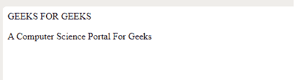

# 什么是 SGML？

> 原文:[https://www.geeksforgeeks.org/what-is-sgml/](https://www.geeksforgeeks.org/what-is-sgml/)

在本文中，我们将了解 [SGML](https://www.geeksforgeeks.org/?p=396587) 。SGML 代表标准通用标记语言是一种标准通用标记语言，它利用了广泛使用的标记语言的超集，如超文本标记语言和可扩展标记语言。它用于标记文件，现在的好处是不再依赖于特定的应用程序。

它基本上源于 **GML** (通用标记语言)，它允许用户为电子文档开发标准化的格式样式。它于 1986 年由**国际标准组织**(国际标准化组织)开发和标准化。SGML 指定了标记元素的规则。然后，这些标签可以以特定的方式解释为布局因素。

它被广泛用于处理大量文件，这些文件是常见修订的关注点，并希望以独一无二的格式发布，因为它是一个庞大而复杂的系统，它并不总是在私人计算机上广泛使用。

**SGML 的成分:**

*   SGML 提供了一种描述这些实体、元素和属性之间关系的方法，并告诉计算机如何识别文档的组成部分，它基于文档由一系列实体(对象)组成的概念。
*   它提供了允许计算机识别文本实体的各种元素开始和结束的规则。
*   SGML 中的 ***【文档类型定义(DTD)】***用于以计算机能够理解的形式描述文档的每个元素。

SGML 是产生文件的最简单的媒介，这些文件可以被人阅读，并以直接的方式在机器和应用程序之间交换。人类和机器都很容易理解。

**SGML 的结构:**

```htmlhtml
<mainObject> 
    <subObject>  
    </subObject>
</mainObject> 
```

**SGML 文件的扩展名为:**

```htmlhtml
File_Name.sgml
```

**语法:**

```htmlhtml
<NAME TYPE="user">
   Geeks for Geeks
</NAME>
```

**例 1:**

## 标准通用标识语言

```htmlhtml
<EMAIL>
    <SENDER>
        <PERSON>
            <FIRSTNAME>GEEKS FOR GEEKS</FIRSTNAME>     
        </PERSON>
    </SENDER>
    <BODY>        
        <p>A Computer Science Portal For Geeks</p>
    </BODY>
</EMAIL>
```

**输出:**



简单段落

**例 2:**

## 标准通用标识语言

```htmlhtml
<EMAIL>
    <RECEIVER>
        <PERSON>
            <FIRSTNAME>Krishna</FIRSTNAME>     
        </PERSON>
    </RECEIVER>
    <BODY>        
        <p>It is a name of the person.</p>

    </BODY>
</EMAIL>
```

**输出:**

