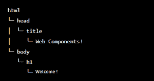
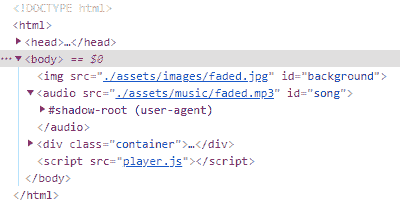
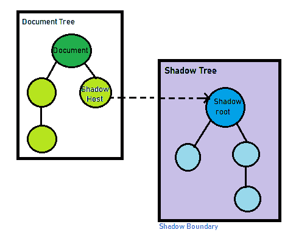

# 什么是影根，如何使用？

> 原文:[https://www . geesforgeks . org/什么是影子根和如何使用它/](https://www.geeksforgeeks.org/what-is-shadow-root-and-how-to-use-it/)

在当今充满组件驱动架构的世界中，仍然存在这样一种情况，即全球应用的 CSS 可能会在我们代码的其余部分造成问题。这是因为 CSS 的创建方式和方式。这不一定是坏的，但值得注意的是，我们可以通过组件架构世界中的封装思想更有效地使用样式。这有助于我们避免不必要的副作用，同时保持组件代码干净、最小、易于扩展和重建。

web 组件的一个重要特性是封装——能够隐藏行为、样式和标记结构并将其与页面上的其他代码区分开，这样各个部分就不会重叠，并保持代码的美观和整洁。它的核心组件是影子 DOM 应用编程接口，它提供了一种向元素添加单独的隐藏 DOM 的方法。本文介绍了使用阴影 DOM 和阴影根概念的基础知识。

在介绍 Shadow DOM 之前，让我们先了解一些概念:

**什么是 DOM？**

网页的基础是 HTML，一种供人们书写和理解的标记语言。HTML 给了我们一种添加内容和结构的方法，但是机器需要的不仅仅是这个。由于这个原因，文档对象模型(又称 DOM)正在被创建。DOM 然后有一个应用编程接口，我们的应用程序可以使用它来操纵文档的结构、内容和样式。

**什么是 DOM 树？**

当浏览器加载网页时，HTML 代码被转换为由“对象”和“节点”组成的数据模型此外，生成一个“DOM 树”，其中存储了网页结构。

DOM 树如下所示:



DOM 树

Web 组件是一组各种各样的技术，使您能够构建可重用的定制元素。它们的功能被封装在程序的其他部分之外，可以包含在网络应用程序中。

有 4 个网络组件标准，我们将重点关注影子 DOM:

1.  影子天赋
2.  超文本标记语言模板
3.  自定义元素
4.  超文本标记语言导入

影子 DOM 消除了创建网络应用的脆弱性。脆弱性来自于 HTML、CSS 和 JavaScript 的全球性。多年来，我们已经发明了大量的工具来解决这些问题。例如，当你添加一个新的 HTML id /类时，它不会说它是否与网站上使用的当前名称冲突。微妙的小故障正在悄悄出现，CSS 的特异性正在成为一个大问题！(重要的所有事情！)，样式选择器正在失去平衡，输出可能会受到影响。阴影 DOM 修复了 HTML 和 DOM。这会将限定范围的样式添加到 web 应用程序中。

**注意:**请始终记住，这个概念并没有在所有浏览器中应用。

阴影 DOM 用于封装。影子 DOM 允许组件的作者构建自己的 DOM，它独立于常规的 DOM。这确保了针对这个新的 DOM 编写的所有 JavaScript 和 CSS 都可以被完全封装，并且它的结果可以屏蔽在全局字段中声明的 CSS，除非组件允许这样做。

**构建了 Shadow DOM:**DOM 的结构通常对我们是隐藏的，但是我们可以在开发者工具中看到。例如，在 Chrome 中，我们需要在开发工具中允许“显示用户代理阴影 DOM”选项。

```htmlhtml
What you can see below #shadow-root is called “shadow DOM”.

```



我们无法通过常规的 JavaScript 调用或选择器获得内置的影子 DOM 元素。这些不是普通的孩子，而是一种强大的封装技术。

**阴影根:** A **阴影树**是一个节点树，其根称为**阴影根**。一个**阴影根**总是通过它的宿主连接到另一个节点树。因此，影子树从不孤单。阴影根的宿主的节点树有时被称为光照树。

影子 DOM 允许隐藏的 DOM 树附加到常规 DOM 树的元素上。

这里，这个阴影 DOM 树从一个阴影根开始，它可以附加到你选择的任何元素上，就像普通的 DOM 一样。

```htmlhtml
<my-header>
  #shadow-root
    <header>
      <h1>
      <button>

```

影子树的顶部是**影子根。**树所附着的元素(< my-header >)称为影子宿主，宿主有一个名为 shadowRoot 的属性，该属性指向影子根。影子根是附加到宿主元素的文档片段，它具有标识其宿主元素的宿主属性。附加阴影根的行为是元素如何获得它的阴影 DOM。



您需要了解一些影子 DOM 术语:

1.  **阴影宿主:**你选择开始一个新的阴影 DOM 的元素。
2.  **阴影树:**节点树，即阴影 DOM 内部的 DOM 树。
3.  **阴影边界:**这是阴影 DOM 结束的地方，常规 DOM 开始。
4.  **影子根:**是影子树的根节点。

**创建阴影 DOM:** 一旦选择了要用于托管阴影 DOM 的元素，就必须将阴影 DOM 附加到它上面。请参见下面的片段。

```htmlhtml
<p class="highlight">Welcome to GeeksForGeeks</p> 

<div id="Firstcomponent"></div> 

<script> 
  const shadowRootOne = 
     document.getElementById('Firstcomponent')
            .attachShadow({mode: 'open'}); 
</script>

```

所以在这个脚本中，我们抓取一个 id 为 Firstcomponent 的 div 元素，然后在这个元素上调用一个名为 attachShadow()的特殊方法，其中这个方法传入一个具有属性模式的对象。

**有两个限制:**

1.  每个元素只能创建一个阴影根。
2.  **元素**必须是自定义元素，或者是“blockquote”、“body”、“div”、“article”、“average”、“footer”、“h1…h6”、“header”、“main”、“nav”、“p”、“section”或“span”中的一个。其他元素，如< img >，不能托管阴影树。

模式选项用于设置封装级别。它必须遵循两个值中的任何一个:

*   **“打开”**–打开意味着可以使用 JavaScript 访问影子 DOM。

```htmlhtml
For example using the Element.shadowRoot property:
let myShadowDom = myCustomElem.shadowRoot;

```

*   **“关闭”**–Mycustomelem . Shadowroot 返回 null。

如果将阴影根附加到设置了**模式:关闭**的自定义元素，您将无法从外部访问阴影 DOM。

我们只能通过 attachShadow 返回的引用来访问影子 DOM，它可能隐藏在一个类中。浏览器原生阴影树关闭。没有办法接近他们。由 attachShadow()方法返回的阴影根。这个对象代表您新创建的阴影 DOM 的根节点，您将把您的其他元素附加到。

让我们看看下面给出的例子，它显示了在组件托管的阴影根上添加一个段落元素。

```htmlhtml
const paragraphElement = document.createElement('p'); 
paragraphElement.setAttribute('class', 'highlight'); 
paragraphElement.innerText = 
'This is a Shadow DOM paragraph'; 

shadowRootOne.appendChild(paragraphElement);

```

上面的代码将把一个带有高亮类的新段落元素附加到阴影根，它将成为新阴影 DOM 的一部分。这个段落元素是与主 DOM 分开封装的，所以它不能通过执行 JavaScript 和 CSS 选择来识别。它也不会从 CSS 作者页面继承任何样式，但是在这个阶段它会有默认的浏览器样式，因为我们还没有为这个 Shadow DOM 指定样式。

**向阴影 DOM 添加样式:**阴影树内的样式作用于阴影树，不影响阴影树外的元素。通常，阴影树外部的样式与阴影树内部的选择器不匹配。

有 2 种方法可以为阴影 DOM 添加样式。将样式包含到阴影 DOM 中的第一种方法与将任何其他元素添加到阴影 DOM 中相同。用一个简单的 appendChild 调用影子根。另一种方法是使用<template></template>

```htmlhtml
const styleElement = document.createElement('style'); 
styleElement.innerText = ` 
  .highlight { 
      background: #FFA500; 
      font-size: 6rem; 
  } `; 

shadowRootOne.appendChild(styleElement);

```

该段落封装在一个单独的 Shadow DOM 中，因此，如果您更改了全局样式以具有更高的特异性，它不会更改新组件的样式。