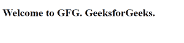
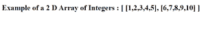

# 虚化空白有什么好处？

> 原文:[https://www . geeksforgeeks . org/塌陷空白空间的优势是什么/](https://www.geeksforgeeks.org/what-is-the-advantage-of-collapsing-white-space/)

**空白**是指浏览器读取并渲染的代码中的空值或空白值。Html 有一个特殊的功能，就是折叠这些空白。如果您在代码中添加额外的/连续的空格或换行符，它将把它看作一个空格，这就是所谓的空格折叠。在本文中，我们将讨论在 [HTML](https://www.geeksforgeeks.org/html-tutorials/) 中折叠空白的优势。

**折叠空白的优点:**

*   当您为网页编写 HTML 时，您希望代码对用户来说更容易理解/可读。
*   收缩空格**减少了服务器和客户端之间的传输时间**，因为收缩特征去除了被空格占据的不必要的字节。
*   错了，如果你**多留了**白色**空间**，浏览器会忽略掉，完美显示 UI。

**示例 1:** 以下示例显示了折叠空白的基本示例。h1 标签在短形式和完整形式之间包含大量空间。如果您在浏览器中运行此代码，您将看到以下输出。两者之间的所有空白都被转换成了一个单独的空白。

## 超文本标记语言

```html
<!DOCTYPE html>
<html>
<head>
    <title>Page Title</title>
</head>
<body> 
    <h1>Welcome to GFG.              GeeksforGeeks.</h1>
</body>
</html>
```

**输出:**



折叠 _ 空白

**示例 2:** 以下示例将代码中类型为结构的整数 2d 数组显示为每行位于不同的行中。如果您将看到输出，它将与所有折叠的空白在一行。

## 超文本标记语言

```html
<!DOCTYPE html>
<html>
<body>
    <h1>Example of a 2 D Array of Integers : 
            [
            [1,2,3,4,5],
            [6,7,8,9,10]
            ]   
    </h1>
</body>
</html>
```

**输出:**



折叠 _ 空白