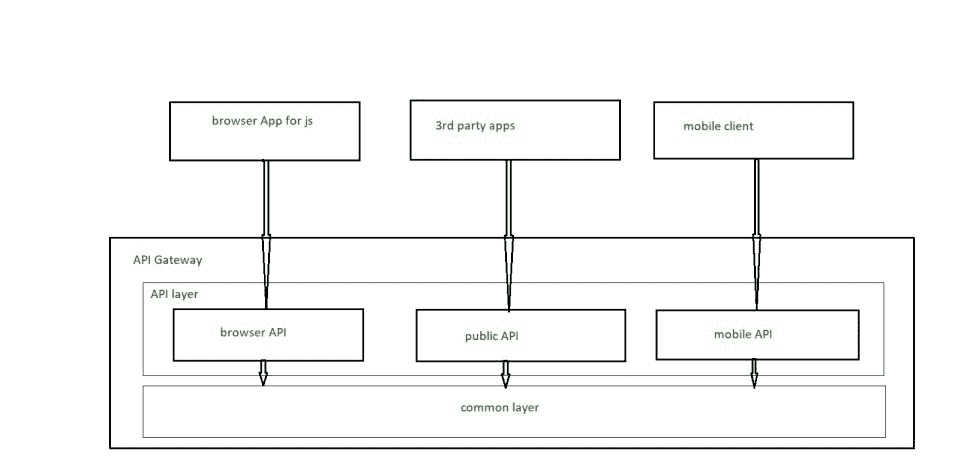

# 什么是 API 网关模式？

> 原文:[https://www . geesforgeks . org/什么是 api-gateway-pattern/](https://www.geeksforgeeks.org/what-is-the-api-gateway-pattern/)

应用编程接口——它代表“应用编程接口”。一般来说，API 是执行某些特定任务或功能的内置库或库集合。一般来说，我们使用应用编程接口与其他网络应用程序连接。我们通常通过遵循某些协议、方法与其他 web 应用程序连接。我们还可以通过另一个网络应用程序或软件使用的应用编程接口来使用数据。换句话说，我们可以通过应用编程接口与其他网络应用程序/软件交换数据。

**什么是应用编程接口网关模式:**应用编程接口网关模式在某些情况下代表“前端后端”。它基本上是外部来源进入任何应用程序的入口。当程序员制作客户端应用程序时，他们脑海中出现的模式。它充当客户端应用程序和微服务之间的媒介。例如，网飞是应用编程接口网关最著名的例子。

**API 网关模式的使用:**这种模式的主要职责是路由请求手段，基本上为我们的请求如何进行、批准或可能被取消、API 组合和 app 认证提供了路线图。

**应用编程接口网关如何处理客户端请求:**

*   应用编程接口请求主要来自外部的客户端，首先到达应用编程接口网关。
*   是应用编程接口网关的工作将请求路由到它们的位置。
*   其他附加请求，即使用多个服务和聚合结果，由应用编程接口网关处理。

它有助于防止我们的软件恶意的网络故障，因为它有两个不同的层，一个是公共层，用于客户端和应用编程接口层之间的身份验证。这些层保护我们免受像 XML 解析器攻击、SQL 注入攻击等攻击。它帮助客户非常容易地进行交流。

**API 网关的架构–**它基本上由两层组成–

*   公共层有助于边缘功能的工作，边缘功能有助于认证。
*   在应用编程接口层，每个应用编程接口模块都有助于为特定的客户端创建一个应用编程接口。API 层由一个或多个独立的 API 模块组成。

**API 网关模式的优势–**

*   它封装了 web 应用程序的整个内部结构。
*   它从不调用特定的服务。例如，客户端与 API 网关的交互。
*   它有助于简化客户端的代码。

**API 网关模式的缺点–**

*   它是每个网络应用程序的重要组成部分，这意味着只有当应用程序接口是最新的时，网络应用程序服务才会显示。
*   对于每个进程来说，轻量级变得非常重要，因为否则它们的时间复杂性会增加，因为它们的开发人员必须在更新 API 的过程中等待。