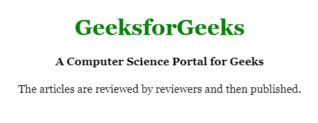
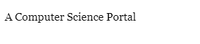
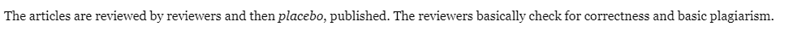
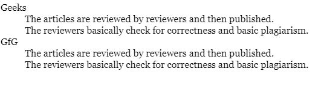
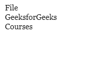

# aria-labelled by 属性是什么？

> 原文:[https://www . geesforgeks . org/什么是-aria-labelledby-attribute/](https://www.geeksforgeeks.org/what-is-the-aria-labelledby-attribute/)

aria-labelledby 属性是超文本标记语言的一个固有属性，它习惯于在对象和标签之间产生关系。一旦任何组件包含 aria-labelledby 和 aria-label 属性，浏览器的高优先级毫无疑问将是 aria-labelledby。这个 aria-labelledby 属性可以用于任何典型的超文本标记语言类型的元素。它并不局限于组件，但是 aria-label 属性我们必须时刻注意，而受害 aria-label 因为它并不适用于所有的 HTML 元素。

**语法:**

```htmlhtml
<element aria-labelledby =""> Content </element>
```

**参数:**所有元素标识的空格分隔列表。

以下是 aria-labelledby 属性的一些常见用法:

*   **Multiple Labels:** Here each element is a field with both labels, the individual labels, and the group labels.

    **示例:**

    ```htmlhtml
    <!DOCTYPE html> 
    <html> 

    <head> 
        <style> 
            body { 
                text-align: center; 
            } 

            h1 { 
                color: green; 
            } 
        </style> 
    </head> 

    <body> 
        <h1>GeeksforGeeks</h1> 
        <div id="myBillingId"><h4>Billing of the Course</h4></div> 
        <br> 
        <div> 
            <div id="myNameId">Student_ID: 
                <input type="text"
                    aria-labelledby="myBillingId myNameId" /> 
            </div> 
        </div> 
        <div> 
            <div id="myCourseId">Course: 
                <input type="text"
                    aria-labelledby="myBillingId myCourseId" /> 
            </div> 
        </div> 
    </body> 

    </html>
    ```

    **输出:**
    

*   **Associating Headings With Regions:** In this example, the header element is linked with the group head div, which makes the relation between the group head and the header element.

    **示例:**

    ```htmlhtml
    <!DOCTYPE html> 
    <html> 

    <head> 
        <style> 
            body { 
                text-align: center; 
            } 

            h1 { 
                color: green; 
            } 
        </style> 
    </head> 

    <body> 

        <div role="main" aria-labelledby="geeks"> 
            <h1>GeeksforGeeks</h1> 
            <h4 id="geeks">A Computer Science Portal for Geeks</h4> 
        The articles are reviewed by reviewers and then published. 

        </div> 
    </body> 

    </html>
    ```

    **输出:**
    

*   **Radio Groups**: In this example, the radio group of a button is in relation to the container head.

    **示例:**

    ```htmlhtml
    <!DOCTYPE html> 
    <html> 

    <head> 
        <style> 
            body { 
                text-align: center; 
            } 

            h1 { 
                color: green; 
            } 
        </style> 
    </head> 

    <body> 
        <h1>GeeksforGeeks</h1> 
        <div id="radio_label">My radio labels</div> 
        <ul role="radiogroup" aria-labelledby="radio_label"> 
            <li role="radio"> 
                <input type="radio">Geeks</li> 
            <li role="radio"> 
                <input type="radio">For</li> 
            <li role="radio"> 
                <input type="radio">Geeks</li> 
        </ul> 
    </body> 

    </html>
    ```

    **输出:**
    

*   **Dialog Label:** In this example relation established between dialog and the header element.

    **示例:**

    ```htmlhtml
    <div role="dialog" aria-labelledby="dialogheader"> 
        <dialog id="dialogheader">Choose a File</dialog> 
        A Computer Science Portal 
    </div> 
    ```

    **输出:**
    

*   **Inline Definition:** In the example below, the definition of a term that is described in the natural flow of the narrative is associated with the term itself using the aria-labelledby attribute.

    **示例:**

    ```htmlhtml
    <p>
        The articles are reviewed by reviewers and then 
        <dfn id="placebo">placebo</dfn>, published. 

        <span role="definition" aria-labelledby="placebo"> 
            The reviewers basically check for
            correctness and basic plagiarism.
        </span> 
    </p>
    ```

    **输出:**
    

*   **Definition Lists:** In the example below, the definitions in a formal definition list are associated with the terms they define using the aria-labelledby attribute.

    **示例:**

    ```htmlhtml
    <dl> 
        <dt id="Geeks">Geeks</dt> 
        <dd role="definition" aria-labelledby="Geeks"> 
            The articles are reviewed by reviewers
            and then published. 
        </dd>

        <dd role="definition" aria-labelledby="Geeks"> 
            The reviewers basically check for
            correctness and basic plagiarism. 
        </dd> 

        <dt id="GFG">GfG</dt> 
        <dd role="definition" aria-labelledby="GFG"> 
            The articles are reviewed by reviewers
            and then published. 
        </dd>

        <dd role="definition" aria-labelledby="GFG"> 
            The reviewers basically check for
            correctness and basic plagiarism. 
        </dd> 
    </dl>
    ```

    **输出:**
    

*   **Menus:** In the example below, a popup menu is associated with its label using the aria-labelledby attribute

    **示例:**

    ```htmlhtml
    <div role="menubar"> 
        <div role="menuitem" aria-haspopup="true" id="fileMenu">File</div> 
        <div role="menu" aria-labelledby="fileMenu"> 
            <div role="menuitem">GeeksforGeeks</div> 
            <div role="menuitem">Courses</div> 
        </div> 
    </div> 
    ```

    **输出:**
    