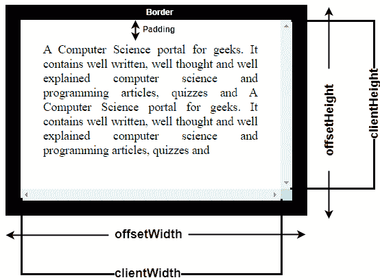

# offset health 和 clientHeight 有什么区别？

> 原文:[https://www . geeksforgeeks . org/offset theight 和 clientheight 的区别是什么/](https://www.geeksforgeeks.org/what-is-the-difference-between-offsetheight-and-clientheight/)

**offset thight:**是帮助以像素为单位测量元素可见高度的属性，包括元素*可见内容、垂直填充、边框*和*滚动条*等 CSS 属性，但不包括*上下边距*。

```html
offsetHeight = Visible content + padding + border + scrollbar
```

**ClientHeight:** 它是帮助以像素为单位测量元素内部高度的属性，包括像*填充*这样的 CSS 属性，但不包括*水平滚动条高度*、*边框*或*边距*。

```html
clientHeight = Visible content + padding
```



**示例:**

```html
<!DOCTYPE html>
<html>

<head>
    <title>
        What is the difference between
        offsetHeight and clientHeight?
    </title>

    <style>
        h1 {
            color:green;
        }
        #GFG {
            height: 200px;
            width: 300px;
            padding: 20px;
            margin: 20px;
            border: 10px solid black;
            overflow-x:scroll;
            overflow-y:scroll;
            text-align:justify;
        }
        #geeks {
            font-weight:bold;
            color:green;
        }
    </style>
</head>

<body>
    <center>
        <h1>GeeksforGeeks</h1>

        <h2>OffsetHeight and ClientHeight</h2>

        <button onclick="myGeeks()">
            Click Here!
        </button>

        <div id="GFG">
            This course is focused on Data Structures
            & Algorithms and will help you to prepare
            for product-based companies like Microsoft,
            Amazon, Adobe, etc. This is an online
            learning program which can be completed
            according to your pace. The course
            curriculum has been divided into 10 weeks
            where you can practice the question & 
            attempt the Contest according to your 
            time convenience. The course content includes
            pre-recorded premium Video lectures & 
            programming questions for practice. You will 
            learn algorithmic techniques for solving 
            various computational problems and will
            implement more than 200 algorithmic coding
            problems. 
        </div>

        <div id="geeks"></div>

        <script>
            function myGeeks() {

                var element = document.getElementById("GFG");
                var text = "";

                text += "ClientHeight: " + element.clientHeight
                            + "px" + "<br>";

                text += "OffsetHeight: " + element.offsetHeight
                            + "px" + "<br><br>";

                text += "ClientWidth: " + element.clientWidth
                            + "px" + "<br>";

                text += "OffsetWidth: " + element.offsetWidth + "px";

                document.getElementById("geeks").innerHTML = text;
            }
        </script>
    </center>
</body>

</html>
```

**输出:**

*   **之前点击按钮:**
    
*   **点击按钮后:**
    