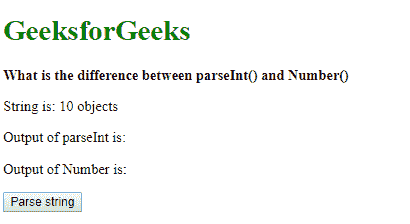
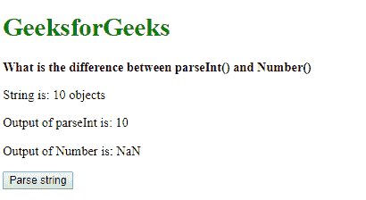
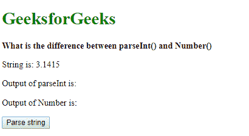
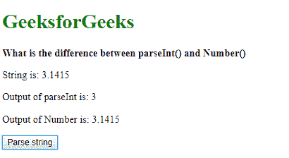
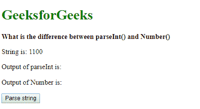
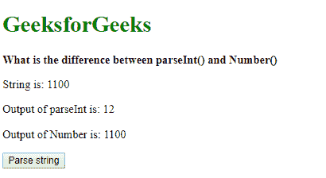

# parsent()和 Number()有什么区别？

> 原文:[https://www . geeksforgeeks . org/parse int 和 number 的区别是什么/](https://www.geeksforgeeks.org/what-is-the-difference-between-parseint-and-number/)

*   **The parseInt() function:**
    The **parseInt() function** is used to parse a string and convert it to an integer of a specified radix. It takes two parameters, the string to be parsed and the radix to be used. The radix is an integer between 2 and 36 which represents the base of the number.

    如果 **parseInt()** 在解析时遇到不符合指定基数的字符，它将忽略该字符和所有后续字符。然后，它将解析到该点的值作为整数返回。在这种情况下，允许前导或尾随空格。

    如果函数获得第一个字符，并且不能将其转换为数字，它将返回 NaN，除非基数大于 10。该 NaN 值对于任何基数都不是有效的数字，不能用于任何数学计算。

    **语法:**

    ```
    parseInt(string, radix)
    ```

*   **The Number() function**
    The Number() function is used to create a primitive type Number object. It takes one parameter which is the value of the number. This value could be passed with a string and the Number function will try to represent it as a number. If the argument could not be converted into a number, it returns a NaN value. This NaN value is not a valid number and cannot be used in any mathematical calculation.

    **语法:**

    ```
    Number(valueString)
    ```

这些之间的差异可以用下面的例子来解释:

**示例 1:**
此示例显示*parsent()*尝试将该值转换为可以转换为整数的最后一个字符。尾部空格和字符被忽略，因为它们无效。另一方面*号()*功能只是返回 *NaN* 。

```
<!DOCTYPE html>
<html>

<head>
    <title>
      What is the difference between 
      parseInt() and Number()
  </title>
</head>

<body>
    <h1 style="color: green">
      GeeksforGeeks
  </h1>
    <b>
      What is the difference between
      parseInt() and Number()
  </b>
    <p>String is: 10 objects</p>
    <p>Output of parseInt is: <span class="parseOutput">
      </span>
  </p>
    <p>Output of Number is: <span class="numberOutput">
      </span>
  </p>
    <button onclick="parseNumber()">
      Parse string
  </button>
    <script type="text/javascript">
        function parseNumber() {
            let string = '10.6 objects';
            let number1 = parseInt(string);
            let number2 = Number(string);

            document.querySelector(
              '.parseOutput').textContent = number1;
            document.querySelector(
              '.numberOutput').textContent = number2;
        }
    </script>
</body>

</html>
```

**输出:**

*   **点击按钮前:**
    
*   **点击按钮后:**
    

**例 2:**
本例展示了*parsent()*只返回整数值而 *Number()* 返回包括浮点在内的所有数字的区别。

```
<!DOCTYPE html>
<html>

<head>
    <title>
      What is the difference between 
      parseInt() and Number()
  </title>
</head>

<body>
    <h1 style="color: green">
      GeeksforGeeks
  </h1>
    <b>What is the difference between
      parseInt() and Number()
  </b>
    <p>String is: 3.1415</p>
    <p>Output of parseInt is: <span class="parseOutput">
      </span>
  </p>
    <p>Output of Number is: <span class="numberOutput">
      </span>
  </p>
    <button onclick="parseNumber()">Parse string</button>
    <script type="text/javascript">
        function parseNumber() {
            let string = '3.1415';
            let number1 = parseInt(string);
            let number2 = Number(string);

            document.querySelector(
              '.parseOutput').textContent = number1;
            document.querySelector(
              '.numberOutput').textContent = number2;
        }
    </script>
</body>

</html>
```

**输出:**

*   **点击按钮前:**
    
*   **点击按钮后:**
    

**示例 3:**
该示例显示了*parsent()*中基数参数的工作方式。传递的字符串以 2 为基数进行分析。这将返回值 12。另一方面， *Number()* 按原样返回字符串中的值。

```
<!DOCTYPE html>
<html>

<head>
    <title>
      What is the difference between 
      parseInt() and Number()
  </title>
</head>

<body>
    <h1 style="color: green">
      GeeksforGeeks
  </h1>
    <b>What is the difference between
      parseInt() and Number()
  </b>
    <p>String is: 1100</p>
    <p>Output of parseInt is: <span class="parseOutput">

      </span></p>
    <p>Output of Number is: <span class="numberOutput">
      </span></p>
    <button onclick="parseNumber()">
      Parse string
  </button>

    <script type="text/javascript">
        function parseNumber() {
            let string = '1100';
            let number1 = parseInt(string, 2);
            let number2 = Number(string);

            document.querySelector(
              '.parseOutput').textContent = number1;
            document.querySelector(
              '.numberOutput').textContent = number2;
        }
    </script>
</body>

</html>
```

**输出:**

*   **点击按钮前:**
    
*   **点击按钮后:**
    