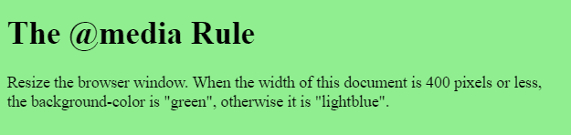
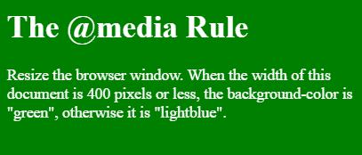

# 媒体查询中的“屏幕”和“仅屏幕”有什么区别？

> 原文:[https://www . geeksforgeeks . org/什么是屏幕和仅屏幕媒体查询的区别/](https://www.geeksforgeeks.org/what-is-the-difference-between-screen-and-only-screen-in-media-queries/)

媒体查询用于创建响应性网页设计。这意味着基于屏幕或媒体类型，网页的视图因系统而异。
**屏幕:**用于设置媒体查询的屏幕大小。屏幕尺寸可以通过使用最大宽度和最小宽度来设置。屏幕大小因屏幕而异。

**语法:**

```html
@media screen and (max-width: width)
```

**示例:**本示例使用媒体查询，当显示区域的最大宽度为 400px 时有效。它是指定屏幕，而不是其他可用的媒体类型，最常见的另一种是打印。

```html
<!DOCTYPE html>
<html>

<head>
    <meta name="viewport" content=
        "width=device-width, initial-scale=1.0">

    <!-- CSS property to set style -->    
    <style>
        body {
            background-color: lightgreen;
        }

        /* Media query */
        @media screen and (max-width: 400px) {
            body {
                background-color: green;
                color:white;
            }
        }
    </style>
</head>

<body>
    <h1>The @media Rule</h1>

    <p>
        Resize the browser window. When the width of
        this document is 400 pixels or less, the 
        background-color is "green", otherwise it
        is "lightblue".
    </p>
</body>

</html>                    
```

**输出:**
**屏幕尺寸大于 400px:**

**屏幕尺寸小于 400px:**


**仅屏幕:**仅**关键字用于防止不支持带有媒体功能的媒体查询的旧浏览器应用指定的样式。**

****语法:****

```html
@media only screen and (max-width: width) 
```

****例 2****

```html
<!DOCTYPE html>
<html>

<head>
    <meta name="viewport" content=
        "width=device-width, initial-scale=1.0">

    <!-- CSS property to set style -->    
    <style>
        body {
            background-color: lightgreen;
        }

        /* Media query */
        @media only screen and (max-width: 400px) {
            body {
                background-color: green;
            }
        }
    </style>
</head>

<body>
    <h1>The @media Rule</h1>

    <p>
        Resize the browser window. When the width of
        this document is 400 pixels or less, the 
        background-color is "green", otherwise it
        is "lightblue".
    </p>
</body>

</html>                    
```

****输出:**
**屏幕尺寸大于 400px:**

**屏幕尺寸小于 400px:**
**