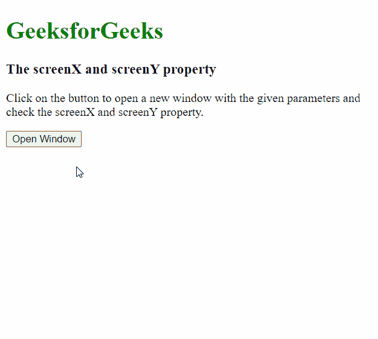
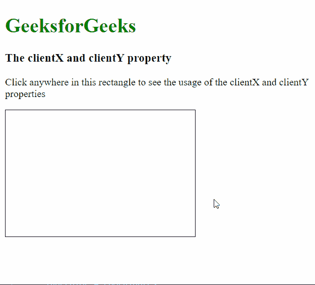
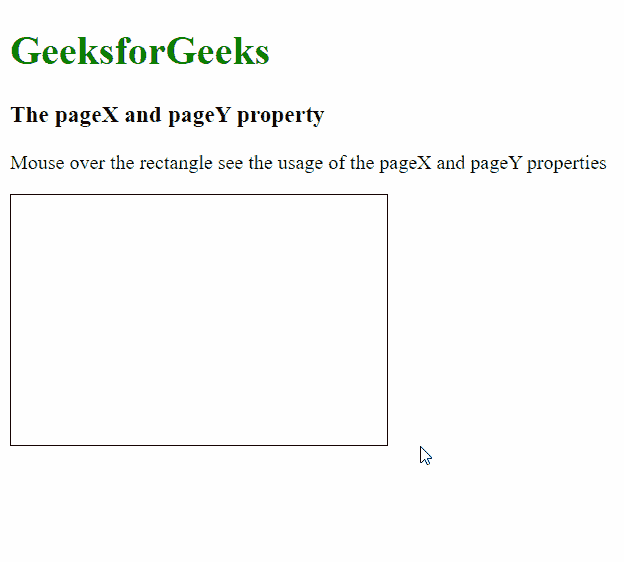

# screenX/Y、clientX/Y 和 pageX/Y 有什么区别？

> 原文:[https://www . geeksforgeeks . org/screenx-y-clientx-y-和-pagex-y/](https://www.geeksforgeeks.org/what-is-the-difference-between-screenx-y-clientx-y-and-pagex-y/) 的区别是什么

JavaScript 的属性 screenX/Y、clientX/Y 和 pageX/Y 之间的区别通常是混淆的。每个属性都返回一个值，该值指示不同参考点的物理像素数。这些属性的区别和用例描述如下:

**1。screenX 和 screenY 属性:****screenX**和 **screenY** 是只读属性，分别提供相对于全局或屏幕坐标的水平和垂直坐标。它返回一个表示坐标的双浮点值。

**示例:**

## 超文本标记语言

```html
<!DOCTYPE html>
<html>

<body>
    <h1 style="color: green;">
        GeeksforGeeks
    </h1>

    <h3>The screenX and screenY property</h3>

    <p>
        Click on the button to open a new
        window with the given parameters
        and check the screenX and screenY
        property.
    </p>

    <button onclick="getScreenXY()">
        Open Window
    </button>

    <script>
        function getScreenXY() {

            // Open a new window with the
            // left at 400 and the top at 200
            var newWindow = window.open("", "newWindow",
                "left=400, top=200, width=450, height=300");

            newWindow.document.write(
                "<p> This is the example window to" +
                " show the usage of screenX/Y");

            // Show the screenX and screenY property
            newWindow.document.write(
                "<br>screenX: " + newWindow.screenX
            );
            newWindow.document.write(
                "<br>screenY: " + newWindow.screenY + "</p>"
            );
        }
    </script>
</body>

</html>
```

**输出:**



**2。clientX 和 clientY 属性:****clientX**和 **clientY** 是只读属性，分别提供内容区域或浏览器窗口视口内的水平和垂直坐标。

例如，如果用户垂直向下滚动网页，并在视口的开始处单击，那么 clientY 将始终返回 0。它返回一个表示坐标的双浮点值。

**示例:**

## 超文本标记语言

```html
<!DOCTYPE html>
<html>

<head>
    <style>
        div {
            width: 300px;
            height: 200px;
            border: 1px solid black;
        }
    </style>
</head>

<body>
    <h1 style="color: green;">
        GeeksforGeeks
    </h1>

    <h3>The clientX and clientY property</h3>

    <p>
        Click anywhere in this rectangle to
        see the usage of the clientX and
        clientY properties
    </p>

    <div onclick="showCoordinates(event)"></div>

    <p id="display"></p>

    <script>
        function showCoordinates(event) {
            var x = event.clientX;
            var y = event.clientY;
            var coordinates = "clientX: " +
                x + ", clientY: " + y;
            document.getElementById("display")
                .innerHTML = coordinates;
        }
    </script>
</body>

</html>
```

**输出:**



**3。pageX 和 pageY 属性:****PageX**和 **pageY** 是只读属性，分别返回相对于整个文档左边缘的水平和垂直坐标，即相对于浏览器窗口中完全呈现的内容区域的左边缘和网址栏的正下方。

例如，如果用户向下滚动页面，无论滚动多少，它仍然会返回相对于页面顶部的坐标。

**示例:**

## 超文本标记语言

```html
<!DOCTYPE html>
<html>

<head>
    <style>
        div {
            width: 300px;
            height: 200px;
            border: 1px solid black;
        }
    </style>
</head>

<body>
    <h1 style="color: green;">
        GeeksforGeeks
    </h1>

    <h3>The pageX and pageY property</h3>

    <p>
        Mouse over the rectangle see the
        usage of the pageX and pageY
        properties
    </p>

    <div onmousemove="showCoordinates(event)" 
        onmouseout="clearCoordinates()">
    </div>

    <p id="display"></p>

    <script>
        function showCoordinates(event) {
            var x = event.pageX;
            var y = event.pageY;
            var coordinates = "pageX: " +
                x + ", pageY: " + y;
            document.getElementById("display")
                .innerHTML = coordinates;
        }

        function clearCoordinates() {
            document.getElementById("display")
                .innerHTML = "";
        }
    </script>
</body>

</html>
```

**输出:**

