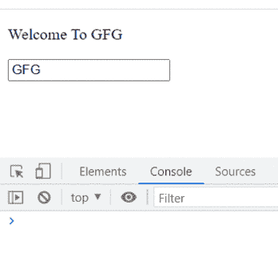
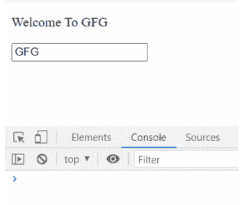

# 第二个可以选择性传递给 setState 的参数是什么，它的用途是什么？

> 原文:[https://www . geeksforgeeks . org/第二个参数是什么——可以选择性地传递给 set state——以及它的目的是什么/](https://www.geeksforgeeks.org/what-is-the-second-argument-that-can-optionally-be-passed-to-setstate-and-what-is-its-purpose/)

可以选择性地传递给设置状态的第二个参数是**回调函数**，该函数在设置状态完成后立即被调用，组件被重新呈现。

如果您希望您的程序使用设置状态更新状态值，然后对更新的状态值执行某些操作，那么您必须在函数中指定这些操作，该函数应该是设置状态的第二个参数。如果我们不这样做，那么这些动作将在状态的前一个值上执行，因为设置状态的**异步**特性。

**创建反应应用程序:**

**步骤 1:** 使用以下命令创建一个反应应用程序:

```html
npx create-react-app setState_example
```

**步骤 2:** 创建项目文件夹，即 setState_example 后，使用以下命令移动到该文件夹:

```html
cd setState_example
```

**项目结构:**如下图。


**App.js** :现在在 App.js 文件中写下下面的代码。

**1。不将第二个参数传递给设置状态:**

## java 描述语言

```html
import React, { Component } from 'react';

class App extends Component {
  constructor(props) {
    super(props);
    this.state = {
      name: "GFG",
    };
  }

  updateName = (value) => {
    console.log("Previous name: "+this.state.name)
    this.setState({ name: value});
    console.log("Current name: "+this.state.name);
  };

  render() {
    const {name}  = this.state;
    return (
      <div>
        <p>Welcome To GFG</p>

        <input
          type="text"
          value={name}
          onChange={e => this.updateName(e.target.value)}  
        />
      </div>
    );
  }
}

export default App;
```

**运行应用程序的步骤:**从项目的根目录使用以下命令运行应用程序:

```html
npm start
```

**输出:**现在打开浏览器，转到***http://localhost:3000/***，会看到如下输出:



输出

**说明:**在将输入字段的值从“GFG”更改为“GeeskForGeeks”时，控制台窗口首先打印输入字段的前一个值，而不是当前值。但是当前值不等于我们在输入字段中键入的值(即 GeeksForGeeks)发生这种情况是因为我们没有在 setState 内部声明 console.log(" Current name:"+this . state . name ")函数，这是由于哪个 console . log 函数正在对输入字段的前一个值进行调用。它展示了 setState 的异步特性。

**2。向设置状态传递第二个参数。**

## java 描述语言

```html
import React, { Component } from 'react';

class App extends Component {
  constructor(props) {
    super(props);
    this.state = {
      name: "GFG",
    };
  }

  updateName = (value) => {
    console.log("Previous name: "+this.state.name)
    this.setState({ name: value}, ()=>{

      // Passing it as a second parameter to setState
      console.log("Current name: "+this.state.name)
    });
  };

  render() {
    const {name}  = this.state;
    return (
      <div>
        <p>Welcome To GFG</p>

        <input
          type="text"
          value={name}
          onChange={e => this.updateName(e.target.value)}
        />
      </div>
    );
  }
}

export default App;
```

**运行应用程序的步骤:**从项目的根目录使用以下命令运行应用程序:

```html
npm start
```

**输出:**现在打开浏览器，转到***http://localhost:3000/***，会看到如下输出:



输出

**说明:**在将输入字段的值从“GFG”更改为“GeeskForGeeks”时，控制台窗口首先打印输入字段的前一个值，而不是当前值。当前值与输入字段内的值匹配发生这种情况是因为我们在 setState 内声明了 console.log(" Current name:"+this . state . name)函数，由于该函数，console . log 函数获得了输入字段的更新值。