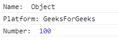
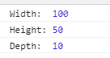
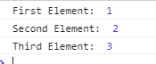

# 花括号在` var { … } = …`语句中有什么用？

> 原文:[https://www . geesforgeks . org/var 语句中的花括号有什么用处/](https://www.geeksforgeeks.org/what-is-the-use-of-curly-brackets-in-the-var-statements/)

析构赋值允许我们将数组或对象的属性赋给一堆变量，这些变量有时非常方便和简短。请看下图。下面提到的两种方法都是正确的，并且产生相同的结果。

*   **无破坏:**

    ```
    var array = [1, 20, 40];

    var first = array[0]
    var second = array[1]
    var third = arr[2]

    ```

*   **带破坏**

    ```
    var array = [1, 20, 40];

    var [first, second, third] = array;

    ```

**对象析构**可以对 JavaScript 对象进行析构。在赋值操作符的左侧，有一个变量模式，其中存储了对象的属性。变量的名称必须与对象中定义的名称相同。让我们从下面的例子来看看这个概念。

**注意:**花括号“{ 0 }”用于析构 JavaScript 对象属性。

*   **例:**

    ```
    <!DOCTYPE html>
    <html lang="en">

    <head>
        <meta charset="UTF-8">
        <title>GeeksForGeeks</title>
    </head>

    <body>
        <script>

            let example_object = {
                name: "Object",
                platform: "GeeksForGeeks",
                number: 100
            };

            let {name, platform, number} = example_object;

            console.log("Name: ", name);
            console.log("Platform: ", platform);
            console.log("Number: ", number);
        </script>
    </body>

    </html>
    ```

*   **输出:**
    

如果我们希望对象中定义的变量被分配给具有其他名称的变量，那么我们可以使用冒号来设置它。

*   **语法:**

    ```
    {sourceProperty : targetVariable}
    ```

*   **例:**

    ```
    <!DOCTYPE html>
    <html lang="en">

    <head>
        <meta charset="UTF-8">
        <title>GeeksForGeeks</title>
    </head>

    <body>
        <script>
            let cuboid = {
                width: 100,
                height: 50,
                depth: 10
            };

            // width -> w
            // height -> h
            // depth -> d
            let {width:w, height:h, depth:d} = cuboid;

            console.log("Width: ", w);
            console.log("Height:", h);
            console.log("Depth: ", d);
        </script>
    </body>

    </html>
    ```

*   **输出:**
    

**数组析构:**数组的元素也可以用同样的方式进行析构。析构赋值可以用来在 JavaScript 中将数组值赋给一堆不同的变量。

**注意:**方括号“[ ]”用于析构数组元素。

*   **例:**

    ```
    <!DOCTYPE html>
    <html lang="en">

    <head>
        <meta charset="UTF-8">
        <title>GeeksForGeeks</title>
    </head>

    <body>
        <script>
            var arr = [1, 2, 3];

            var [arr_1, arr_2, arr_3] = arr;

            console.log("First Element: ", arr_1);
            console.log("Second Element: ", arr_2);
            console.log("Third Element: ", arr_3);
        </script>
    </body>

    </html>
    ```

*   **输出:**
    