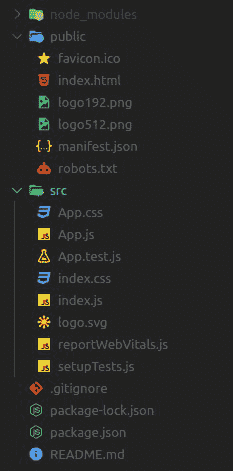

# 超级(道具)有什么用？

> 原文:[https://www . geeksforgeeks . org/super props 的用途是什么/](https://www.geeksforgeeks.org/what-is-the-use-of-superprops/)

大多数开发人员只是写 **super(道具)**，因为它在代码中没有伤害，但是没有人渴望知道这个东西实际上是如何工作的原因以及它是如何有用的。让我们更深入地了解类组件，并了解 super(道具)在构造函数中的使用。

这里就产生了一个问题，**为什么我们需要超级(道具)？**

所以，这个问题的简单答案是，这个东西基本上允许在构造函数中访问这个。其实 super()函数做的是，调用父类的构造函数。

**语法:**使用 super(props)没有什么复杂的，我们只需要在子类组件的构造函数方法中调用 super(props)就可以了，就像这样:

```html
class Checkbox extends React.Component {
  constructor(props) {
    super(props); 
    this.state = { isOn: true };
  }
  // ...
}
```

让我们借助实际实现来谈一谈。

*   **步骤 1:** 创建反应应用程序

    ```html
    npx create-react-app super_props
    ```

*   **步骤 2:** 完成项目文件夹创建(super_props)后，使用下面的命令进入其中。

    ```html
    cd super_props
    ```

**项目结构:**一旦我们在任何代码编辑器(如 Visual Studio Code)中打开我们的项目文件夹，我们的项目结构将如下所示:



现在我们将在 **src** 文件夹中创建一个单独的组件 **Person.js** ，它将是一个基于类的组件，将从其父级 React.Component 继承 Person 类组件。

**注意:**确保在默认组件 **App.js.** 中导出和导入

**示例:**我们现在来看看 super(道具)的实现，但是在这个示例中我们不会使用 super。

## Person.js

```html
import React from "react";

class Person extends React.Component {
  constructor(props) {
    console.log(this.props);
  }
  render() {
      console.log(this.props);
    return null;
  }
}

export default Person;
```