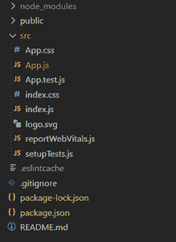
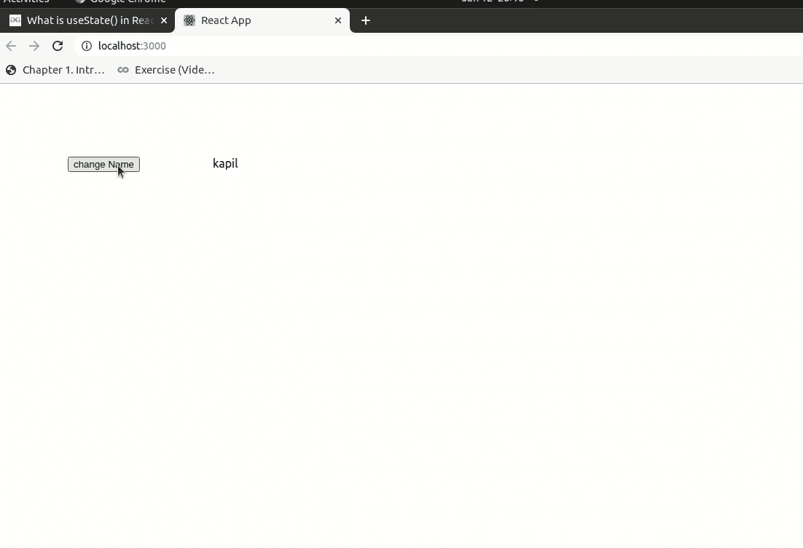
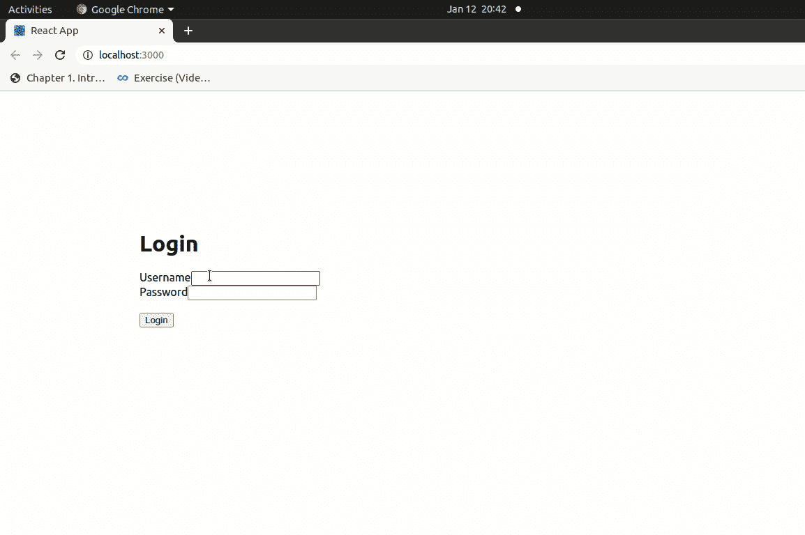

# 什么是 useState() &它是如何用于验证输入值的？

> 原文:[https://www . geesforgeks . org/what-is-usestate-how-it-used-to-validate-input-values/](https://www.geeksforgeeks.org/what-is-usestate-how-it-has-been-used-to-validate-input-values/)

[useState()](https://www.geeksforgeeks.org/reactjs-usestate-hook/) 是 ReactJs 中的一个钩子，它允许功能组件具有一个状态。我们在这个函数中传递初始状态，它返回一个变量和一个函数来更新那个状态。

*   我们必须从 react 包中导入 useState()钩子。

    ```html
    import  { useState } from 'react';
    ```

*   使用 useState()钩子创建状态的语法:

    ```html
    const [ state, updateState] = useState("Initial Value")
    ```

useState()返回一个包含两个元素的列表。首先是状态本身，其次是更新这个状态的函数。

**创建反应应用程序:**

**步骤 1:** 使用以下命令创建一个反应应用程序:

```html
npx create-react-app foldername
```

**步骤 2:** 创建项目文件夹(即 foldername)后，使用以下命令移动到该文件夹:

```html
cd foldername
```

**项目结构:**如下图。



**示例 1:**
**文件名 App.js:**

## java 描述语言

```html
import React, { Component, useState } from "react";
const App = () =>   {

  const [name, updateName] = useState("kapil")
const handleUpdate = () => {

    updateName("Nikhil")
}
    return(
    <div >
      <button
        style = { {margin: 100 }}
        onClick = { () => { handleUpdate()} } >
        change Name
      </button>
      { name }
    </div>
    );

}
export default App;
```

**输出:**


**示例 2:** 如果用户没有用预期值填写表单，则在“反应”中验证输入值会显示一条错误消息。有许多方法可以用 React 验证输入值。

**文件名 App.js:**

## java 描述语言

```html
import React from 'react';

export default class App extends React.Component {

      state = {
        fields: {},
        errors: {}
    }
    //method to validate values 
    handleValidation = ()=>{
      let fields = this.state.fields;
      let errors = {};
      let formIsValid = true;

      //Name check if name is empty or not
      if(!fields["name"]){
         formIsValid = false;
         errors["name"] = "Cannot be empty";
      }
        //name should not contain special char
      if(typeof fields["name"] !== "undefined"){
         if(!fields["name"].match(/^[a-zA-Z]+$/)){
            formIsValid = false;
            errors["name"] = "Only letters";
         }        
      }

      //Email should not be empty
      if(!fields["email"]){
         formIsValid = false;
         errors["email"] = "Cannot be empty";
      }
        //validating email
      if(typeof fields["email"] !== "undefined"){
         let lastAtPos = fields["email"].lastIndexOf('@');
         let lastDotPos = fields["email"].lastIndexOf('.');

         if (!(lastAtPos < lastDotPos && lastAtPos > 0
         && fields["email"].indexOf('@@') == -1 && 
         lastDotPos > 2 && (fields["email"].length - lastDotPos) > 2)) {
            formIsValid = false;
            errors["email"] = "Email is not valid";
          }
     }  

     this.setState({errors: errors});
     return formIsValid;
 }

    //after submit form it will be called
  handleSubmit = (e) =>{
  e.preventDefault();
    if(this.handleValidation())
      alert("form submitted successfully")
  }

    //updating the field value
  handleUpdate(field, e){         
    let fields = this.state.fields;
    fields[field] = e.target.value;        
    this.setState({fields});
}

    render(){
      return (
          <div style = {{margin:200}}>           
             <form  onSubmit= {this.handleSubmit.bind(this)}>
                 <input  type="text"  placeholder="Name" 
                 onChange={this.handleUpdate.bind(this, "name")} 
                 value={this.state.fields["name"]}/>
                    <span style={{color: "red"}}>
                    {this.state.errors["name"]}</span>
                    <br/>
                 <input type="text" placeholder="Email" 
                 onChange={this.handleUpdate.bind(this, "email")} 
                 value={this.state.fields["email"]}/>
                    <span style={{color: "red"}}>
                    {this.state.errors["email"]}</span>
                    <br/>
                 <button type = "submit">click</button>

            </form>
          </div>
    )
  }
}
```

**输出:**

